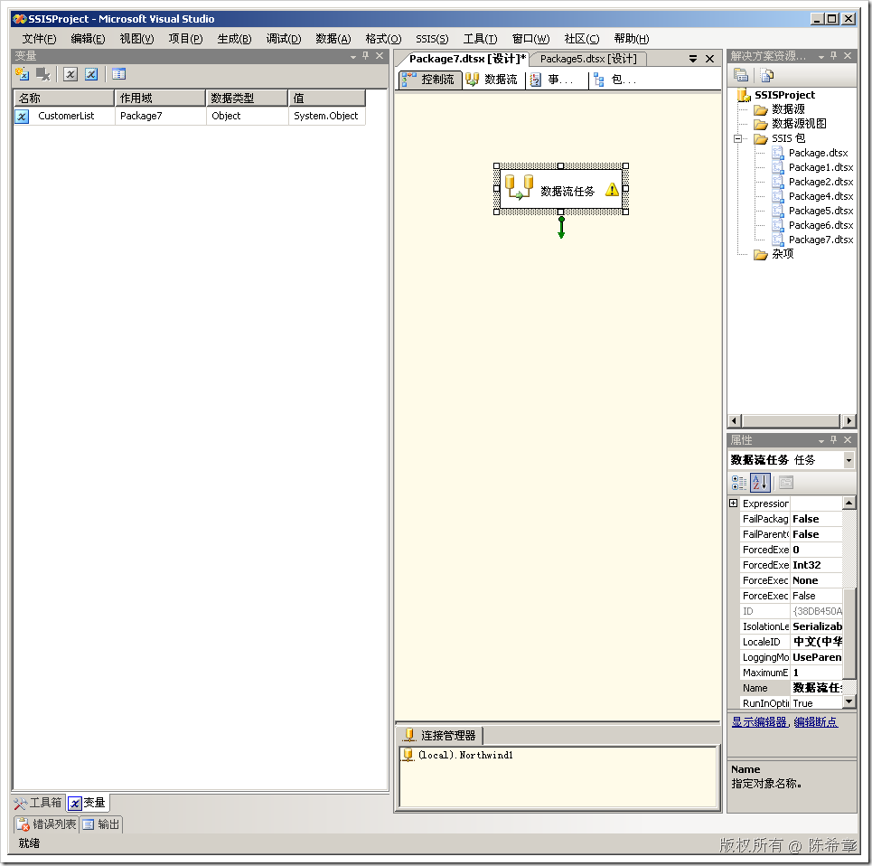
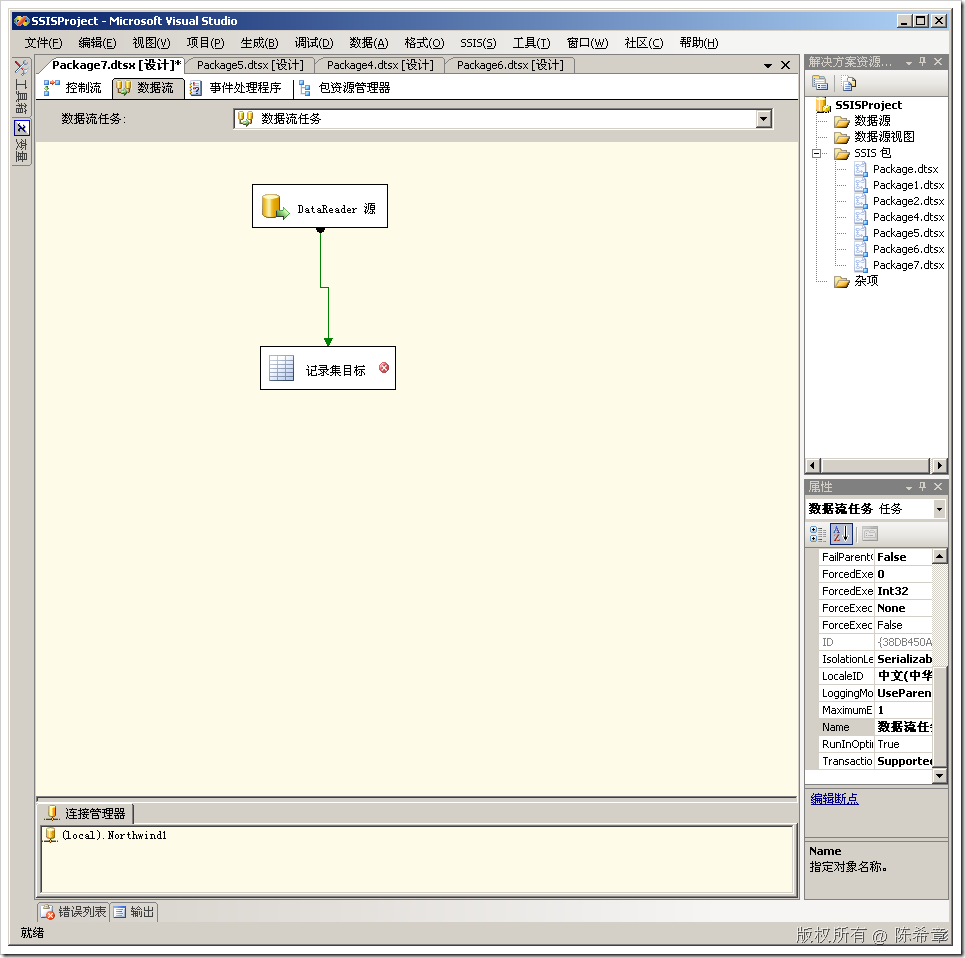
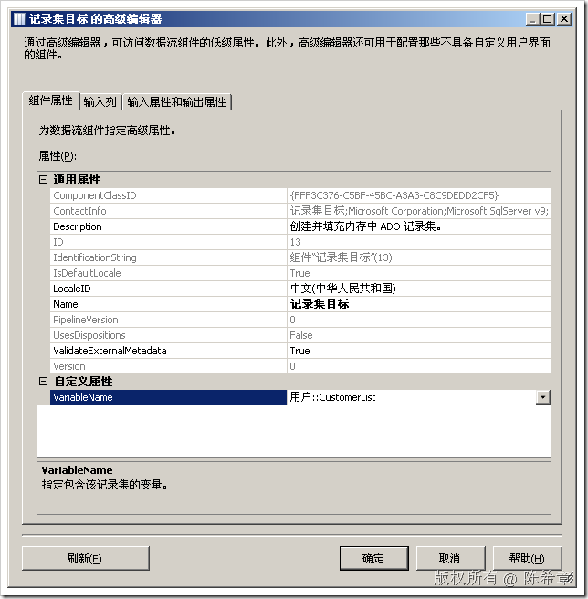
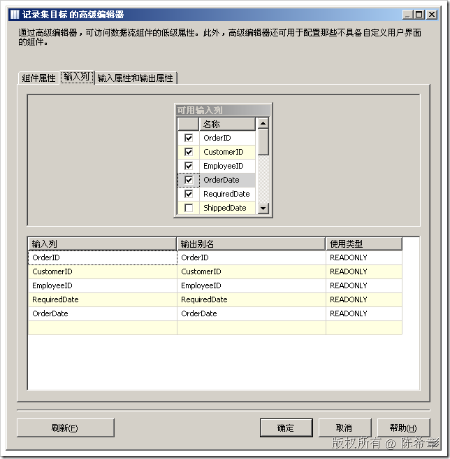
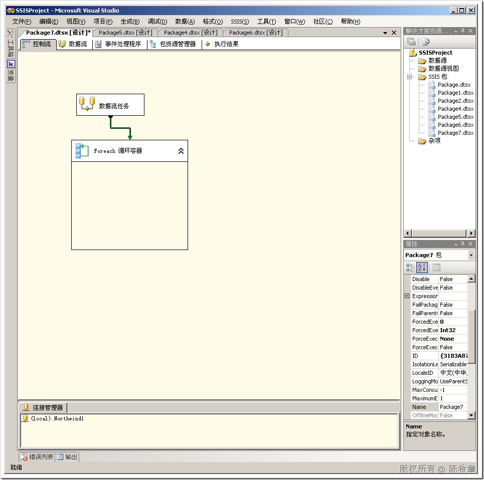
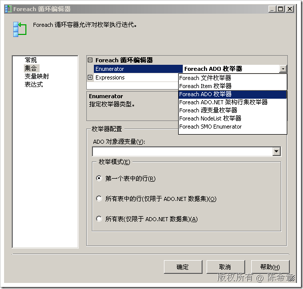
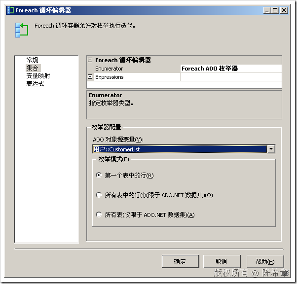
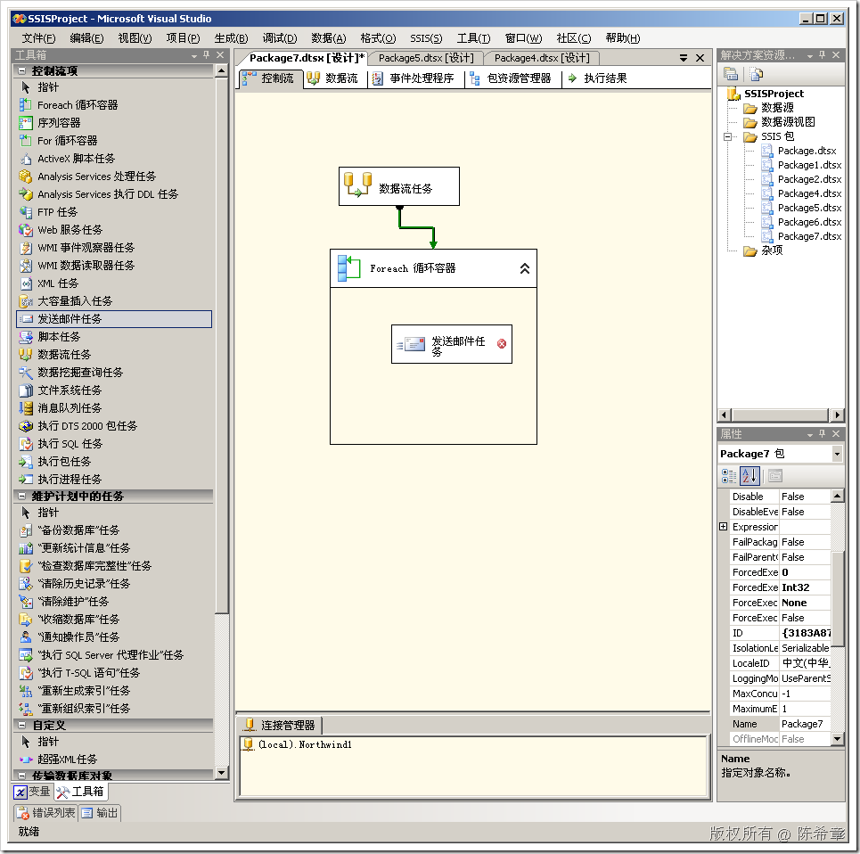

# SSIS中的记录集目标 
> 原文发表于 2009-06-22, 地址: http://www.cnblogs.com/chenxizhang/archive/2009/06/22/1508211.html 

这一篇，我们来看看另外一个特殊的目标组件：记录集目标。它与DataReader目标有些类似，也是在内存中的。但与DataReader目标不同的是，它可以被下游任务使用。

 它的使用也比较简单，我们一般指定一个变量来接收它的结果（注意它的结果是一个RecordSet,而不是DataSet)。然后再后续的任务项中，我们就可以读取该变量，并根据里面的值进行一些处理。

  

 1. 首先，我们创建一个变量。其类型要设置为object

  

 2. 然后，我们拖拽一个“数据流任务”到空白处，双击它进行编辑

  

 双击“记录集目标”

  

  

 这样就完成了该组件的配置。

  

 3. 接下来回到“控制流”中，我们添加一个容器对其进行处理

  

 双击“循环容器”

  

 选择“ADO枚举器”

  

 指定我们之前定义好的变量

 最后，我们还可以在容器中添加其他任务（例如发送邮件任务），对这个结果集进行遍历处理

    

 【后续的定义没有什么特殊的，这里就不赘述了】

 本文由作者：[陈希章](http://www.xizhang.com) 于 2009/6/22 12:49:33 发布在：<http://www.cnblogs.com/chenxizhang/>  
 本文版权归作者所有，可以转载，但未经作者同意必须保留此段声明，且在文章页面明显位置给出原文连接，否则保留追究法律责任的权利。   
 更多博客文章，以及作者对于博客引用方面的完整声明以及合作方面的政策，请参考以下站点：[陈希章的博客中心](http://www.xizhang.com/blog.htm) 