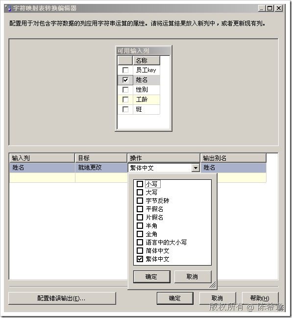
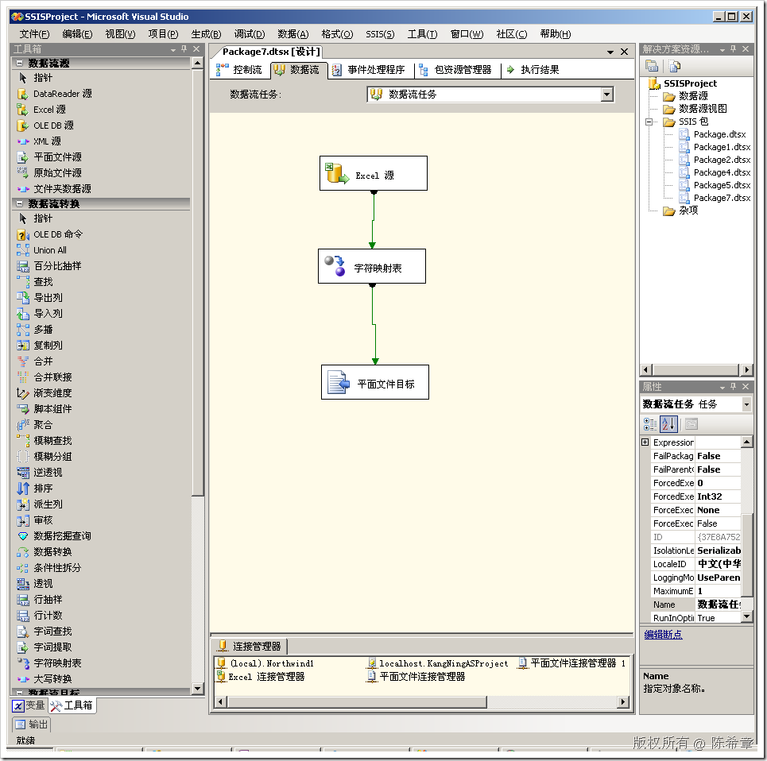
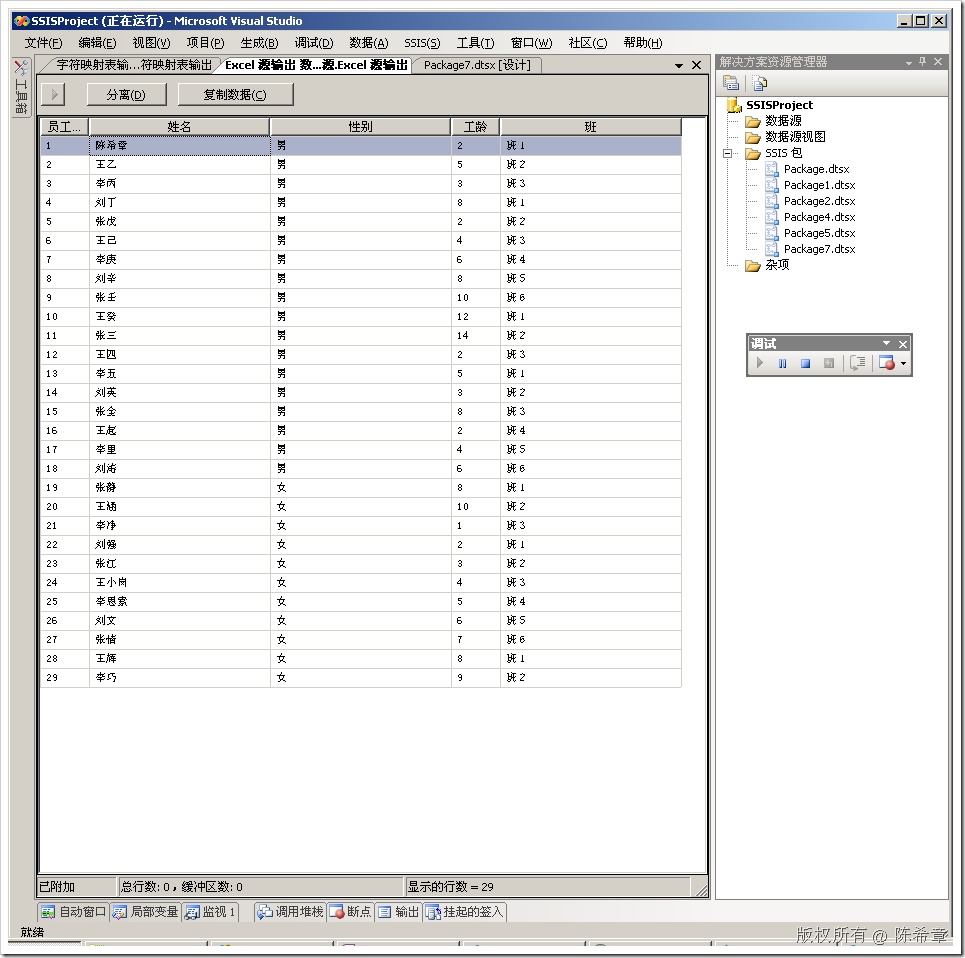
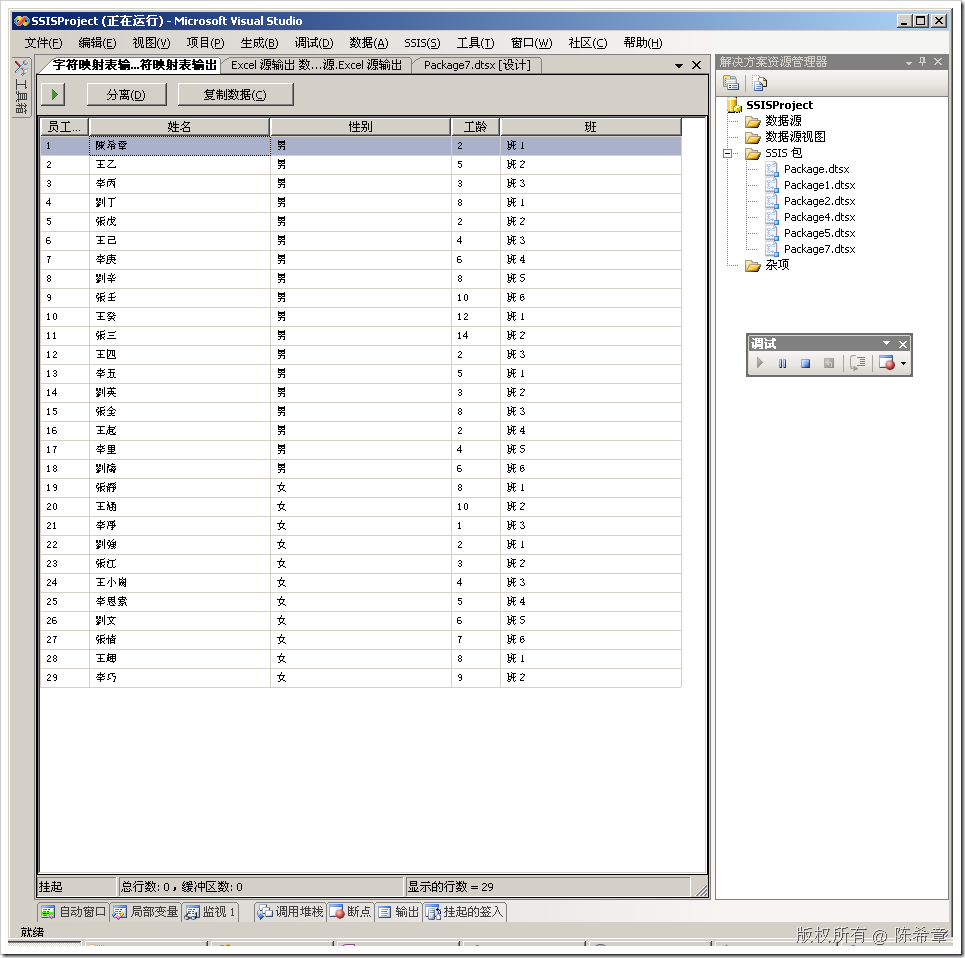

# SSIS中的字符映射表转换组件 
> 原文发表于 2009-06-22, 地址: http://www.cnblogs.com/chenxizhang/archive/2009/06/22/1508365.html 

这一篇我们介绍一下SSIS所提供的一个很有意思的转换组件：字符映射表。它的名字不是很直观，实际上它是可以对字符进行一些处理的。

 例如，我们可以将字符转为小写，大写，或者繁体等等。如下图所示

  

 我们就演示一下转换繁体的效果

  

 通过数据查看器工具，可以看到没有转换之前是简体的

  

 而转换之后就全部变成繁体了

 

 本文由作者：[陈希章](http://www.xizhang.com) 于 2009/6/22 16:28:26 发布在：<http://www.cnblogs.com/chenxizhang/>  
 本文版权归作者所有，可以转载，但未经作者同意必须保留此段声明，且在文章页面明显位置给出原文连接，否则保留追究法律责任的权利。   
 更多博客文章，以及作者对于博客引用方面的完整声明以及合作方面的政策，请参考以下站点：[陈希章的博客中心](http://www.xizhang.com/blog.htm) 