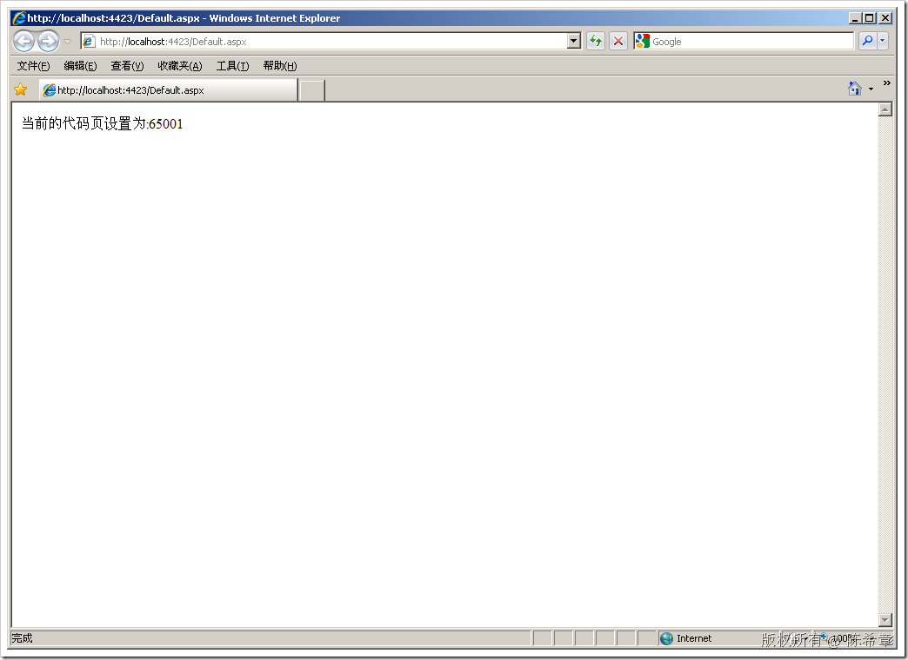
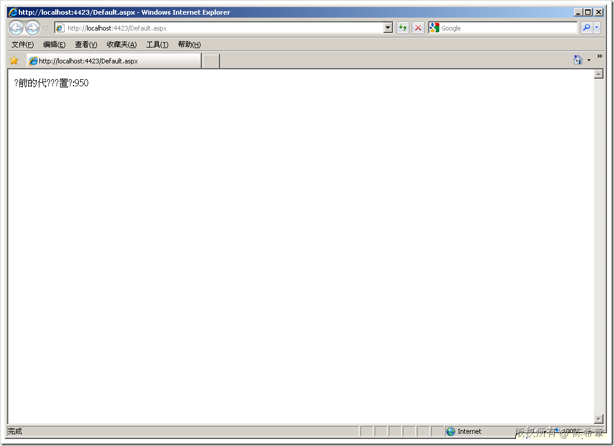
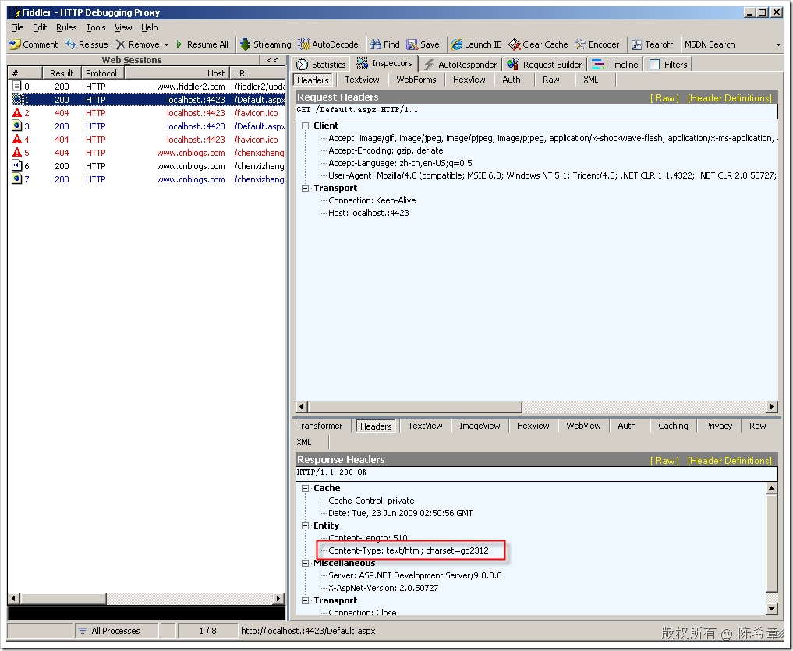
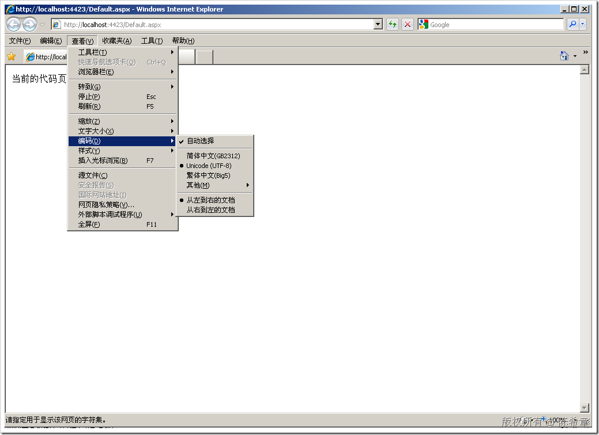

# 解析codepage和charset的含义及其应用 
> 原文发表于 2009-06-23, 地址: http://www.cnblogs.com/chenxizhang/archive/2009/06/23/1509335.html 

很多朋友可能没有意识到这个问题，但如果你的网站经常出现莫名其妙的乱码，那么就应该好好地来看看这个话题。

 codepage，中文翻译为 “内码表”或者“代码页”,它的完整介绍可以参考下面的链接

 [http://zh.wikipedia.org/wiki/%E4%BB%A3%E7%A0%81%E9%A1%B5](http://zh.wikipedia.org/wiki/%E4%BB%A3%E7%A0%81%E9%A1%B5 "http://zh.wikipedia.org/wiki/%E4%BB%A3%E7%A0%81%E9%A1%B5")

 简单地说，这是程序用于对字符进行编码的一个表。代码页是服务器的事情，或者说是程序的事情。与客户端没有关系。

 常见的三种codepage我们是必须知道的

 * 简体中文 ： 936
* 繁体中文 ： 950
* UTF-8 ： 65001

 我们以前写ASP程序的时候，通常都需要明确指定codepage的，大致下面这样的语法

 <%@ codepage=936%>简体中文  
<%@ codepage=950%>繁体中文  
<%@ codepage=65001%>UTF-8 这样实际上是指定当前页面的字符按照特定的代码页进行编码 这些代码对于有些比较年轻的朋友来说，可能根本没有接触过。毕竟，在ASP.NET里面，你一般不需要进行设置。 **<%@ Page Language="C#" AutoEventWireup="true" CodeBehind="Default.aspx.cs" Inherits="WebApplication1.\_Default"%>** <!DOCTYPE html PUBLIC "-//W3C//DTD XHTML 1.0 Transitional//EN" "<http://www.w3.org/TR/xhtml1/DTD/xhtml1-transitional.dtd">> <html xmlns="<http://www.w3.org/1999/xhtml"> >  
<head runat="server">  
    <title></title>  
</head>  
<body>  
    <form id="form1" runat="server">  
    
  
    
  
    </form>  
</body>  
</html> 这是一个简单的页面，我们在其中并没有看到有关代码页的设置。那么，如果没有做设置，会用什么设置呢？ 答案是：ASP.NET将默认使用UTF -8 进行编码。这也是为什么现在的网页很少发生乱码的原因。 怎么看这个默认的代码页设置呢？很简单，我们通过下面的代码就可以看到 using System;  
using System.Collections.Generic;  
using System.Web;  
using System.Web.UI;  
using System.Web.UI.WebControls; namespace WebApplication1  
{  
    public partial class \_Default : System.Web.UI.Page  
    {  
        protected void Page\_Load(object sender, EventArgs e)  
        {  
                Response.Write("当前的代码页设置为:"+**Session.CodePage.ToString()**);  
        }  
    }  
}  
 大家可以看到，默认的codepage是65001   与此同时，如果你不想用默认的UTF-8（我认为基本上这是不可能的），你仍然可以修改该设置

 * 直接在页面中修改
+ <%@ Page Language="C#" AutoEventWireup="true" CodeBehind="Default.aspx.cs" Inherits="WebApplication1.\_Default" **CodePage="936"%**>

* 在代码中修改
+ Session.CodePage = 936;//这句代码修改代码页为简体中文

 我们可以来测试一下为什么会发生乱码。假设，我们强制给代码页设置为950（也就是繁体中文），但是在response里面，我们又输出了简体中文字。那么该页面看起来就像下面这样

  

 传说中的乱码，对吧？

 好了，我们大致介绍了codepage的概念：简单地说，它是程序对字符进行编码的依据。

 那么，什么是charset呢？

 charset，中文翻译为“字符集”，这是指浏览器对收到的字符进行解码所用的字符表。浏览器一般都会自动地根据response中的元数据，选择相应的字符集。如果浏览器的字符集与服务器指定的代码页不匹配，那么很自然可能又产生乱码。

 怎么看response中的charset信息？

  

 怎么调整浏览器的字符器设置呢？虽然一般都是自动的，但仍然可以更改

  

 所以，我们到这里就明白了，codepage是服务器端的，charset是浏览器端的。两者必须匹配，才能避免乱码问题。

 本文由作者：[陈希章](http://www.xizhang.com) 于 2009/6/23 11:20:26 发布在：<http://www.cnblogs.com/chenxizhang/>  
 本文版权归作者所有，可以转载，但未经作者同意必须保留此段声明，且在文章页面明显位置给出原文连接，否则保留追究法律责任的权利。   
 更多博客文章，以及作者对于博客引用方面的完整声明以及合作方面的政策，请参考以下站点：[陈希章的博客中心](http://www.xizhang.com/blog.htm) 

