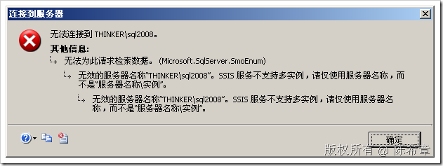
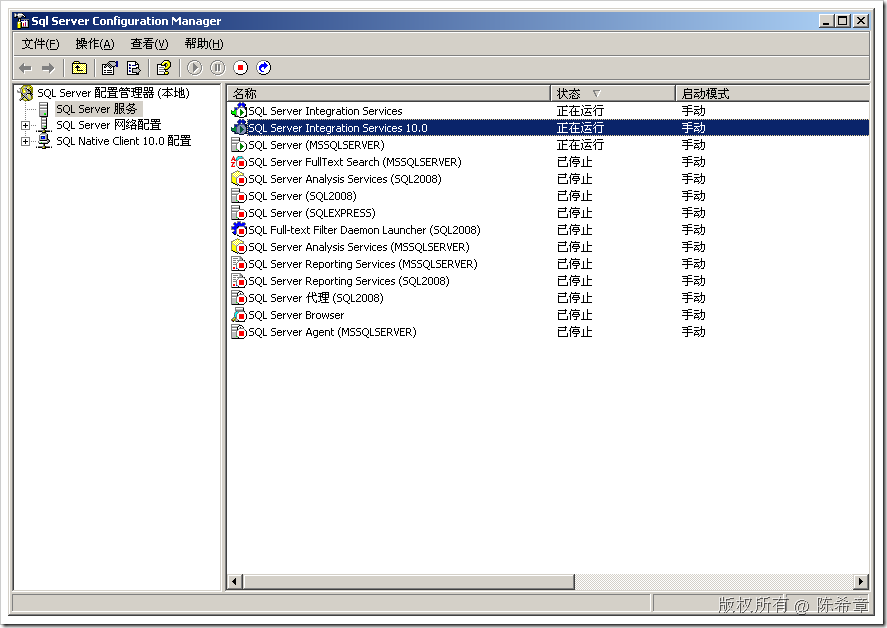
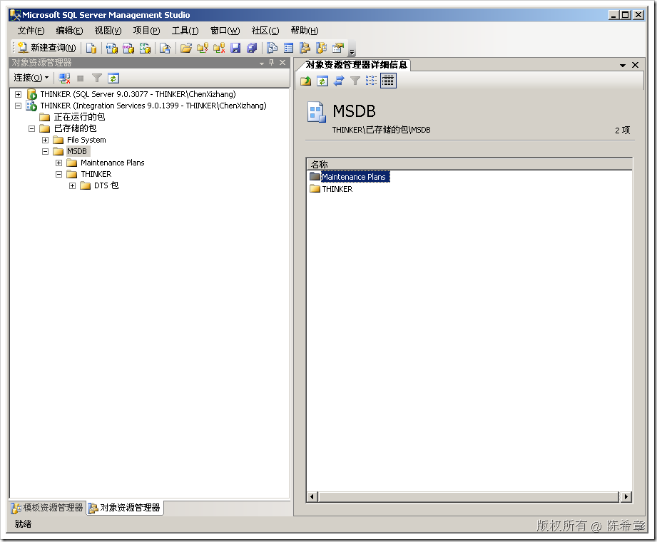
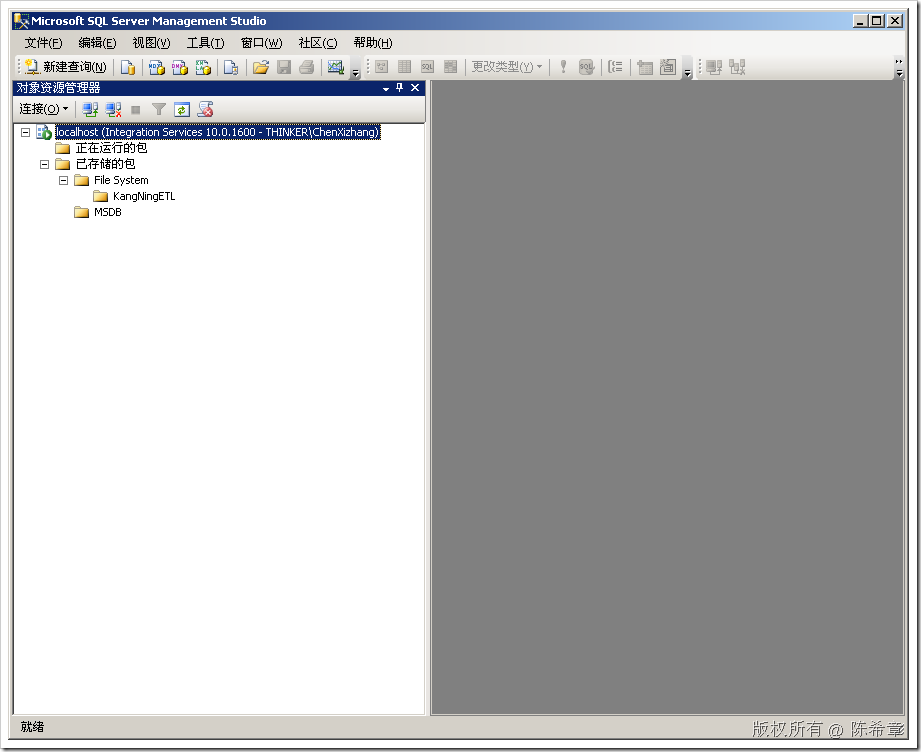

# SSIS支持多实例吗？ 
> 原文发表于 2009-06-23, 地址: http://www.cnblogs.com/chenxizhang/archive/2009/06/23/1509570.html 

我们知道在安装SQL Server组件的时候，有一个选择就是：可以安装多个实例。

 如果一个物理机器安装有多个实例，那么他们的区别在于，有一个叫默认实例，其他的都叫命名实例。

 默认实例的好处是访问起来比较方便，因为要访问默认实例的话，只需要输入服务器名称就可以了。

 那么，哪些组件是支持多实例的呢？

 * SQL Server Database Engine * SQL Server Analysis Service * SQL Server Reporting Service

 这三个组件不仅支持多实例，而且支持群集。

 而SQL Server Integration Service是不支持多实例的。如果我们试图用类似 机器名\实例名 这样的格式去访问SSIS，那么就会出现下面这样的错误

  

 但是，我们在服务配置管理器中，确实可以看到多个SSIS服务？

  

 在我的机器上，因为既安装了SQL Server 2005，又安装了SQL Server 2008，所以大家看到，我有两个SSIS 服务。第二个（带有10.0后缀的），是SQL Server 2008的

 既然说没有实例的概念，那么这两个服务又是怎么回事呢？

 答案就是：

 当我们通过SQL SERVER 2005来运行包的时候，它就使用SSIS 2005，反之亦然。

 在SSMS 2005中看到的效果如下

  

 在SSMS 2008中看到的效果如下

  

 【注意】值得说明的是，两个服务都可以把包存放在MSDB，但这个MSDB显然对应了不同的版本。而不是指同一个数据库。

 也就是说，SSIS可以有多个服务，就好象有多个版本一样。它们不是实例的概念。访问SSIS永远都是用机器名称。

 本文由作者：[陈希章](http://www.xizhang.com) 于 2009/6/23 16:00:40 发布在：<http://www.cnblogs.com/chenxizhang/>  
 本文版权归作者所有，可以转载，但未经作者同意必须保留此段声明，且在文章页面明显位置给出原文连接，否则保留追究法律责任的权利。   
 更多博客文章，以及作者对于博客引用方面的完整声明以及合作方面的政策，请参考以下站点：[陈希章的博客中心](http://www.xizhang.com/blog.htm) 