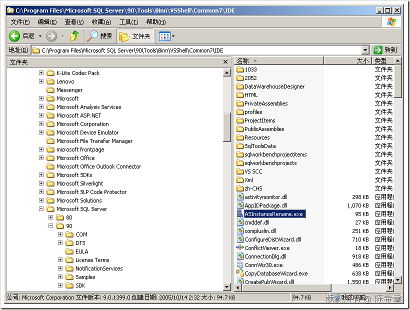
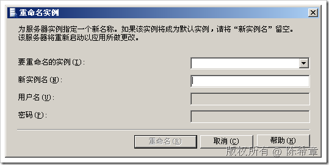

# 为安装好的SSAS实例重命名 
> 原文发表于 2009-06-23, 地址: http://www.cnblogs.com/chenxizhang/archive/2009/06/23/1509574.html 

某些时候，你可能需要对已经安装好的SSAS实例进行重命名. 一个典型的应用场景是：在你对SSAS 2000的服务器进行了side by side 的migrate后，SSAS 2005作为命名实例存在与SSAS 2000并行。当一切测试完成，你可能会删除掉SSAS 2000，而想把SSAS 2005设置为默认实例

 你当然不想删除掉然后重装。那么有没有什么比较简洁的方法来完成这样的任务呢？

 答案是有，SSAS 2005提供了一个工具：ASInstanceRename.exe。

 这个工具位于下面这样的目录：C:\Program Files\Microsoft SQL Server\90\Tools\Binn\VSShell\Common7\IDE

  

 双击该工具

  

  工具比较简单但也实用。我就不赘述了

  

 题外话：

 那么如何给一个关系引擎服务器重命名呢？这个问题通常出现在下面的场景：假设你是用克隆的方式安装的SQL Server。

 答案是：

 * 先用sp\_helpserver 查看一下当前实例的具体信息 * 再用sp\_dropserver把原先的实例名删除掉 * 再用sp\_addserver添加新的实例名称

 关于这三个系统存储过程的使用，有兴趣的朋友可以参考一下帮助文档

 本文由作者：[陈希章](http://www.xizhang.com) 于 2009/6/23 16:04:02 发布在：<http://www.cnblogs.com/chenxizhang/>  
 本文版权归作者所有，可以转载，但未经作者同意必须保留此段声明，且在文章页面明显位置给出原文连接，否则保留追究法律责任的权利。   
 更多博客文章，以及作者对于博客引用方面的完整声明以及合作方面的政策，请参考以下站点：[陈希章的博客中心](http://www.xizhang.com/blog.htm) 