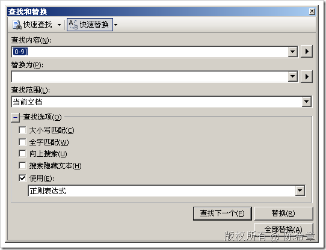

# 如何替换掉代码段中的行号 
> 原文发表于 2009-06-25, 地址: http://www.cnblogs.com/chenxizhang/archive/2009/06/25/1511135.html 

有时候，我们会从网络上摘录一些代码进行参考。很多博客作者都会用一些工具将代码加上行号。这当然会比较好看，但是对于使用者来说却不是很好的消息。例如下面这一段代码

  1using System;  
 2using System.Data;  
 3using System.Configuration;  
 4using System.Collections;  
 5using System.Web;  
 6using System.Web.Security;  
 7using System.Web.UI;  
 8using System.Web.UI.WebControls;              
 9using System.Web.UI.WebControls.WebParts;  
10using System.Web.UI.HtmlControls;  
13using System.DirectoryServices;  
14  
15  
16namespace abc  
17{  
18 public partial class Test : System.Web.UI.Page  
19    {  
20        protected void Page\_Load(object sender, EventArgs e)  
21        {   
22        }  
23    }  
24} 【备注]这个代码没有什么可以学习的啦,只是作为一个演示,呵呵   它包含了很多数字的行号。那么我们该如何去将其删除掉呢？是不是要一个一个手工地删除呢？当然，你可以那么做。但我想你还是应该听从我的建议，善用VS的替换工具，使用正则表达式进行批量替换 首先，选中你的代码 然后，按下CTRL+H,进行如下的配置  最后，点击“全部替换” ,wow,就可以看到下面的代码了   using System;  
using System.Data;  
using System.Configuration;  
using System.Collections;  
using System.Web;  
using System.Web.Security;  
using System.Web.UI;  
using System.Web.UI.WebControls;              
using System.Web.UI.WebControls.WebParts;  
using System.Web.UI.HtmlControls; using System.DirectoryServices; namespace abc  
{  
    public partial class Test : System.Web.UI.Page  
    {  
        protected void Page\_Load(object sender, EventArgs e)  
        {   
        }  
    }  
}   当然,这个例子很简单,但能说明一个问题,就是VS其实带了一些比较好的小工具,可以提高工作效率, 值得一说的是,VS这个正则表达式,与我们通常意义上理解的正则表达式是不同的,具体请参考联机帮助 【注意】我同时有一个建议，大家写博客文章的时候，实际上没有必要搞那个行号，增加大家的麻烦，何必呢  本文由作者：[陈希章](http://www.xizhang.com) 于 2009/6/25 17:29:32 发布在：<http://www.cnblogs.com/chenxizhang/>  
 本文版权归作者所有，可以转载，但未经作者同意必须保留此段声明，且在文章页面明显位置给出原文连接，否则保留追究法律责任的权利。   
 更多博客文章，以及作者对于博客引用方面的完整声明以及合作方面的政策，请参考以下站点：[陈希章的博客中心](http://www.xizhang.com/blog.htm) 

