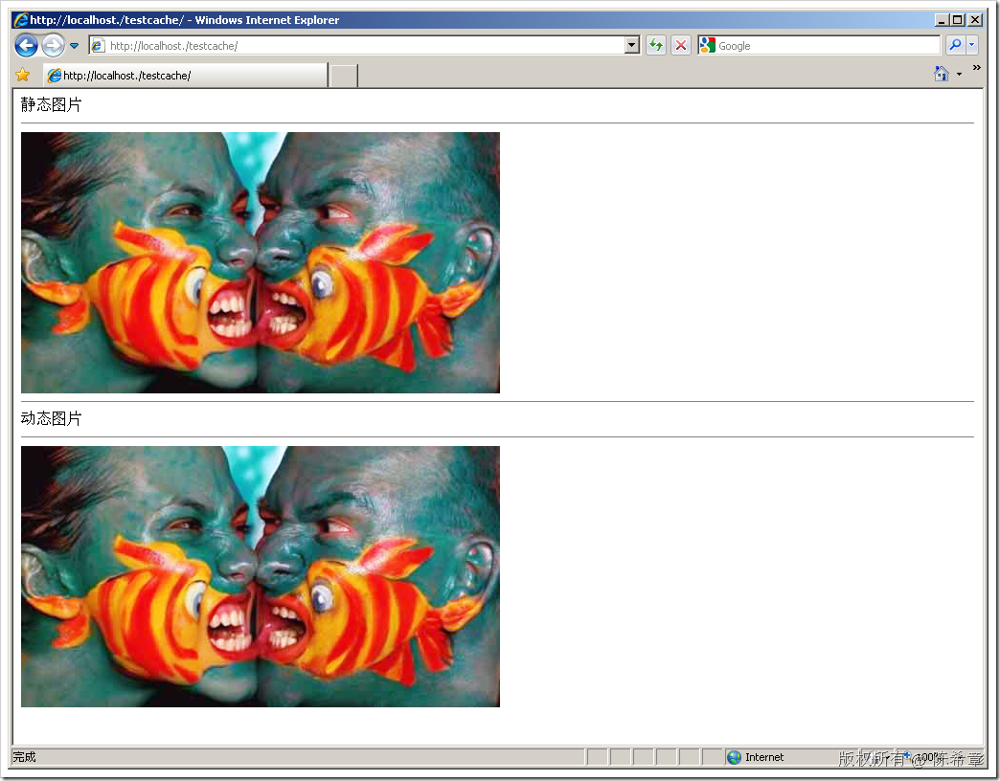

# 动态还是静态，这是一个问题 
> 原文发表于 2009-06-25, 地址: http://www.cnblogs.com/chenxizhang/archive/2009/06/25/1511177.html 

我们经常会讨论到网页内容的动态和静态的问题，这是一个没有唯一答案的话题。

 1.静态，我们损失了灵活性，意味着，任何用户在任何时候看到的效果都是一样的。

 2.动态，我们得到了灵活性，意味着，我们可以根据用户的不同，时间的不同，或者仅仅是我们高兴不高兴，来决定要怎么输出内容到浏览器。

 但是，动态的功能增加了服务器的负担，是因为动态页面（或者其他动态资源），他们不可能被浏览器缓存，换句话说，浏览器因为认为这是一项动态资源，所以它不敢擅自缓存。

 我们先看看静态内容的缓存机制：大部分的浏览器都会自动缓存静态的网页（htm，html）以及静态的图片(jpg等等），当一个页面刷新的时候，它们会去服务器比较一下，如果服务器没有更改（一般是比较文件的属性），则直接用304返回，表示无更改，也就是说它可以直接用浏览器缓存里面的文件进行渲染和展现。

 为什么这么说呢？我们先来看一个静态页面，我定义为default.htm，里面有两张图片，一张是动态的（我用了一个ashx来动态生成图片，后面介绍），一张是静态的（直接引用Jpg文件）

 下面的内容是default.htm

 <!DOCTYPE html PUBLIC "-//W3C//DTD XHTML 1.0 Transitional//EN" "<http://www.w3.org/TR/xhtml1/DTD/xhtml1-transitional.dtd">>  
<html xmlns="<http://www.w3.org/1999/xhtml"> >  
<head>  
    <title></title>  
</head>  
<body>  
静态图片
  
  

  
动态图片
  
  
</body>  
</html> 这个页面在浏览器中看起来像下面这样：

  

 【注意】虽然两个图片看起来是一样的，但下面这一张是动态生成的

  

 请注意观察：default.htm和test.jpg这两个请求都是直接返回304的，意思是说没有更改。请注意Response这边显示为：Not Modifed

 而image.ashx永远都是返回200，也就是说真正执行了。

  

 那么，具体来说，那个default.htm和test.jpg是缓存到了哪里呢？这个位置因人而异，但有一个统一的叫法：IE 高速缓存。在我的机器上，这个目录被移动到了一个特殊的磁盘

  

 好了，到这里为止，你应该知道了，浏览器对于一些静态格式的文件，是会做缓存的。这样很显然可以减轻一些服务器的压力。因为没有必要读取文件，再发送到浏览器的。

 那么，对于动态内容是怎么回事呢？

 我们常见的asp,aspx和上面提到的ashx都是动态内容。它们的特点是可以动态生成内容。如下面这个

 using System;  
using System.Collections.Generic;  
using System.Web;  
using System.Web.Services;  
using System.Drawing; namespace WebApplication1  
{  
    /// 
  
    /// $codebehindclassname$ 的摘要说明  
    /// 
  
    [WebService(Namespace = "<http://tempuri.org/")]>  
    [WebServiceBinding(ConformsTo = WsiProfiles.BasicProfile1\_1)]  
    public class image : IHttpHandler  
    {         public void ProcessRequest(HttpContext context)  
        {  
            context.Response.ContentType = "image/jpeg";  
            context.Response.Cache.SetCacheability(HttpCacheability.Server);  
            context.Response.Cache.SetValidUntilExpires(false);  
            context.Response.Cache.SetExpires(DateTime.Now.AddHours(1));  
            context.Response.AddHeader("content-disposition","inline; filename="+context.Request.Path);  
            context.Response.BufferOutput = false;             Bitmap bitmap = new Bitmap(context.Server.MapPath("test.jpg"));  
            bitmap.Save(context.Response.OutputStream, System.Drawing.Imaging.ImageFormat.Jpeg);             context.Response.End();  
        }         public bool IsReusable  
        {  
            get  
            {  
                return false;  
            }  
        }  
    }  
} 以上代码就是我们常见的动态生成图片的代码。你注意到，我也尝试设置了Cache的一些选项，而事实上这些选项也确实告知浏览器了，例如，我通过

context.Response.Cache.SetExpires(DateTime.Now.AddHours(1));  
    告诉他说，我希望缓存一个小时。

 但你会发现浏览器不予理会

  

 他每次都请求，头部里面都明确写了,no-cache，也就是说他因为检测到这种文件格式（ashx）属于动态内容，所以不考虑缓存。

 同样的情况也发生在aspx上面，你注意看上图，aspx的请求也都是200状态的

 【注意】一个aspx即便不包含服务器代码，也会被认为是动态页面，而不等同于htm文件

  

 那么，动态内容难道就无法做缓存了吗？答案是：不，只是要在服务器做缓存。

 一般情况下，用的最多的就是aspx的输出缓存（outputcache),以下指令是告知ASP.NET引擎，这个页面的所有内容全部缓存60秒。

 <%@ OutputCache Duration="60" VaryByParam="none" %>

 也就是说，动态内容的缓存应该是由服务端控制的，页面仍然会被请求，进入执行管道(pipleline)，但至于是否真得要去执行内部的代码，则由ASP.NET引擎决定。

  

 对于ashx，没有办法直接设置outputcache这样的指令，但可以在代码中通过访问CacheAPI去实现缓存，例如下面这样

 using System;  
using System.Collections.Generic;  
using System.Web;  
using System.Web.Services;  
using System.Drawing;  
using System.IO; namespace WebApplication1  
{  
    /// 
  
    /// $codebehindclassname$ 的摘要说明  
    /// 
  
    [WebService(Namespace = "<http://tempuri.org/")]>  
    [WebServiceBinding(ConformsTo = WsiProfiles.BasicProfile1\_1)]  
    public class image : IHttpHandler  
    {         public void ProcessRequest(HttpContext context)  
        {             context.Response.ContentType = "image/jpeg";  
            context.Response.BufferOutput = false;    **if (context.Cache["Image"] != null)  
            {  
                BinaryWriter bw = new BinaryWriter(context.Response.OutputStream);  
                bw.Write((byte[])context.Cache["Image"]);  
            }  
            else  
            {  
                Bitmap bitmap = new Bitmap(context.Server.MapPath("test.jpg"));  
                bitmap.Save(context.Response.OutputStream, System.Drawing.Imaging.ImageFormat.Jpeg);  
                context.Cache["Image"] = File.ReadAllBytes(context.Server.MapPath("test.jpg"));  
            }**              context.Response.End();  
        }         public bool IsReusable  
        {  
            get  
            {  
                return false;  
            }  
        }  
    }  
}  

 so， 你到底要用静态图片，还是动态图片呢？

 本文由作者：[陈希章](http://www.xizhang.com) 于 2009/6/25 19:03:24 发布在：<http://www.cnblogs.com/chenxizhang/>  
 本文版权归作者所有，可以转载，但未经作者同意必须保留此段声明，且在文章页面明显位置给出原文连接，否则保留追究法律责任的权利。   
 更多博客文章，以及作者对于博客引用方面的完整声明以及合作方面的政策，请参考以下站点：[陈希章的博客中心](http://www.xizhang.com/blog.htm) 

