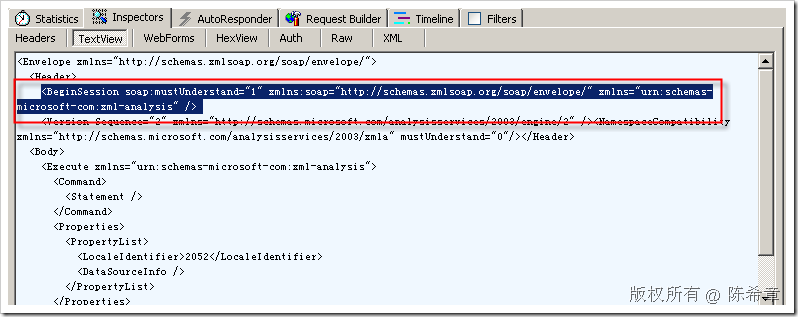
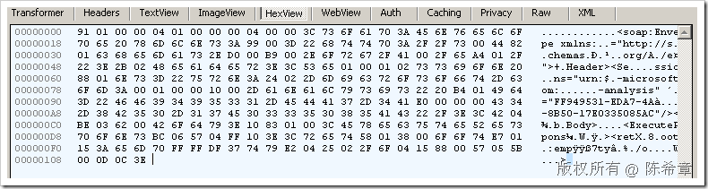
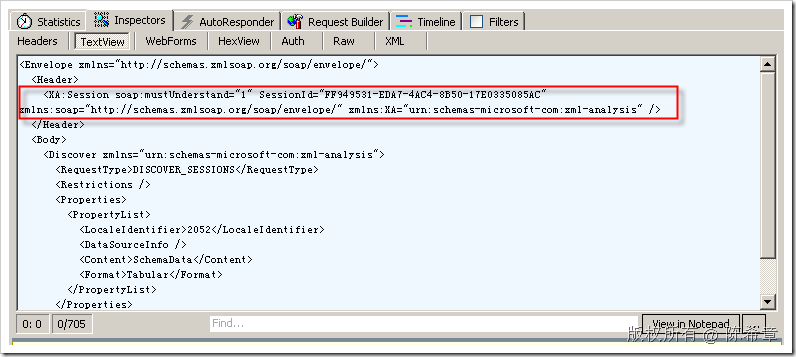
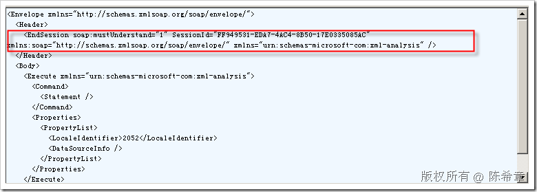

# SSAS: 再谈谈如何控制会话（Session）及其销毁 
> 原文发表于 2009-06-26, 地址: http://www.cnblogs.com/chenxizhang/archive/2009/06/26/1511870.html 

理解会话对于理解SSAS的编程比较重要。从名字上说，Session还可以称为Dialog,或者Convensation等等。它们都表示这样一个意思：

 1. 它们需要预先建立

 2. 一旦建立之后，那么在这个会话上可以进行多个操作，而且这些操作都可以共享一些会话级别的资源，例如变量值等等

 3. 它们需要关闭，或者被自动回收

  

 SSAS的会话是由服务器控制的，通常情况下，它的最小空闲时间是45分钟（2700秒），也就是说如果一个会话空闲了45分钟，那么它可能（只是可能）被回收。

 为什么说只是可能呢？服务器并不一定会马上回收空闲的会话，这取决于另外一个参数（最大空闲时间），以及服务器内存是不是紧张了。

 同样道理，而即便是你明确地发出了终止Session的指令，也不见得立即会回收。这仍然是取决于服务器的策略。不过，我们是建议使用完之后明确地关闭会话的，这样至少在我们程序的角度来说是一个好的设计。

 在SSAS中，使用BeginSession的指令开始一个会话，这个会话会回复一个SessionID。然后，后续操作都可以使用这个SessionID指定与该会话的关联。在使用完之后，可以使用EndSession指令结束会话。

 下面是一个BeginSession

  

 它的回复大致是下面这样的,

  

 这一段东西是编码过的，解开来之后，我们一般那可以看到一个SessionID

 <soap:Envelope xmlns:soap="http://schemas.xmlsoap.org/soap/envelope/"><soap:Header> <Session xmlns="urn:schemas-microsoft-com:xml-analysis" **SessionId=“FF949531-EDA7-4AC4-8B50-17E0335085AC"**/> </soap:Header><soap:Body><ExecuteResponse xmlns="urn:schemas-microsoft-com:xml-analysis"><return><root xmlns="urn:schemas-microsoft-com:xml-analysis:empty"/></return></ExecuteResponse></soap:Body></soap:Envelope>    

 然后，我们再来看一下建立会话之后，后续操作应该怎么做。每个操作的头部都会带有一个Session的头，里面包含了指定的SessionID

  

 最后，我们来看一下如何结束会话

  

 这是它的工作原理。大家应该掌握。

  

 那么，对于ADOMDConnection的属性SessionID属性，我们应该怎么样理解呢？

 * 如果没有指定该属性，而当connection成功调用了open方法之后，会自动地将最新的SessionID赋予该属性 * 如果在调用open之前指定了该属性，那么将尝试连接到指定会话，如果会话不存在或者已经终止，则抛出异常（这里要注意捕获异常） * 当调用Connection的Close方法 ，会自动地终止会话

     也就是说，可以在一个连接没有关闭之前，进行多个操作，这些操作可以共享一些会话级别的资源，例如：计算成员，集等等

 这里先预先提一下，有关SSAS对象的一些级别（后续有专门的文章介绍）

 * 全局级别（global）：在任何会话中都可见，例如维度成员，命名集，以及通过BIDS创建的计算成员，操作等等 * 会话级别（Session）：在单一会话中可见，一般都通过CREATE SESSION … 这样的语句来创建的，例如CREATE SESSION SET….这是创建一个会话级别的集。 * 查询级别（Query）：在单一查询中可见，一般通过WITH语句来定义，例如WITH SET。。。

 本文由作者：[陈希章](http://www.xizhang.com) 于 2009/6/26 18:08:16 发布在：<http://www.cnblogs.com/chenxizhang/>  
 本文版权归作者所有，可以转载，但未经作者同意必须保留此段声明，且在文章页面明显位置给出原文连接，否则保留追究法律责任的权利。   
 更多博客文章，以及作者对于博客引用方面的完整声明以及合作方面的政策，请参考以下站点：[陈希章的博客中心](http://www.xizhang.com/blog.htm) 

