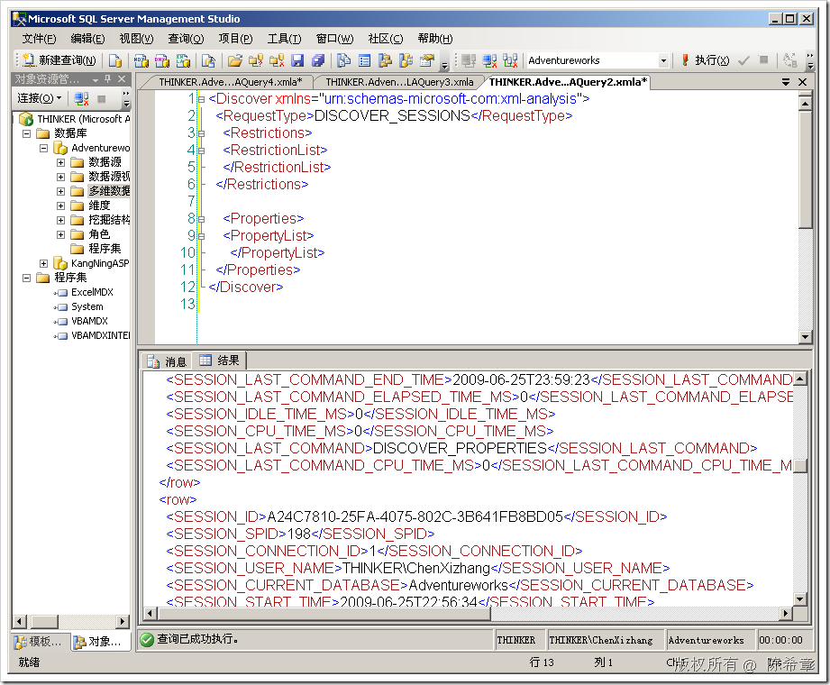
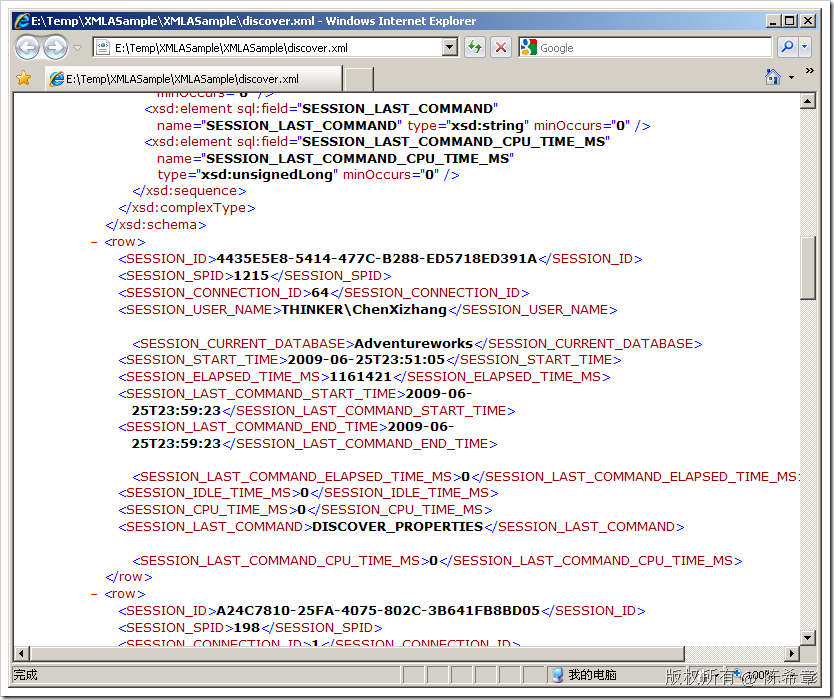

# SSAS: 如何在客户端程序中调用DISCOVER命令 
> 原文发表于 2009-06-26, 地址: http://www.cnblogs.com/chenxizhang/archive/2009/06/26/1511883.html 

上次我们提到了如何用DISCOVER命令，查看服务器端的所有会话

 <Discover xmlns="urn:schemas-microsoft-com:xml-analysis">     <RequestType>DISCOVER\_SESSIONS</RequestType>     <Restrictions>  
        <RestrictionList>  
        </RestrictionList>  
    </Restrictions>     <Properties>  
        <PropertyList>  
           </PropertyList>  
    </Properties> </Discover>  

 这一段脚本可以在服务器端直接执行

  

 那么这一段脚本怎么在客户程序中执行呢？

 【注意】ADOMD.NET是不可以直接执行DISCOVER命令的。我们一般通过下面这样的方式来做

 客户端需要封装一个SOAP Envelope（信封），在里面包含我们的脚本

 <Envelope xmlns="<http://schemas.xmlsoap.org/soap/envelope/">>  
  <Header>  
    <XA:Session soap:mustUnderstand="1" SessionId="$sessionId$" xmlns:soap="<http://schemas.xmlsoap.org/soap/envelope/"> xmlns:XA="urn:schemas-microsoft-com:xml-analysis" />  
  </Header>  
  <Body>  
<Discover xmlns="urn:schemas-microsoft-com:xml-analysis">  
    <RequestType>DISCOVER\_SESSIONS</RequestType>  
    <Restrictions>  
        <RestrictionList>  
        </RestrictionList>  
    </Restrictions>     <Properties>  
        <PropertyList>  
           </PropertyList>  
    </Properties>  
</Discover>  
  </Body>  
</Envelope> 读取过来的信息是一片XML文档，大致如下  本文由作者：[陈希章](http://www.xizhang.com) 于 2009/6/26 18:20:59 发布在：<http://www.cnblogs.com/chenxizhang/>  
 本文版权归作者所有，可以转载，但未经作者同意必须保留此段声明，且在文章页面明显位置给出原文连接，否则保留追究法律责任的权利。   
 更多博客文章，以及作者对于博客引用方面的完整声明以及合作方面的政策，请参考以下站点：[陈希章的博客中心](http://www.xizhang.com/blog.htm) 

