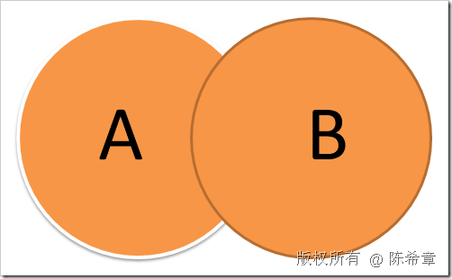
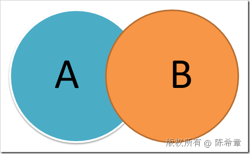
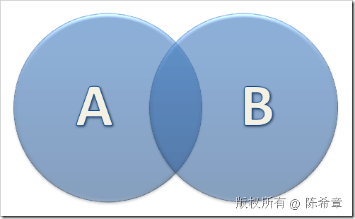

# SQL SERVER: 合并相关操作(Union,Except,Intersect) 
> 原文发表于 2009-06-26, 地址: http://www.cnblogs.com/chenxizhang/archive/2009/06/26/1511889.html 

SQL Server 中对于结果集有几个处理，值得讲解一下

 1. 并集（union，Union all)

 
>  这个很简单，是把两个结果集水平合并起来。例如
> 
>  SELECT * FROM A 
> 
>  UNION 
> 
>  SELECT * FROM B
> 
>  【注意】union会删除重复值，也就是说A和B中重复的行，最终只会出现一次，而union all则会保留重复行。
> 
>   
> 
> 

 2. 差异（Except）

 
>  就是两个集中不重复的部分。例如
> 
>  SELECT * FROM A
> 
>  EXCEPT 
> 
>  SELECT * FROM B
> 
>  这个的意思是，凡是不出现在B表中的A表的行。
> 
> 

 
>   
> 
> 

 3. 交集（intersect)

 
>  就是两个集中共同的部分。例如
> 
>  SELECT * FROM A
> 
>  INTERSECT
> 
>  SELECT * FROM B
> 
>  这个的意思是，同时出现在A和B中的记录
> 
>   
> 
> 

 本文由作者：[陈希章](http://www.xizhang.com) 于 2009/6/26 18:31:02 发布在：<http://www.cnblogs.com/chenxizhang/>  
 本文版权归作者所有，可以转载，但未经作者同意必须保留此段声明，且在文章页面明显位置给出原文连接，否则保留追究法律责任的权利。   
 更多博客文章，以及作者对于博客引用方面的完整声明以及合作方面的政策，请参考以下站点：[陈希章的博客中心](http://www.xizhang.com/blog.htm) 