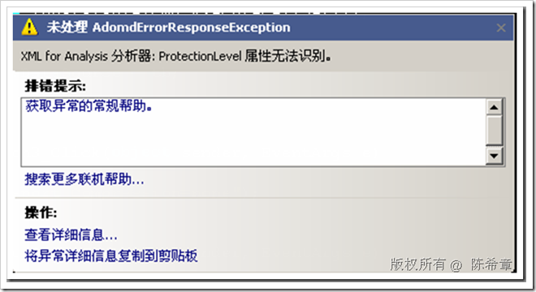
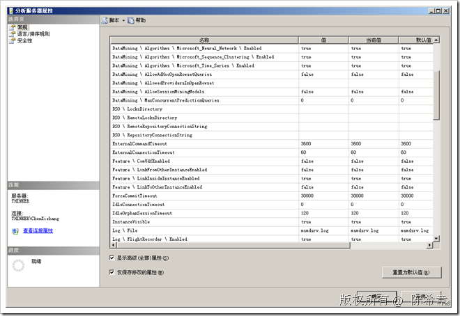
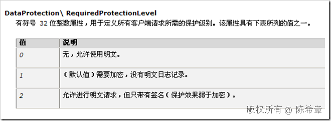
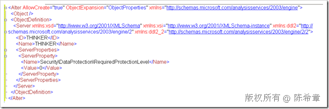

# SSAS : 如何更改服务器的加密选项 
> 原文发表于 2009-06-27, 地址: http://www.cnblogs.com/chenxizhang/archive/2009/06/27/1512109.html 

默认情况下，对于通过TCP/IP的方式与SSAS通讯的请求，SSAS会加密数据并且对其进行签名。这样做当然是提高安全性。与此同时，它也可能会加重CPU的负担，但微软官方资料表示，这种负担大约是提高了5%左右。所以，综合起来说，还是比较划算的。

 如果我们需要进行一些诊断和调试，我们可能希望在某个时候不进行加密。根据资料说，可以通过修改连接字符串中的ProtectionLevel来指定有关的选项，但我看是不行。应该是新版本的ADOMD.NET提高了这方面的安全性，它总是报告一个错误说无法识别

 

 此路不通，又生一计：能不能直接修改服务器的某个选项呢？

 找了一圈，也没有找到。

  

 但最终在内部资料中找到了该属性

  

 下面来看看如何修改该选项

  本文由作者：[陈希章](http://www.xizhang.com) 于 2009/6/27 9:07:41 发布在：<http://www.cnblogs.com/chenxizhang/>  
 本文版权归作者所有，可以转载，但未经作者同意必须保留此段声明，且在文章页面明显位置给出原文连接，否则保留追究法律责任的权利。   
 更多博客文章，以及作者对于博客引用方面的完整声明以及合作方面的政策，请参考以下站点：[陈希章的博客中心](http://www.xizhang.com/blog.htm) 

