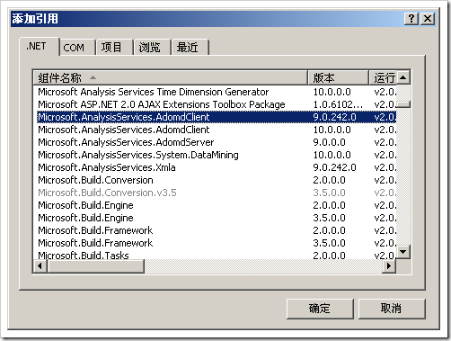

# SSAS : 数据访问接口整理汇总 
> 原文发表于 2009-06-27, 地址: http://www.cnblogs.com/chenxizhang/archive/2009/06/27/1512111.html 

Microsoft SQL Server 2005 Analysis Services (SSAS) supports several technologies that can be used to access data and metadata stored on an instance of Analysis Services. Using the Analysis Services data access technologies, you can do the following:  **Retrieve Schema Rowsets**  Schema rowsets are one way in which client applications can examine metadata stored on, and retrieve support and monitoring information from, an Analysis Services instance. You can retrieve OLE DB, OLE DB for Online Analytical Processing (OLAP), OLE DB for Data Mining, or XML for Analysis (XMLA) schema rowsets. To retrieve schema rowsets: * You can use OLE DB commands with the Analysis Services 9.0 OLE DB provider. For more information, see **Analysis Services 9.0 OLE DB Provider (SSAS).这是一个非托管的提供程序，msolap90.dll*** You can run the **XMLA Discover method** directly against an Analysis Services instance to retrieve schema rowset information. For more information, see Discover Method (XMLA).

  **Retrieve Data and Metadata**  You can retrieve data and metadata, in either tabular or multidimensional formats, from cubes and mining models. To retrieve data and metadata: * You can **use ADOMD.NET in a managed client application** to retrieve Analysis Services information using common Microsoft .NET Framework data access interfaces. For more information, see ADOMD.NET. * You can **use the Analysis Services 9.0 OLE DB provider in unmanaged client applications** to support OLE DB access. For more information, see Analysis Services 9.0 OLE DB Provider (SSAS). * You can **use XMLA to retrieve data directly from an Analysis Services instance in an XML-based format**. For more information, see XML for Analysis (XMLA).

  **Manipulate Analysis Services Objects**  You can manipulate Analysis Services objects, such as databases, cubes, dimensions, and mining structures, **using Multidimensional Expressions (MDX), Data Mining Extensions (DMX), or XMLA commands**. To manipulate Analysis Services objects: * You can use ADOMD.NET in a managed client application to send commands using common .NET Framework data access interfaces. For more information, see ADOMD.NET. * You can use the Analysis Services 9.0 OLE DB provider in unmanaged client applications to send commands using OLE DB access. For more information, see Analysis Services 9.0 OLE DB Provider (SSAS). * You can use XMLA to send commands directly to an Analysis Services instance. For more information, see XML for Analysis (XMLA).

  

 **何时使用OLEDB Provider？**
-----------------------

 **在非托管环境中，例如在Excel，就是使用OLEDB 的方式**

 **如何使用OLEDB Provider?**
-----------------------

  

 **它的连接字符串，大致如下**

 Provider=MSOLAP.4;Integrated Security=SSPI;Persist Security Info=True;Initial Catalog=Adventureworks;Data Source=(local);MDX Compatibility=1;Safety Options=2;MDX Missing Member Mode=Error

 如何在VB或者VBA代码中使用，则需要先添加引用

  

    

  

 **何时使用ADOMD.NET ?**
-------------------

 **在托管环境中。例如.NET编写的程序。**

 **如何使用ADOMD.NET？**
------------------

  

  

 **何时使用XMLA？**
-------------

 **在没有办法使用OLEDB以及ADOMD.NET的时候。例如在java中直接通过XML的方式来操作**

 **通常都是发送下面这样的消息到服务器。当然，前提是服务器已经配置为可以使用http访问**

 <Envelope xmlns="<http://schemas.xmlsoap.org/soap/envelope/">>  
  <Header>  
    <XA:Session soap:mustUnderstand="1"  SessionId="$sessionId$" xmlns:soap="<http://schemas.xmlsoap.org/soap/envelope/"> xmlns:XA="urn:schemas-microsoft-com:xml-analysis" />  
  </Header>  
  <Body>  
    <Execute xmlns="urn:schemas-microsoft-com:xml-analysis">  
      <Command>  
        <Statement>        
        SELECT [Customer].[Customer Geography].[Country-Region] ON 0,  
[Measures].[Internet Sales-Sales Amount] ON 1  
FROM [Analysis Services Tutorial]</Statement>  
      </Command>  
      <Properties>  
        <PropertyList>  
        <Catalog>Adventureworks</Catalog>  
          <LocaleIdentifier>2052</LocaleIdentifier>  
          <DataSourceInfo />  
          <Format>Multidimensional</Format>  
          <AxisFormat>TupleFormat</AxisFormat>  
          <Content>SchemaData</Content>  
        </PropertyList>  
      </Properties>  
    </Execute>  
  </Body>  
</Envelope>  

 需要注意的是，OLEDB 和ADOME.NET其实也仍然是使用XMLA的，也就是SSAS通讯的官方语言就是XMLA，只不过：**OLEDB 和ADOMD.NET所使用的XMLA是所谓的over TCP/IP的。**

 本文由作者：[陈希章](http://www.xizhang.com) 于 2009/6/27 9:11:20 发布在：<http://www.cnblogs.com/chenxizhang/>  
 本文版权归作者所有，可以转载，但未经作者同意必须保留此段声明，且在文章页面明显位置给出原文连接，否则保留追究法律责任的权利。   
 更多博客文章，以及作者对于博客引用方面的完整声明以及合作方面的政策，请参考以下站点：[陈希章的博客中心](http://www.xizhang.com/blog.htm) 

