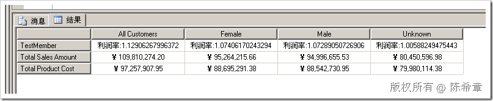
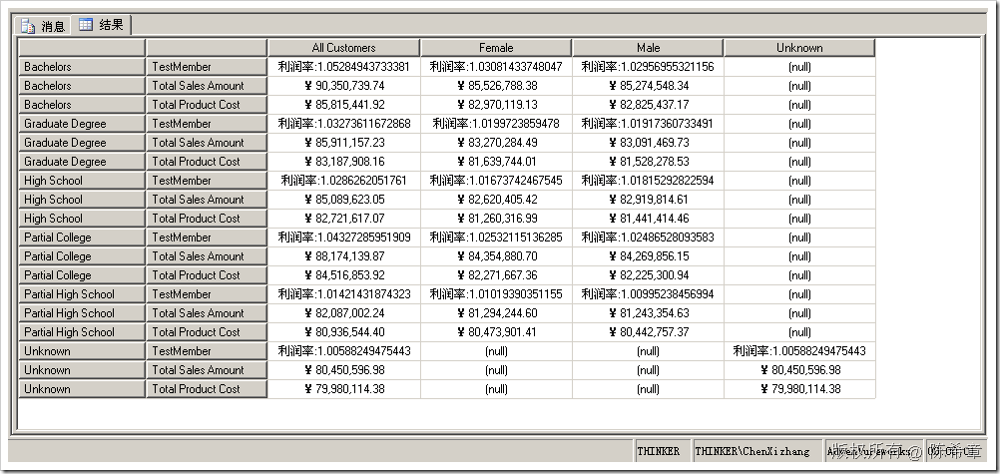

# SSAS :  使用.NET为SSAS编写自定义程序集（二） 
> 原文发表于 2009-06-27, 地址: http://www.cnblogs.com/chenxizhang/archive/2009/06/27/1512177.html 

上一篇，我们演示了一个简单的函数，AddPrefix，它的作用是为一个字符串添加一个前缀。

 [http://www.cnblogs.com/chenxizhang/archive/2009/06/27/1512163.html](http://www.cnblogs.com/chenxizhang/archive/2009/06/27/1512163.html "http://www.cnblogs.com/chenxizhang/archive/2009/06/27/1512163.html")

   
下面为它添加一些灵活性

 using System;  
using System.Collections.Generic;  
using System.Text; namespace SSASStoreProcedure  
{  
    public partial class StoredProcedures  
    {  
        /// 
  
        /// 这个方法用来添加一个前缀  
        /// 
  
        /// <param name="input"></param>  
        /// <returns></returns>  
        public static string AddPrefix(string prefix,string input)  
        {  
            return string.Format("{0}:{1}", prefix, input);  
        }  
    }  
} 现在，我们这个存储过程，它的前缀可以由用户指定，这显然更加好一些 WITH MEMBER [Measures].[TestMember]  
AS  
SSASStoreProcedure.AddPrefix('利润率',[Measures].[Total Sales Amount]/[Measures].[Total Product Cost]) SELECT [Customer].[Gender].Members ON 0,  
{[TestMember],[Measures].[Total Sales Amount],[Measures].[Total Product Cost]} ON 1  
FROM [Analysis Services Tutorial]  

 我们这次用来测试的脚本更加复杂一些：添加了一个计算成员，放在度量值组中。这个新的度量值，可以计算两个现有度量值的运算结果，并且添加相应的前缀

  

 很显然，该方法内部的具体实现可以很复杂。

 作为测试,我们还可以修改一下查询

 WITH MEMBER [Measures].[TestMember]  
AS  
SSASStoreProcedure.AddPrefix('利润率',[Measures].[Total Sales Amount]/[Measures].[Total Product Cost]) SELECT [Customer].[Gender].Members ON 0,  
{[Customer].[Education].CHILDREN}*{[TestMember],[Measures].[Total Sales Amount],[Measures].[Total Product Cost]} ON 1  
FROM [Analysis Services Tutorial] 

 本文由作者：[陈希章](http://www.xizhang.com) 于 2009/6/27 11:41:16 发布在：<http://www.cnblogs.com/chenxizhang/>  
 本文版权归作者所有，可以转载，但未经作者同意必须保留此段声明，且在文章页面明显位置给出原文连接，否则保留追究法律责任的权利。   
 更多博客文章，以及作者对于博客引用方面的完整声明以及合作方面的政策，请参考以下站点：[陈希章的博客中心](http://www.xizhang.com/blog.htm) 

