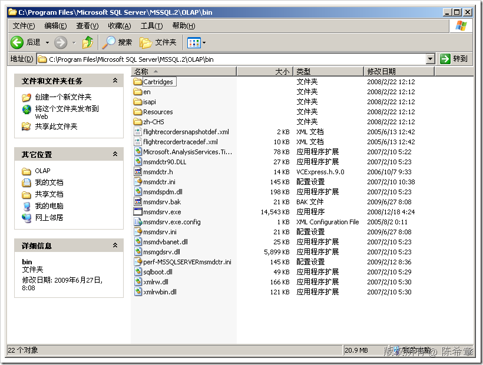

# SSAS : 使用.NET为SSAS编写自定义程序集(三) 
> 原文发表于 2009-06-27, 地址: http://www.cnblogs.com/chenxizhang/archive/2009/06/27/1512199.html 

这一篇我们来看看如何在存储过程中访问当前的上下文,例如当前在哪个数据库,哪个服务器等等

  

 首先,需要添加引用

  

 需要注意,如果你的机器安装了多个SQL Server的版本,一定要找到正确的目录.下面这个目录是SQL Server 2005的

  

 修改代码如下

 using System;  
using System.Collections.Generic;  
using System.Text; using Microsoft.AnalysisServices.AdomdServer; namespace SSASStoreProcedure  
{  
    public partial class StoredProcedures  
    {  
        /// 
  
        /// 这个方法用来添加一个前缀  
        /// 
  
        /// <param name="input"></param>  
        /// <returns></returns>  
        public static string AddPrefix(string prefix,string input)  
        {  
            return string.Format("{0}:{1}", prefix, input);  
        } **public static string AddServerName(string input)  
        {  
            string servername = Context.CurrentServerID;  
            return string.Format("{0}:{1}", servername, input);**  **}**  
    }  
}      然后,部署程序集,用以下脚本测试

 WITH MEMBER [Measures].[TestMember]  
AS  
SSASStoreProcedure.AddServerName([Measures].[Total Sales Amount]/[Measures].[Total Product Cost]) SELECT [Customer].[Gender].Members ON 0,  
{[Customer].[Education].CHILDREN}*{[TestMember],[Measures].[Total Sales Amount],[Measures].[Total Product Cost]} ON 1  
FROM [Analysis Services Tutorial]  

  

 需要注意的是:

 这个Context对象,在SQL Server 2008中有些改进,包含了CurrentConnection对象和Server对象.

 [Context](http://msdn.microsoft.com/zh-cn/library/microsoft.analysisservices.adomdserver.context.aspx) 类具有两个新增属性： * [Server](http://msdn.microsoft.com/zh-cn/library/microsoft.analysisservices.adomdserver.context.server.aspx)，对新增服务器对象的只读引用。 * [CurrentConnection](http://msdn.microsoft.com/zh-cn/library/microsoft.analysisservices.adomdserver.context.currentconnection.aspx)，对新增 **AdomdConnection** 对象的只读引用。

	+ 这里可以得到当前用户的信息,那样就更强大了

 本文由作者：[陈希章](http://www.xizhang.com) 于 2009/6/27 12:45:46 发布在：<http://www.cnblogs.com/chenxizhang/>  
 本文版权归作者所有，可以转载，但未经作者同意必须保留此段声明，且在文章页面明显位置给出原文连接，否则保留追究法律责任的权利。   
 更多博客文章，以及作者对于博客引用方面的完整声明以及合作方面的政策，请参考以下站点：[陈希章的博客中心](http://www.xizhang.com/blog.htm) 

