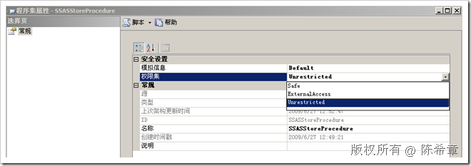
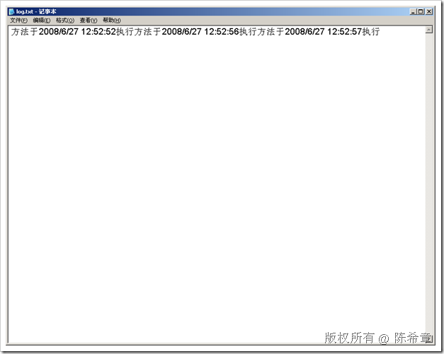

# SSAS :  使用.NET为SSAS编写自定义程序集(四) 
> 原文发表于 2009-06-27, 地址: http://www.cnblogs.com/chenxizhang/archive/2009/06/27/1512205.html 

这一篇我来讲解一下如何为SSAS编写一些操作.这与之前谈到的用于查询的存储过程是不一样,它没有返回值,而是进行某个操作.

 通常这种操作,会根据一些参数对当前的Cube做一些操作.我这里作为演示目的,就写了一个最简单的文件操作,以便大家理解

  

 1. 添加一个方法

 public static void SomeMethod()  
{   
    File.AppendAllText("e:\\temp\\log.txt",string.Format("方法于{0}执行",DateTime.Now.ToString()));  
}  

 2. 部署该程序集

 因为代码中需要进行文件操作，该操作以及超出了SQL Server的边界，所以应该设置它的权限集为“不限制”

  

  

 3. 测试

 CALL SSASStoreProcedure.SomeMethod()  
ON [Analysis Services Tutorial] 【注意】CALL后面的是存储过程名称。而这个名称只需要两部分：namespace.methodname，而不需要classname.

 ON后面的是Cube名称，必须指定一个。

  

 MSDN中的文档这个部分又有问题。大家要注意。

 4. 检查

 

 本文由作者：[陈希章](http://www.xizhang.com) 于 2009/6/27 12:59:31 发布在：<http://www.cnblogs.com/chenxizhang/>  
 本文版权归作者所有，可以转载，但未经作者同意必须保留此段声明，且在文章页面明显位置给出原文连接，否则保留追究法律责任的权利。   
 更多博客文章，以及作者对于博客引用方面的完整声明以及合作方面的政策，请参考以下站点：[陈希章的博客中心](http://www.xizhang.com/blog.htm) 

