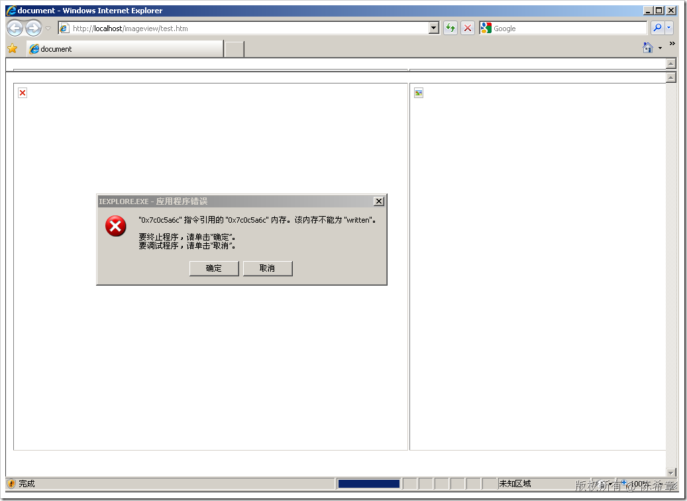
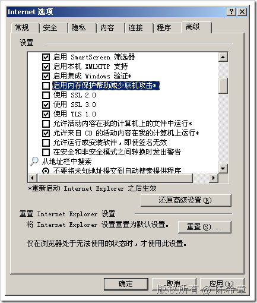

# IE 8内存保护 
> 原文发表于 2009-06-28, 地址: http://www.cnblogs.com/chenxizhang/archive/2009/06/28/1512509.html 

这两天帮一个朋友做一个网页的测试，这个网页需要用到ActiveX控件。按说不应该有啥问题的，但每次我这边打开这个网页就报告错误，就是将要弹出那个要求安装加载项的时候

   

 我开始没有在意，觉得是不是这个加载项有什么问题或者其他什么原因。但昨天还是决意了解一下到底咋回事

 原来是因为我前不久刚安装了最新的IE 8这个版本，它有一个所谓的“内存保护”的功能，只要把如下的选项清除就可以了

 

 我就搞不明白了，保护就保护吧，为什么安装加载项就崩溃？

  难道IE 8开始也拒绝ActiveX了？

 本文由作者：[陈希章](http://www.xizhang.com) 于 2009/6/28 7:04:28 发布在：<http://www.cnblogs.com/chenxizhang/>  
 本文版权归作者所有，可以转载，但未经作者同意必须保留此段声明，且在文章页面明显位置给出原文连接，否则保留追究法律责任的权利。   
 更多博客文章，以及作者对于博客引用方面的完整声明以及合作方面的政策，请参考以下站点：[陈希章的博客中心](http://www.xizhang.com/blog.htm) 