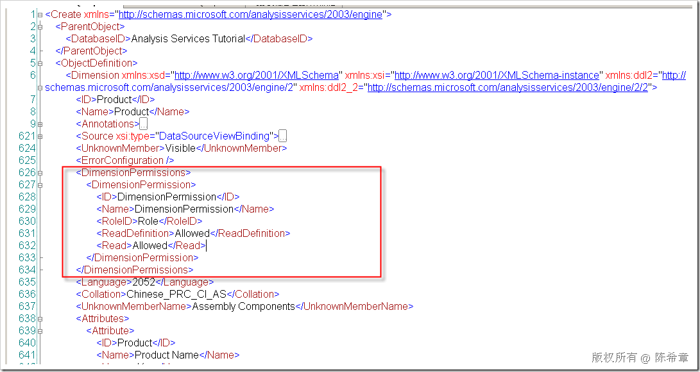
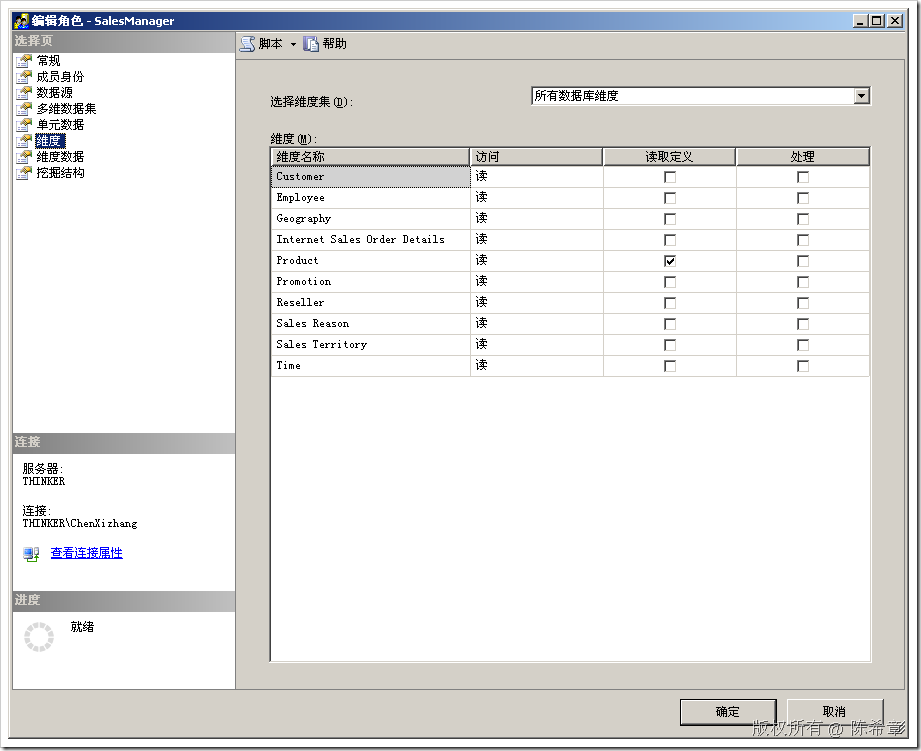

# SSAS : 数据库角色的信息是保存在哪里的 
> 原文发表于 2009-06-30, 地址: http://www.cnblogs.com/chenxizhang/archive/2009/06/30/1514199.html 

SSAS的安全是基于角色来管理的，而且它所接受的身份验证模式只有Windows验证着一种。这一点需要特别注意

 而另外一个要注意的是，假设我们为某个角色授予了对某个SSAS对象的权限，例如读取某个维度数据的权限，那么这些定义是放在哪里去了呢？

 这些定义我们称为元数据。他们是直接跟维度定义放在一起的。例如下面这个例子

  

 这个定义就相当于在下面这样设置

  

 【注意】

 因为维度是可以共享的（也可以链接），所以如果要为特定Cube的维度授权，应该选择到相应的Cube。这样的话，对于维度的权限定义就保存在了Cube的元数据中，而不是维度中。 

  

  

 【注意】

 SSAS的权限，有很多与关系型数据库不同的地方。例如“处理”和“读取定义”是两种特殊的权限。而且SSAS里面没有拒绝的概念，要么就是允许，要么就是不允许（这相当于废除）。

 SSAS的权限是可以叠加的，也就是说一个用户属于多个角色的话，他们的权限是合并的。与此同时，在连接字符串中还可以指定角色列表。

 如果某个 Microsoft Windows 用户或组属于多个数据库角色，则对所有单元的查询首先会导致根据该用户或组所属的各个数据库角色分别生成数据集。 然后，Microsoft SQL Server Analysis Services 将把所有这些数据集组合为一个数据集，再将组合后的数据集返回给该用户或组

 还有一点，就是SSAS的权限也是可以继承的，也就是子对象可以从父对象上面继承，例如授予某个角色处理数据库的权限，那么就自然具有了处理Cube的权限

 本文由作者：[陈希章](http://www.xizhang.com) 于 2009/6/30 18:12:03 发布在：<http://www.cnblogs.com/chenxizhang/>  
 本文版权归作者所有，可以转载，但未经作者同意必须保留此段声明，且在文章页面明显位置给出原文连接，否则保留追究法律责任的权利。   
 更多博客文章，以及作者对于博客引用方面的完整声明以及合作方面的政策，请参考以下站点：[陈希章的博客中心](http://www.xizhang.com/blog.htm) 