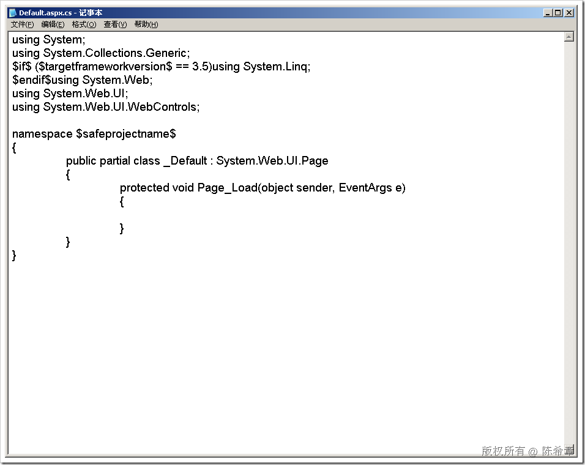

# .NET : 在定义项目模板的时候使用占位符 
> 原文发表于 2009-07-02, 地址: http://www.cnblogs.com/chenxizhang/archive/2009/07/02/1515152.html 

如果需要定制项目模板，那么可能需要注意这个小技巧 

 $safeprojectname$会被替换为用户根据该模板创建新项目时指定的名称

 

 本文由作者：[陈希章](http://www.xizhang.com) 于 2009/7/2 8:31:01 发布在：<http://www.cnblogs.com/chenxizhang/>  
 本文版权归作者所有，可以转载，但未经作者同意必须保留此段声明，且在文章页面明显位置给出原文连接，否则保留追究法律责任的权利。   
 更多博客文章，以及作者对于博客引用方面的完整声明以及合作方面的政策，请参考以下站点：[陈希章的博客中心](http://www.xizhang.com/blog.htm) 