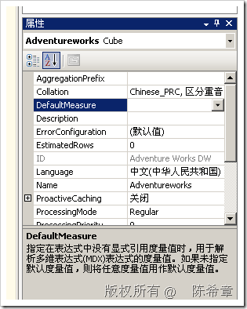

# SSAS : 如果在MDX查询中没有指定度量值，那么会怎么处理 
> 原文发表于 2009-07-02, 地址: http://www.cnblogs.com/chenxizhang/archive/2009/07/02/1515800.html 

我们知道，在SSAS中，其实所有的度量值合在一起，属于一个特殊的维度。这个维度名称为Measures。那么既然是维度，就存在一个切片的问题。如果一个标准维度，没有指定切片的粒度，那么就是用所有该维度的成员计算。也就是（ALLMember）.但是对于度量值呢？总不可能将所有的度量值都计算一次吧？这显然是不对的

  

 如果有必要，我们可以指定某个常用的度量值为默认度量值，例如Internet Sales Amount

 本文由作者：[陈希章](http://www.xizhang.com) 于 2009/7/2 19:53:41 发布在：<http://www.cnblogs.com/chenxizhang/>  
 本文版权归作者所有，可以转载，但未经作者同意必须保留此段声明，且在文章页面明显位置给出原文连接，否则保留追究法律责任的权利。   
 更多博客文章，以及作者对于博客引用方面的完整声明以及合作方面的政策，请参考以下站点：[陈希章的博客中心](http://www.xizhang.com/blog.htm) 