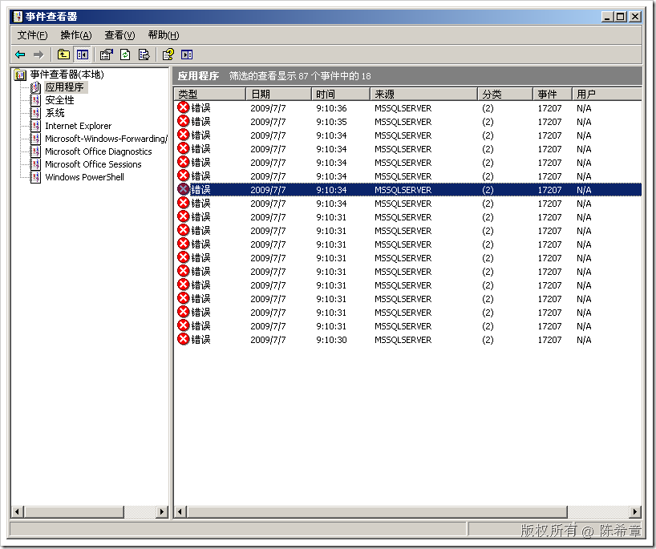
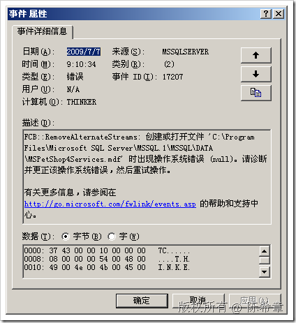

# SQL SERVER : 启动时的问题 
> 原文发表于 2009-07-07, 地址: http://www.cnblogs.com/chenxizhang/archive/2009/07/07/1518104.html 

检查事件日志的时候发现每次SQL Server启动的时候都有一些错误，看那意思是文件句柄找不到。

  

  

 找了下面这篇文档，但仍然没有解决

 <http://www.microsoft.com/technet/support/ee/transform.aspx?ProdName=SQL+Server&ProdVer=2000.80.760.0&EvtID=17207&EvtSrc=MSSQLServer&LCID=1033>

 Details **Product:**  
SQL Server **Event ID:**  
17207 **Source:**  
MSSQLServer **Version:**  
8.0 **Component:**  
SQL Engine **Message:**  
%1: Operating system error %3 during the creation/opening of physical device %2. Explanation The file listed in the message is not accessible to SQL Server for read and/or write operations during startup, database recovery, or backup/restore operations. SQL Server might not be able to find the file, the file may be locked by another application, or SQL Server may not have permissions to access the file. User Action * The specific operating system error returned will vary. Investigate the operating system error first to see if it can lead you to the root cause. * Check the SQL Server error log and the Event Viewer logs for any other errors that occur at the same time as this error. * Verify that the file exists in the exact path listed in the error. If it does not, move the file to that path. * Verify that the file does not have the read-only attribute set to true. * Verify that the SQL Server startup account has read and write permissions to the folder and file. * Verify that the file is not held open by another process such as backup software or virus scanner software. If you can rename the file, it is not locked by another application. * If this error resulted after you moved databases to a new location, put all files back in their original location. To move user or system databases to a new location, follow the steps in the Microsoft Knowledge Base article, [314546](http://support.microsoft.com/?id=314546). * Run hardware diagnostics for the drive where the file resides to verify the disk and file are healthy. * If the file listed is encrypted, verify that the version and edition of Windows and of SQL Server support encrypted files. * If you get this error from rebuildm.exe, verify that you choose the location of files from the original SQL Server installation CD or of a copy of those original files. If you still have problems with rebuildm.exe, follow the steps in the Microsoft Knowledge Base article [273572](http://support.microsoft.com/?id=273572).

 本文由作者：[陈希章](http://www.xizhang.com) 于 2009/7/7 9:13:59 发布在：<http://www.cnblogs.com/chenxizhang/>  
 本文版权归作者所有，可以转载，但未经作者同意必须保留此段声明，且在文章页面明显位置给出原文连接，否则保留追究法律责任的权利。   
 更多博客文章，以及作者对于博客引用方面的完整声明以及合作方面的政策，请参考以下站点：[陈希章的博客中心](http://www.xizhang.com/blog.htm) 

