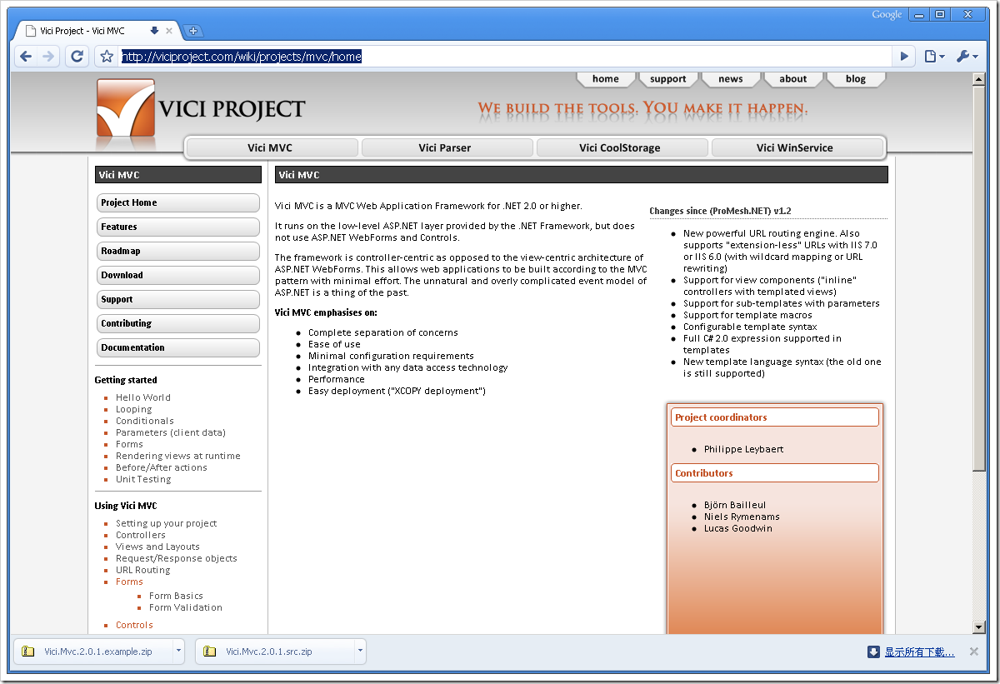

# .NET : 一个比较轻型的MVC框架 
> 原文发表于 2009-07-07, 地址: http://www.cnblogs.com/chenxizhang/archive/2009/07/07/1518208.html 

这个框架可以参考参考，可以直接使用在.NET 2.0 Framework下面

 <http://viciproject.com/wiki/projects/mvc/home>

 

 本文由作者：[陈希章](http://www.xizhang.com) 于 2009/7/7 10:33:17 发布在：<http://www.cnblogs.com/chenxizhang/>  
 本文版权归作者所有，可以转载，但未经作者同意必须保留此段声明，且在文章页面明显位置给出原文连接，否则保留追究法律责任的权利。   
 更多博客文章，以及作者对于博客引用方面的完整声明以及合作方面的政策，请参考以下站点：[陈希章的博客中心](http://www.xizhang.com/blog.htm) 