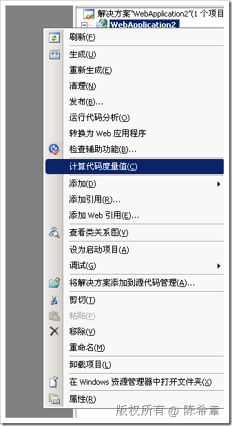
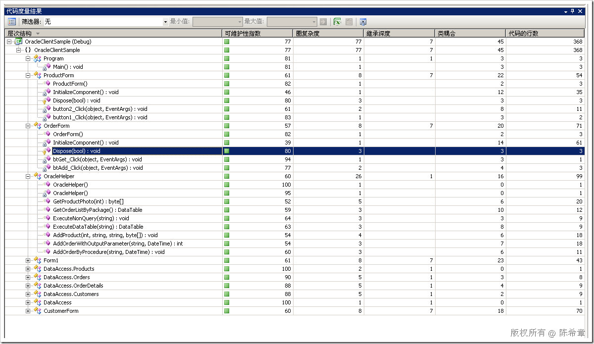

# .NET : 在VS2008中计算代码度量值 
> 原文发表于 2009-07-12, 地址: http://www.cnblogs.com/chenxizhang/archive/2009/07/12/1521879.html 

从VS2008开始，有一个新的工具可以帮助开发人员更好地了解自己编写的代码。这个工具就是“计算代码度量值”  

  

 关于该功能及几个指标的具体介绍，请参考下面的官方文档 

 代码度量是一组软件度量值，使开发人员可以更好地了解他们正在开发的代码。利用代码度量，开发人员可以了解哪些类型和/或方法应该返工或进行更彻底的测试。开发团队可以识别潜在的风险、了解项目的当前状态，并跟踪软件开发的进度。 软件度量值  下面的列表显示了 Visual Studio 计算的代码度量结果： * **可维护性指数** – **计算一个介于 0 和 100 之间的指数值，表示维护代码的相对容易度。值越大表示可维护性越好**。该计算基于 Halstead Volume、圈复杂度和代码的行数。按颜色标记的等级可用于迅速发现代码中的故障点。绿色等级介于 20 和 100 之间，表示代码的可维护性良好。黄色等级介于 10 和 19 之间，表示代码的可维护性中等。红色等级是介于 0 和 9 之间的等级，表示可维护性低。

* 圈复杂度 – 衡量代码在结构上的复杂程度。它通过计算程序流中的不同代码路径的数目（例如 if 块、switch case 以及 do、while、foreach 和 for 循环），然后在总数中加 1 来创建。**具有复杂控制流的程序需要更多单元测试才能实现良好的代码覆盖率，并且不容易维护。**

* 继承深度 – **指明扩展到类层次结构根的类定义的数目。层次结构越深，则越难了解特定方法和字段是在何处定义或/和重新定义的。**在类级别，该数目是通过计算继承树中从 0 开始的类型之上的类型数目（不包括接口）来创建的。在命名空间和项目级别，该计算包括命名空间或项目内所有类型的最高继承深度计算。

* 类耦合 – 通过参数、局部变量、返回类型、方法调用、泛型或模板实例化、基类、接口实现、在外部类型上定义的字段以及属性修饰来衡量与唯一类的耦合程度。该计算不包括基元类型和内置类型，例如 int32、字符串和对象。良好的软件设计要求类型和方法应具有较高的内聚力和较低的耦合。**耦合较高表示设计难以重用和维护，这是因为它与其他类型之间存在许多依存关系。**

* 代码的行数 – 指明代码中的大概行数。**该计数基于 IL 代码，因此并不是源代码文件中的确切行数**。该计算不包括空白、注释、括号以及成员、类型和命名空间的声明。计数过高可能表示某个类型或方法正在尝试执行过多的工作，应予以拆分。还可能表示该类型或方法难以维护。

 匿名方法  “匿名方法”就是没有名称的方法。匿名方法通常用于将代码块作为委托参数进行传递。在某个成员（如方法或访问器）中声明的匿名方法的度量结果与声明该方法的成员相关联，而不与调用该方法的成员关联。 有关代码度量如何处理匿名方法的更多信息，请参见[匿名方法和代码分析](http://msdn.microsoft.com/zh-cn/library/bb514189.aspx)。 生成的代码  某些软件工具和编译器会生成一些代码并添加到项目中，而项目开发人员看不到这些代码，或者不能更改这些代码。在代码度量计算度量值时，通常会忽略生成的代码。这样，度量值便可以反映开发人员能够看到和更改的内容。 不会忽略为 Windows 窗体生成的代码，因为开发人员可以看到和更改这些代码。 “代码度量结果”窗口  当 Visual Studio 分析代码后，将在“代码度量结果”窗口中显示结果。该窗口顶部有一个工具栏，还有一些用于显示计算结果的列。 “层次结构”列包含一个代码层次结构树视图，您可以展开或折叠此视图以查看所需的详细信息级别。其余各列显示计算的结果。您可以根据需要隐藏或排列结果列。有关更多信息，请参见[如何：添加、移除列或对列进行重排](http://msdn.microsoft.com/zh-cn/library/bb385912.aspx)。 “可维护性”列中除了数字结果外还包含一个图标。**绿色图标表示可维护性程度相对较高。黄色图标表示中等可维护性程度。红色图标表示可维护性低或存在潜在的故障点。**这些颜色指示符与 FxCop 规则 AvoidUnmaintainableCode 所使用的严重级别相对应。如果可维护性指数低于 10，则此规则将激发错误；如果指数介于 10 和 20 之间，则激发警告；如果指数高于 20，则既不激发错误，也不激发警告。可维护性指数是以下三种度量值的综合体现：圈复杂度、代码行数以及算术复杂度。可维护性指数的值没有单位。 您可以按任何列对该窗口中的结果进行排序。若要进行排序，请单击列标题。再次单击该列标题，该窗口将按相反的顺序排序。  本文由作者：[陈希章](http://www.xizhang.com) 于 2009/7/12 11:31:34 发布在：<http://www.cnblogs.com/chenxizhang/>  
 本文版权归作者所有，可以转载，但未经作者同意必须保留此段声明，且在文章页面明显位置给出原文连接，否则保留追究法律责任的权利。   
 更多博客文章，以及作者对于博客引用方面的完整声明以及合作方面的政策，请参考以下站点：[陈希章的博客中心](http://www.xizhang.com/blog.htm) 

