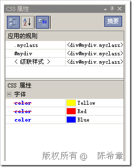
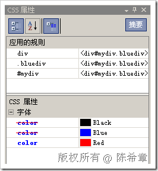

# CSS应用及其优先级问题 
> 原文发表于 2009-07-12, 地址: http://www.cnblogs.com/chenxizhang/archive/2009/07/12/1522055.html 

在网页设计的时候，我们对于格式化的部分，通常都是通过CSS来实现的。编写CSS样式有几种方式

 1. 内联的

 所谓内联(inline)，就是说直接在元素处通过style这个attribute定义。例如

 <div  style="color:Blue">  
    hello,world  

 显然，这种方式的话，必须为每个元素都去定义，非常繁琐。除了个别的情况，我们都不推荐这么做。

  

 2. 内部的

 为了实现样式的共享，例如一批div都希望设置颜色为blue，那么其实没有必要为每个div去设置一个style，而是可以直接在页面style即可，例如

  这段定义一般是被放在head里面的。如此定义之后，该页面中所有的div就可以使用统一的颜色设置了，不管有多少个div。

 但是，假设页面上有很多div，但只有一部分div需要设置颜色为blue，那又该怎么办呢？

 我们可以css语法中的类选择器和ID选择器的定义方式来做

 类选择器：

  需要注意的是，我们定义了一个特殊的名字，叫做bluediv，而且在它的前面加了一个点(.)，这就表示是一个类。与之前直接定义div的style不同，需要使用这个类的div必须明确地声明，如下 
  
    hello,world  

 我们通过class这个attribute来指定当前的div需要使用bluediv这个类样式。

 除了使用类选择器，还可以使用ID选择器，就是说，可以为某个特定ID的元素匹配一个样式规则。例如

  注意：我们用#来表示这个样式是针对ID的。要使用该样式，需要修改div的定义如下

 <div  id="mydiv">  
    hello,world  

 3. 外部的

 上面介绍的内部定义样式可以实现页面级别的样式共享，例如给一批div，或者其他元素统一设置某个样式。但如果要实现更加广泛的共享，例如跨页面的样式共享，则可能会将这些样式定义转移到一个单独的文件中去。例如default.css

 .myclass  
{  
    color:Yellow;  
} 然后，在页面中引用该样式表文件

 <link rel="Stylesheet" href="default.css" />

 至于在元素上面的定义，跟第二种情况是一样的：如果直接用元素名（例如div)定义样式，则元素无需任何设置即可使用该样式；如果使用类选择器，则元素上要定义class这个attribute；如果使用ID选择器，则元素上要定义id这个attribute

  

 最后要说一个话题就是：如果上述多种方式重叠了，例如同时使用了上面三种方式中的多种方式，那么会怎么样呢？

 例如，我们下面这个 div，既使用了ID选择器，又使用了class选择器，还直接使用内联的方式定义了style

 <div  id="mydiv" class="myclass" style="color:Blue">  
    hello,world  

 这种情况下，就会有一个优先级的问题：内联是最优先的，其次是内部，然后才是外部。  

 但是，还有一种情况：假设我们在页面内部定义的样式包含如下

  然后，我们给某个div元素绑定的样式声明是下面这样：

 <div  id="mydiv" class="bluediv">  
    hello,world  

 这其实会同时使用上面三个样式规则。那么到底谁优先呢？答案是：ID选择器最优先，其次是类选择器，最后才是元素选择器。 

 本文由作者：[陈希章](http://www.xizhang.com) 于 2009/7/12 19:13:48 发布在：<http://www.cnblogs.com/chenxizhang/>  
 本文版权归作者所有，可以转载，但未经作者同意必须保留此段声明，且在文章页面明显位置给出原文连接，否则保留追究法律责任的权利。   
 更多博客文章，以及作者对于博客引用方面的完整声明以及合作方面的政策，请参考以下站点：[陈希章的博客中心](http://www.xizhang.com/blog.htm) 

