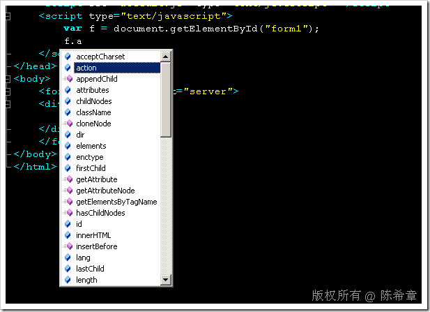
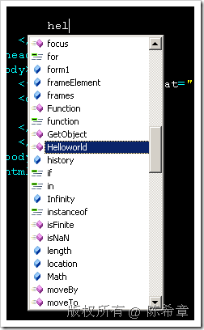
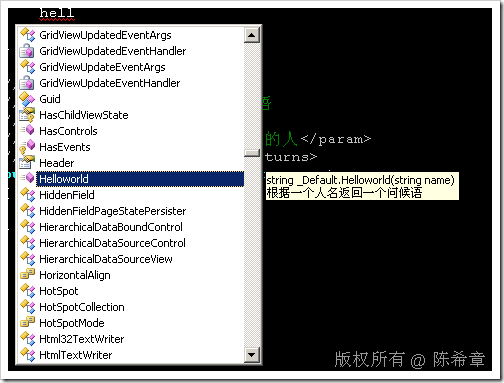
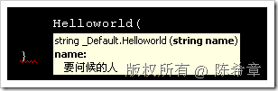
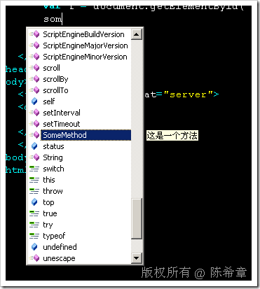
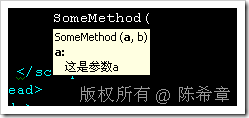

# 如何为javascript代码编写注释以支持智能感知 
> 原文发表于 2009-07-12, 地址: http://www.cnblogs.com/chenxizhang/archive/2009/07/12/1522058.html 

在使用Visual Studio做开发的时候，智能感知是非常方便的。从VS2008开始，提供了对javascript的智能感知支持。例如

  

 上述代码中，我们先用document对象的getElementById的方式取得了文档中的一个Id为form1的元素，实际上就是默认的那个窗体元素。然后，我们将其赋给一个名为f的变量。

 然后，我们在使用f 这个变量的时候，就能自动地列出该form元素所应该有的一些成员，例如action等等。

 这些属于是默认的元素和方法的智能感知，假设我们自己有一些自定义js代码，如何让它也能够智能感知呢？

 答案是：对于自定义方法的智能感知，是自动的。

 例如，我们在页面中添加一个方法如下

 function Helloworld(name) {  
    alert("hello," + name);  
} 然后在文档的任何一个部分，我们想调用该方法，都可以自动地被智能感知识别到

  

 这种智能感知应该是最基本的。但是我们经常在用c#编写代码的时候，有另外一种更好的智能感知：就是说不光是列出方法名，而且会有对该方法以及它的参数，返回值的详细描述，这样使用者就可以更好地使用该方法了。如下所示

  

  

 这是怎么实现的呢?其实这是通过注释来实现的，如下面所示

 /// 
  
/// 根据一个人名返回一个问候语  
/// 
  
/// <param name="name">要问候的人</param>  
/// <returns>返回的问候语</returns>  
public string Helloworld(string name)  
{  
    return "hello," + name;  
} 这种注释我们称为XML注释，是从.NET 2.0开始提供的一种新功能。

  

 好，了解了上面的知识后，如果我们需要为我们的javascript代码添加类似的智能感知提示，那么能不能也用注释呢？

 是的，我们的确可以这么做

 function SomeMethod(a, b) {  
    /// 
  
    /// 这是一个方法  
    /// 
  
    /// <param name="a">这是参数a</param>  
    /// <param name="b">这是参数b</param>  
    /// <returns>方法的返回值</returns>  
    return "Hello,worod";  
} 有一点不同的是，这些注释是写在方法内部的，而不像C#那样写在方法外部。而且，如果要实现这样的功能，以上函数就不能直接在aspx页面中编写，而是要单独写一个js文件。如default.js 然后在aspx中添加对该js的引用   

 本文由作者：[陈希章](http://www.xizhang.com) 于 2009/7/12 19:17:26 发布在：<http://www.cnblogs.com/chenxizhang/>  
 本文版权归作者所有，可以转载，但未经作者同意必须保留此段声明，且在文章页面明显位置给出原文连接，否则保留追究法律责任的权利。   
 更多博客文章，以及作者对于博客引用方面的完整声明以及合作方面的政策，请参考以下站点：[陈希章的博客中心](http://www.xizhang.com/blog.htm) 

