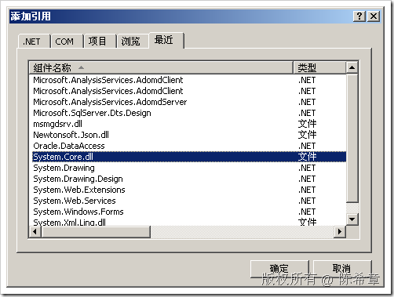

# .NET : Func委托和Action委托 
> 原文发表于 2009-07-12, 地址: http://www.cnblogs.com/chenxizhang/archive/2009/07/12/1522073.html 

上一篇我们讲到了如何在ASP.NET页面中实现异步任务。我们来回顾一下里面一个特殊的类型：LongTimeTask

 public class LongTimeTask  
{  
    public string Result = string.Empty;  
    **public HelloWorldHandler handler;**      **public delegate string HelloWorldHandler();**    public string HelloWorld()  
    {  
        Thread.Sleep(5000);  
        return "Hello,world";  
    }     public IAsyncResult OnBegin(object sender, EventArgs e,  
AsyncCallback cb, object extraData)  
    {  
**handler = new HelloWorldHandler(this.HelloWorld);  
        return handler.BeginInvoke(cb, extraData);**     }     public void OnEnd(IAsyncResult ar)  
    {  
**Result = handler.EndInvoke(ar);**  
    }     public void OnTimeout(IAsyncResult ar)  
    {  
        Result = "超时了";  
    }  
} 我们真正要执行是HelloWorld，但是，为了能够异步调用该方法，所以我们定义了一个delegate(委托），上面红色标出的代码就可以看到，这个delegate其实是我们全部代码中的灵魂。 我这一篇讨论的是：以前我们为了能够调用一个方法，必须比照这个方法定义一个相应的delegate，这个是否能有更好的实现办法呢？ 答案是：有，也就是有通用的delegate了。在.NET Framework 3.5中，提供了两类通用的delegate。 1. 如果方法有返回值，则使用Func，或者Func<>
2. 如果方法没有返回值，则使用Action，或者Action<>

 关于这两个委托的详细资料，大家可以参考MSDN的文档

  

 要使用这两个delegate，必须引用System.Core.dll

 

 下面来看修改好的代码

 using System;  
using System.Threading; namespace WebApplication2  
{  
    public class LongTimeTask  
    {  
        public string Result = string.Empty;  
**public Func<string> handler;**          public delegate string HelloWorldHandler();  
        public string HelloWorld()  
        {  
            Thread.Sleep(5000);  
            return "Hello,world";  
        }         public IAsyncResult OnBegin(object sender, EventArgs e,  
    AsyncCallback cb, object extraData)  
        {  
            **handler = new Func<string>(this.HelloWorld);**            return handler.BeginInvoke(cb, extraData);         }         public void OnEnd(IAsyncResult ar)  
        {  
            Result = handler.EndInvoke(ar);  
        }         public void OnTimeout(IAsyncResult ar)  
        {  
            Result = "超时了";  
        }  
    }  
}  本文由作者：[陈希章](http://www.xizhang.com) 于 2009/7/12 20:06:38 发布在：<http://www.cnblogs.com/chenxizhang/>  
 本文版权归作者所有，可以转载，但未经作者同意必须保留此段声明，且在文章页面明显位置给出原文连接，否则保留追究法律责任的权利。   
 更多博客文章，以及作者对于博客引用方面的完整声明以及合作方面的政策，请参考以下站点：[陈希章的博客中心](http://www.xizhang.com/blog.htm) 

