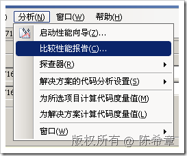
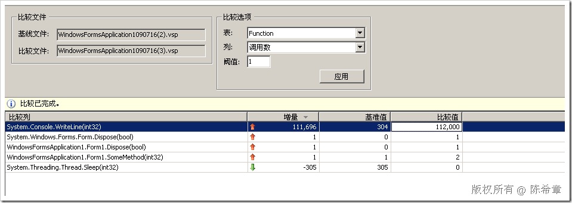

# VSTS : 比较性能基准 
> 原文发表于 2009-07-16, 地址: http://www.cnblogs.com/chenxizhang/archive/2009/07/16/1524903.html 

我们在对代码性能进行调优的时候，通常有这样一个希望：调优之后能不能有什么办法直观地让我们看到改善的情况，例如哪些指标是提高了，哪些指标反而是下降了等等。  
在VSTS的开发人员版中提供了这样的工具，做法就是做两次性能检测，然后比较他们的报告

  

 比较的结果大致如下

 

 本文由作者：[陈希章](http://www.xizhang.com) 于 2009/7/16 15:17:16 发布在：<http://www.cnblogs.com/chenxizhang/>  
 本文版权归作者所有，可以转载，但未经作者同意必须保留此段声明，且在文章页面明显位置给出原文连接，否则保留追究法律责任的权利。   
