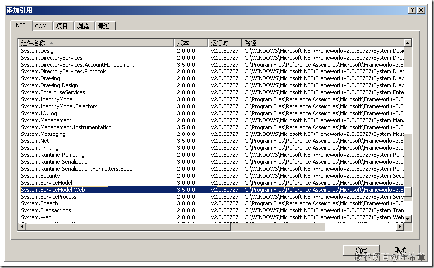
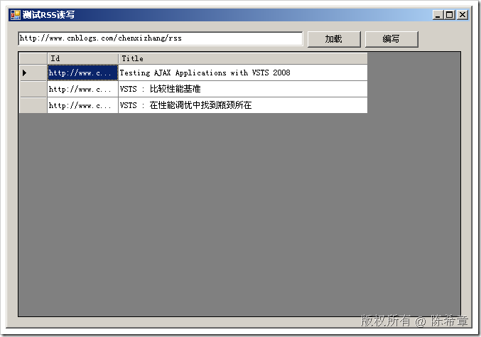
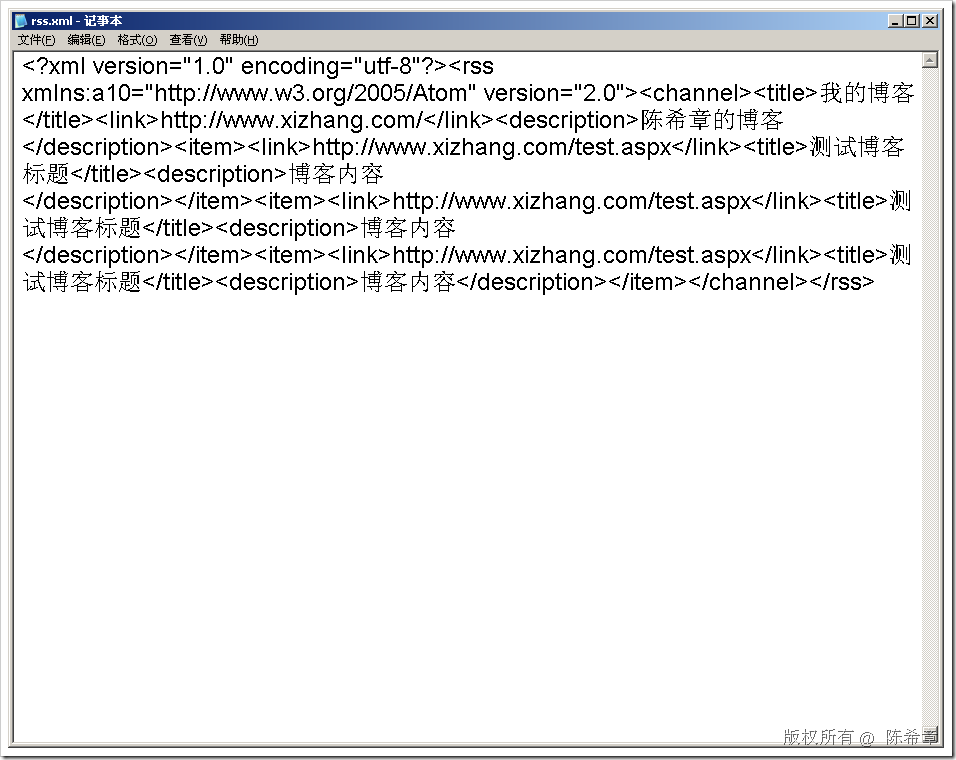
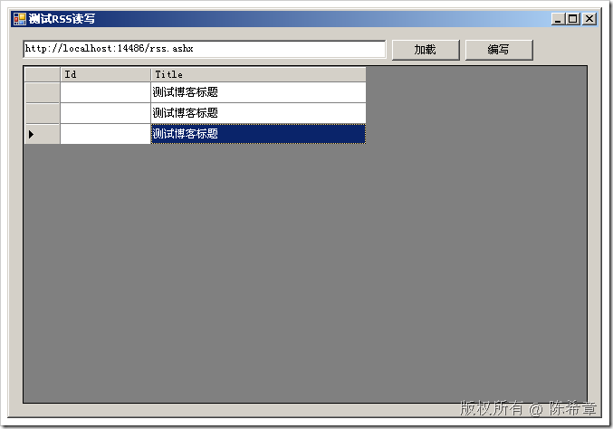

# .NET 3.5 : 读写RSS或者ATOM 
> 原文发表于 2009-07-16, 地址: http://www.cnblogs.com/chenxizhang/archive/2009/07/16/1525000.html 

在.NET 3.5中提供了一套全新的接口来实现对RSS和ATOM这两种数据文件的读写。非常方便。下面演示一下

 1. 首先要添加一个引用System.ServiceModel.Web

  

  

 using System.ServiceModel.Syndication;  
using System.Xml;  

  

 2. 读取RSS的代码

 /// 
  
/// 从一个远程站点读取RSS  
/// 
  
/// <param name="sender"></param>  
/// <param name="e"></param>  
private void btLoad\_Click(object sender, EventArgs e)  
{  
    SyndicationFeed feed = SyndicationFeed.Load(XmlReader.Create(feedaddress.Text));  
    var items = from item in feed.Items  
                where item.Title.Text.Contains("VSTS")  
                orderby item.PublishDate descending  
                select new { Id = item.Id, Title = item.Title.Text };     dgvResult.DataSource = items.ToArray();  
} 效果如下  3. 写入RSS的代码如下 /// 
  
/// 构造一个RSS  
/// 
  
/// <param name="sender"></param>  
/// <param name="e"></param>  
private void btCreate\_Click(object sender, EventArgs e)  
{  
    SyndicationFeed feed = new SyndicationFeed(  
        "我的博客",   
        "陈希章的博客",   
        new Uri("<http://www.xizhang.com/")>,  
        new[]{  
            new SyndicationItem("测试博客标题", "博客内容", new Uri("<http://www.xizhang.com/test.aspx"))>,  
            new SyndicationItem("测试博客标题", "博客内容", new Uri("<http://www.xizhang.com/test.aspx"))>,  
            new SyndicationItem("测试博客标题", "博客内容", new Uri("<http://www.xizhang.com/test.aspx"))>  
        }  
        );     XmlWriter xw = XmlWriter.Create("rss.xml");  
    feed.SaveAsRss20(xw);  
    xw.Close();  
} 效果如下

  

 4. 结合ashx实现网站的RSS整合

 using System;  
using System.Web;  
using System.Web.Services;  
using System.ServiceModel.Syndication;  
using System.Xml; namespace WebApplication1  
{  
    /// 
  
    /// $codebehindclassname$ 的摘要说明  
    /// 
  
    [WebService(Namespace = "<http://tempuri.org/")]>  
    [WebServiceBinding(ConformsTo = WsiProfiles.BasicProfile1\_1)]  
    public class RSS : IHttpHandler  
    {         public void ProcessRequest(HttpContext context)  
        {  
            SyndicationFeed feed = new SyndicationFeed(  
                "我的博客",  
                "陈希章的博客",  
                new Uri("<http://www.xizhang.com/")>,  
                new[]{  
                    new SyndicationItem("测试博客标题", "博客内容", new Uri("<http://www.xizhang.com/test.aspx"))>,  
                    new SyndicationItem("测试博客标题", "博客内容", new Uri("<http://www.xizhang.com/test.aspx"))>,  
                    new SyndicationItem("测试博客标题", "博客内容", new Uri("<http://www.xizhang.com/test.aspx"))>  
                }  
                );             XmlWriter xw = XmlWriter.Create(context.Response.OutputStream);  
            feed.SaveAsRss20(xw);  
            xw.Close();  
            context.Response.End();  
        }         public bool IsReusable  
        {  
            get  
            {  
                return false;  
            }  
        }  
    }  
}

在客户端读取的效果如下  

    5. 结合数据库的案例

 using System;  
using System.Web;  
using System.Web.Services;  
using System.ServiceModel.Syndication;  
using System.Xml;  
using System.Data;  
using System.Linq; namespace WebApplication1  
{  
    /// 
  
    /// $codebehindclassname$ 的摘要说明  
    /// 
  
    [WebService(Namespace = "<http://tempuri.org/")]>  
    [WebServiceBinding(ConformsTo = WsiProfiles.BasicProfile1\_1)]  
    public class RSS : IHttpHandler  
    {         public void ProcessRequest(HttpContext context)  
        {             DataTable tb = new DataTable();  
            tb.Columns.AddRange(  
                new[]{  
                    new DataColumn("Title"),  
                    new DataColumn("Contents"),  
                    new DataColumn("Link")  
                });  
            //这里可以假设读取一些数据过来             var items = from DataRow row in tb.Rows  
                        select new SyndicationItem(row.Field<string>(0), row.Field<string>(1), new Uri(row.Field<string>(2)));             SyndicationFeed feed = new SyndicationFeed(  
                "我的博客",  
                "陈希章的博客",  
                new Uri("<http://www.xizhang.com/")>,  
                items.ToArray()  
                );             XmlWriter xw = XmlWriter.Create(context.Response.OutputStream);  
            feed.SaveAsRss20(xw);  
            xw.Close();  
            context.Response.End();  
        }         public bool IsReusable  
        {  
            get  
            {  
                return false;  
            }  
        }  
    }  
}

 本文由作者：[陈希章](http://www.xizhang.com) 于 2009/7/16 16:48:36 发布在：<http://www.cnblogs.com/chenxizhang/>  
 本文版权归作者所有，可以转载，但未经作者同意必须保留此段声明，且在文章页面明显位置给出原文连接，否则保留追究法律责任的权利。   
 更多博客文章，以及作者对于博客引用方面的完整声明以及合作方面的政策，请参考以下站点：[陈希章的博客中心](http://www.xizhang.com/blog.htm) 

