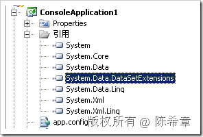
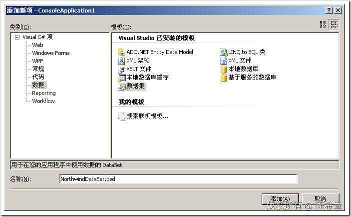
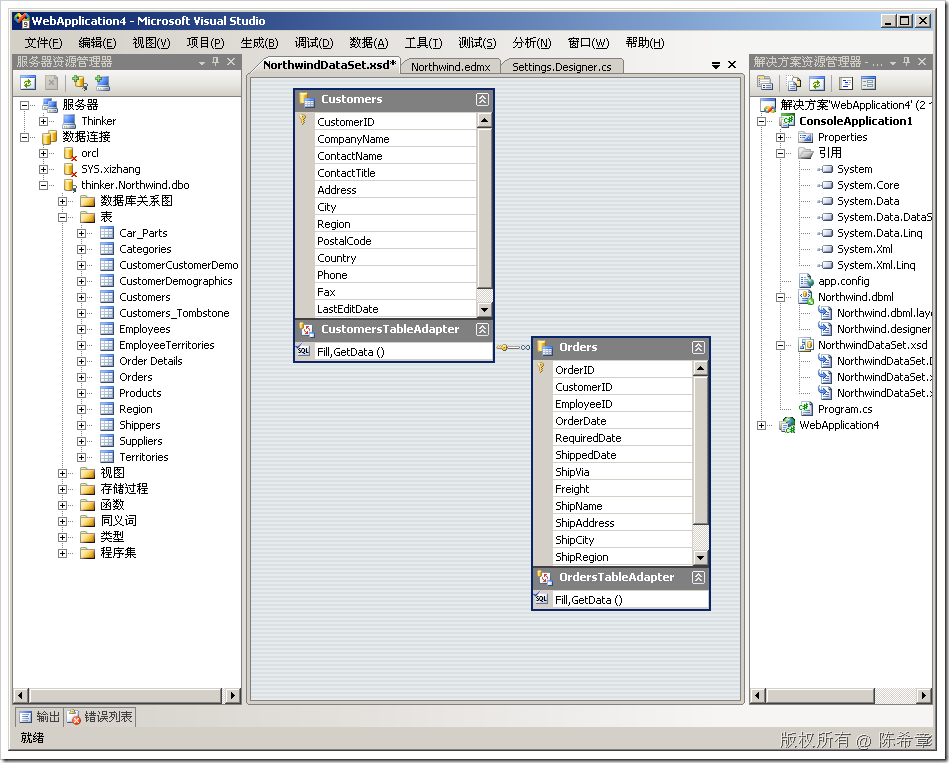

# 再谈谈LINQ TO DataSet 
> 原文发表于 2009-07-17, 地址: http://www.cnblogs.com/chenxizhang/archive/2009/07/17/1525297.html 

首先，这个功能是通过扩展方法来实现的，需要引用System.Data.DataSetExtensions这个程序集

  

 其次，针对DataSet有两种情况

 第一种是非类型话的DataSet，下面代码是一个示例

 DataSet ds = new DataSet(); using (SqlConnection conn = new SqlConnection("server=(local);database=northwind"))  
{  
    using (SqlCommand cmd = conn.CreateCommand())  
    {  
        cmd.CommandText = "SELECT * FROM Customers";  
        SqlDataAdapter adapter = new SqlDataAdapter(cmd);         adapter.Fill(ds, "Customers");         cmd.CommandText = "SELECT * FROM Orders";  
        adapter.Fill(ds, "Orders");  
    }  
} DataRow defaultRow=ds.Tables["Orders"].NewRow();  
defaultRow["OrderID"] = -1;  
defaultRow["OrderDate"] = DateTime.Now; var query=from c in ds.Tables["Customers"].**AsEnumerable()**  
          join o in ds.Tables["Orders"].AsEnumerable() on c.Field<string>("CustomerID") equals o.Field<string>("CustomerID") into g  
          from item in g.DefaultIfEmpty(defaultRow)//这里是为了实现左外连接，因为有的客户可能没有订单  
          select new{  
              CustomerID=c.**Field<string>**("CustomerID"),  
              CompanyName=c.Field<string>("CompanyName"),  
              OrderID=item.Field<int>("OrderID"),  
              OrderDate=item.Field<Nullable<DateTime>>("OrderDate")  
          }; foreach (var item in query)  
{  
    Console.WriteLine(item);  
} 现在我们可以针对不同的表直接进行JOIN或者其他所有的LINQ操作，例如ORDER BY，GROUP BY等等

  

 第二种是针对类型化的DataSet，也就是我们常说的强类型数据集。使用它们太方便了，就是对象操作。

  

 所以，强烈建议要创建强类型的数据集

  

  

 如果是使用强类型的数据集，则读取数据及处理数据的工作都会变得很方便和可靠

    NorthwindDataSet northwind = new NorthwindDataSet();  
           NorthwindDataSetTableAdapters.CustomersTableAdapter a = new NorthwindDataSetTableAdapters.CustomersTableAdapter();  
           a.Fill(northwind.Customers);  
           NorthwindDataSetTableAdapters.OrdersTableAdapter o = new NorthwindDataSetTableAdapters.OrdersTableAdapter();  
           o.Fill(northwind.Orders);            NorthwindDataSet.OrdersRow defaultrow=northwind.Orders.NewOrdersRow();  
           defaultrow.OrderID=-1;  
           defaultrow.OrderDate=DateTime.Now;            var query = from customer in northwind.Customers  
                       join order in northwind.Orders on customer.CustomerID equals order.CustomerID into orders  
                       from item in orders.DefaultIfEmpty(defaultrow)  
                       select new  
                       {  
                           CustomerID = customer.CustomerID,  
                           CompanyName = customer.CompanyName,  
                           OrderID = item.OrderID,  
                           OrderDate=item.Field<Nullable<DateTime>>("OrderDate")  
                       }; 

 本文由作者：[陈希章](http://www.xizhang.com) 于 2009/7/17 9:19:38 发布在：<http://www.cnblogs.com/chenxizhang/>  
 本文版权归作者所有，可以转载，但未经作者同意必须保留此段声明，且在文章页面明显位置给出原文连接，否则保留追究法律责任的权利。   
 更多博客文章，以及作者对于博客引用方面的完整声明以及合作方面的政策，请参考以下站点：[陈希章的博客中心](http://www.xizhang.com/blog.htm) 

