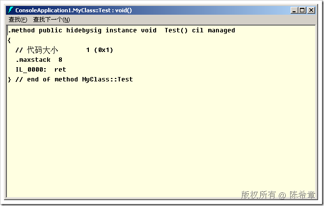
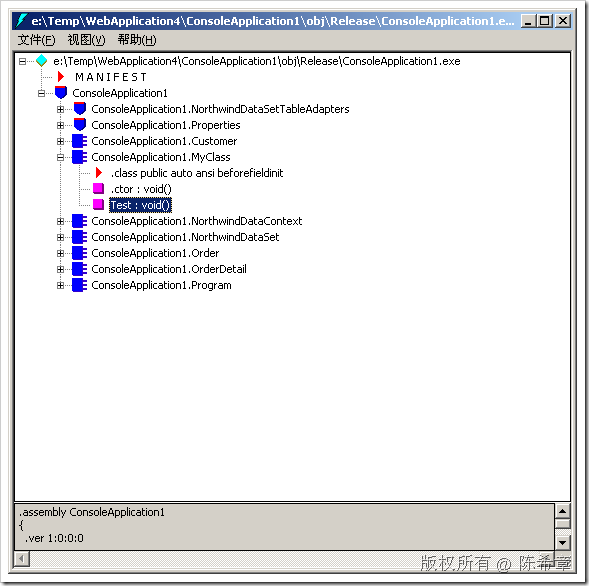

# C# 3.0: 局部方法(partial method)及其特点 
> 原文发表于 2009-07-17, 地址: http://www.cnblogs.com/chenxizhang/archive/2009/07/17/1525324.html 

我们知道，在C# 2.0中引入了一个局部类(partial class)的概念，它允许我们在不同的文件中编写一个类型的多个部分，编译器会做合并编译。

 C# 3.0又开始引入了一个新的语法：局部方法

 它的思路大致是这样：方法声明和方法实现可以分开来做。

 public partial class MyClass  
{  
    //声明方法  
   partial void SomeMethod();      
} public partial class MyClass  
{  
    //实现方法  
   partial void SomeMethod()  
    {  
        Console.WriteLine("Hello,worod");  
    }   
} 但是要注意的是，该方法并不能被外部直接调用，你不可以给它加上类似public这样的访问修饰符。 那么，这就奇怪了。它到底有什么用意呢？ 其实，它正是只能用于类型内部访问。可以试想一下，我们在设计一个类型的时候，可能会有这样的情况：某个操作是需要的，但在类型设计阶段还不知道如何实现。所以，我们需要先放置一个占位符。 public partial class MyClass  
{  
    //声明方法  
   partial void SomeMethod();    public void Test()  
   {  
       SomeMethod();//这个方法要调用SomeMethod,但SomeMethod目前还不知道如何实现  
   }  
}  

 我们类型内部有一个Test方法，它试图要去调用SomeMethod，即便现在还不知道如何实现。

 那么，你可能会问，如何我们后来就压根没有去实现SomeMethod呢？怎么办呢？这是一个好问题！

 事实上，编译器会检测这种情况，如果某个方法虽然声明了，但没有实现，它不会被编译进去，所有对其的调用代码也会被移除。

  

  

 很显然，因为这种特性，局部方法只适用于void类型的方法，即没有返回值的。

 本文由作者：[陈希章](http://www.xizhang.com) 于 2009/7/17 9:45:57 发布在：<http://www.cnblogs.com/chenxizhang/>  
 本文版权归作者所有，可以转载，但未经作者同意必须保留此段声明，且在文章页面明显位置给出原文连接，否则保留追究法律责任的权利。   
 更多博客文章，以及作者对于博客引用方面的完整声明以及合作方面的政策，请参考以下站点：[陈希章的博客中心](http://www.xizhang.com/blog.htm) 

