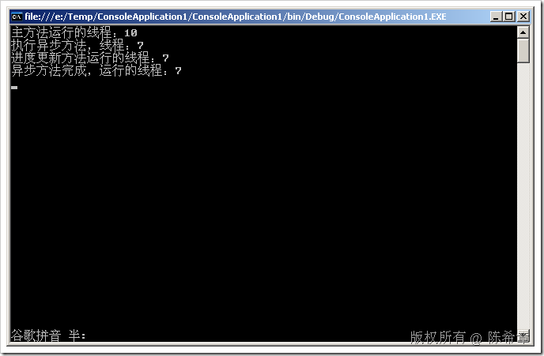

# .NET : 再谈谈多线程 
> 原文发表于 2009-07-21, 地址: http://www.cnblogs.com/chenxizhang/archive/2009/07/21/1527440.html 

这几天在讲.NET核心编程时再次探讨到了多线程这一部分。其中，我们讨论到如果使用BackgroundWorker这个组件的话，那么它的几个事件到底是运行在几个线程的。下面是一个例子 using System;  
using System.Collections.Generic;  
using System.Linq;  
using System.Text;  
using System.ComponentModel;  
using System.Threading; namespace ConsoleApplication1  
{  
    class Program  
    {  
        static void Main(string[] args)  
        {  
            BackgroundWorker worker = new BackgroundWorker();  
            worker.DoWork += new DoWorkEventHandler(worker\_DoWork);  
            worker.RunWorkerCompleted += new RunWorkerCompletedEventHandler(worker\_RunWorkerCompleted);  
            worker.ProgressChanged += new ProgressChangedEventHandler(worker\_ProgressChanged);  
            worker.WorkerReportsProgress = true;             Console.WriteLine("主方法运行的线程：{0}", Thread.CurrentThread.ManagedThreadId);             worker.RunWorkerAsync();             Console.Read();  
        }         static void worker\_ProgressChanged(object sender, ProgressChangedEventArgs e)  
        {  
            Console.WriteLine("进度更新方法运行的线程：{0}", Thread.CurrentThread.ManagedThreadId);         }         static void worker\_RunWorkerCompleted(object sender, RunWorkerCompletedEventArgs e)  
        {  
            Console.WriteLine("异步方法完成，运行的线程：{0}", Thread.CurrentThread.ManagedThreadId);  
        }         static void worker\_DoWork(object sender, DoWorkEventArgs e)  
        {  
            Console.WriteLine("执行异步方法，线程：{0}", Thread.CurrentThread.ManagedThreadId);  
            BackgroundWorker worker = (BackgroundWorker)sender;  
            worker.ReportProgress(10);  
        }  
    }  
}   答案是：有时候是这样   有时候又这样（我在Do\_Work事件里面加了一个Sleep之后的效果）  这的确有点让人捉摸不透。这意味着什么呢？我想，这意味着，只有一点是可以确认的：主方法运行在一个线程，而要后台操作的方法运行在另外一个线程，至于这个后台方法的进度汇报或者完成事件，则可能与后台方法在一个线程，也可能不在一个线程。这估计是取决于后台方法本身所消耗的时间，以及运行环境的线程利用情况而定。 以上行为在Windows Forms的原理**却不是一样的**

 using System;  
using System.ComponentModel;  
using System.Windows.Forms;  
using System.Threading; namespace WindowsFormsApplication1  
{  
    public partial class Form1 : Form  
    {  
        public Form1()  
        {  
            InitializeComponent();             BackgroundWorker worker = new BackgroundWorker();  
            worker.DoWork += new DoWorkEventHandler(worker\_DoWork);  
            worker.RunWorkerCompleted += new RunWorkerCompletedEventHandler(worker\_RunWorkerCompleted);  
            worker.ProgressChanged += new ProgressChangedEventHandler(worker\_ProgressChanged);  
            worker.WorkerReportsProgress = true;             Console.WriteLine("主方法运行的线程：{0}", Thread.CurrentThread.ManagedThreadId);             worker.RunWorkerAsync();         }         static void worker\_ProgressChanged(object sender, ProgressChangedEventArgs e)  
        {  
            Console.WriteLine("进度更新方法运行的线程：{0}", Thread.CurrentThread.ManagedThreadId);         }         static void worker\_RunWorkerCompleted(object sender, RunWorkerCompletedEventArgs e)  
        {  
            Console.WriteLine("异步方法完成，运行的线程：{0}", Thread.CurrentThread.ManagedThreadId);  
        }         static void worker\_DoWork(object sender, DoWorkEventArgs e)  
        {  
            Console.WriteLine("执行异步方法，线程：{0}", Thread.CurrentThread.ManagedThreadId);  
            Thread.Sleep(5000);  
            BackgroundWorker worker = (BackgroundWorker)sender;  
            worker.ReportProgress(10);  
        }  
    }  
} **主方法运行的线程：8**  
执行异步方法，线程：9  
**进度更新方法运行的线程：8  
异步方法完成，运行的线程：8**

 **这是显然有必要的，因为异步方法进度更新或者完成的话，通常我们都需要更新窗体的元素（例如控件），如果此时的线程不是一样的话，就会导致线程安全问题。**   最后，总结一下BackgroundWorker这个组件的工作原理 RunWorkerAsync方法==》触发DoWork事件==》执行DoWork方法（运行在一个独立的线程）==》可以通过调用ReportProgress汇报进度==》触发ProgressChanged事件==》执行ProgressChanged方法==》如果DoWork方法完成了所有操作，则触发RunWorkerCompleted事件==》执行RunWorkerCompleted方法  本文由作者：[陈希章](http://www.xizhang.com) 于 2009/7/21 5:55:22 发布在：<http://www.cnblogs.com/chenxizhang/>  
 本文版权归作者所有，可以转载，但未经作者同意必须保留此段声明，且在文章页面明显位置给出原文连接，否则保留追究法律责任的权利。   
 更多博客文章，以及作者对于博客引用方面的完整声明以及合作方面的政策，请参考以下站点：[陈希章的博客中心](http://www.xizhang.com/blog.htm) 

