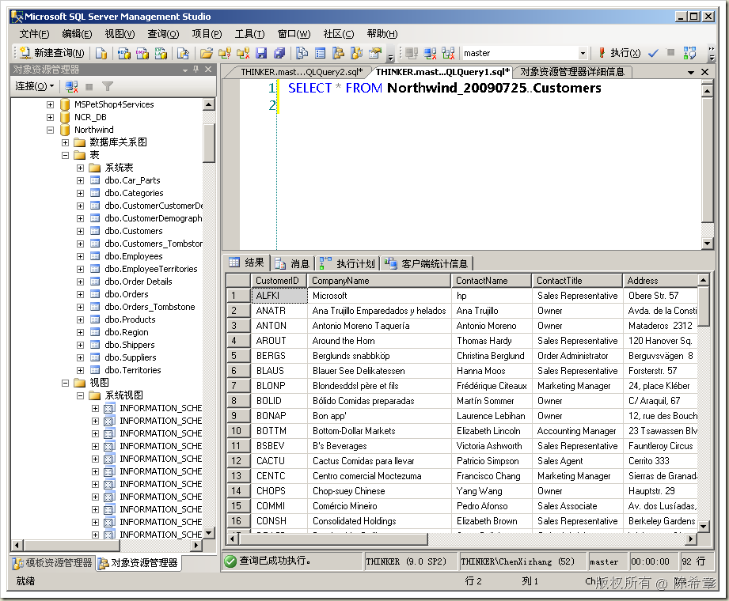
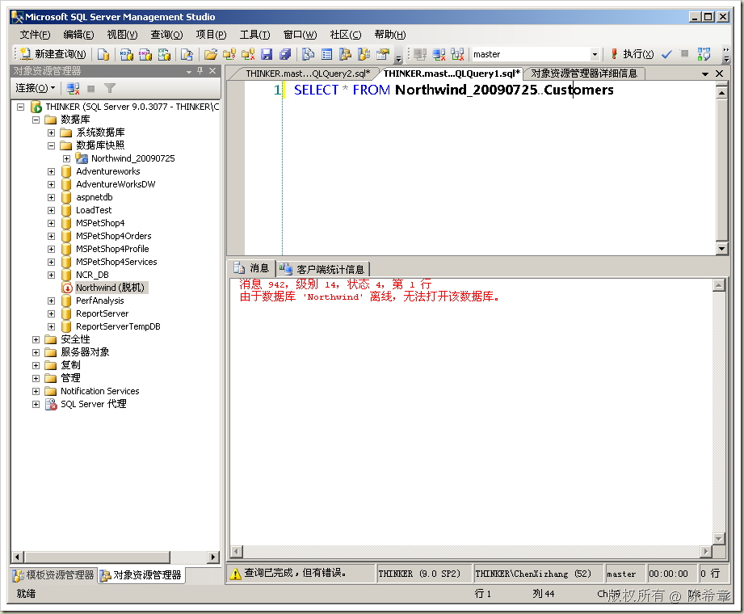

# SQL Server : 数据库快照及其查询 
> 原文发表于 2009-07-25, 地址: http://www.cnblogs.com/chenxizhang/archive/2009/07/25/1530986.html 

近日再次讲到SQL Server 2005中的数据库快照功能。这里做一个总结

 使用场景：

 * 只读的报表查询（可以有多个版本）
	+ 分担源数据库压力 + 将数据静止在某个时间* 对于人为失误问题的灾难恢复

 主要限制：

 * 要求企业版 * 数据库快照与源数据库必须在一个服务器实例 * 如果存在多个快照的话，就不可以使用其中某一个进行还原了

  

 实验步骤：

 1. 创建数据库快照

 -- =============================================  
-- Create Snapshot Template  
-- =============================================  
USE master  
GO -- Drop snapshot database if it already exists  
IF  EXISTS (  
    SELECT name   
        FROM sys.databases   
        WHERE name = N'Northwind\_20090725'  
)  
DROP DATABASE Northwind\_NorthwindTest  
GO -- Create the snapshot database  
CREATE DATABASE Northwind\_20090725 ON  
( NAME = Northwind, FILENAME =   
'E:\Temp\Northwind\_20090725.ss' )  
AS SNAPSHOT OF Northwind;  
GO  

 2. 查询数据库快照

 SELECT * FROM Northwind\_20090725..Customers

  

 3. 理解数据库快照查询的依赖关系

 我们都知道数据库快照这个功能最主要的一个特性就是所谓的"写入时复制",也就是说快照数据库最开始的时候并没有包含数据, 只有在源数据库的数据页发生变化的情况下,才会发生数据复制.

 但是不管数据有没有从源数据库复制到快照数据库,查询快照数据库都要求源数据库是在线的

 为了做这个测试，此时，如果设置源数据库的状态为脱机，则就无法完成查询

 ALTER DATABASE [Northwind] SET  OFFLINE

 

 本文由作者：[陈希章](http://www.xizhang.com) 于 2009/7/25 18:35:28 发布在：<http://www.cnblogs.com/chenxizhang/>  
 本文版权归作者所有，可以转载，但未经作者同意必须保留此段声明，且在文章页面明显位置给出原文连接，否则保留追究法律责任的权利。   
 更多博客文章，以及作者对于博客引用方面的完整声明以及合作方面的政策，请参考以下站点：[陈希章的博客中心](http://www.xizhang.com/blog.htm) 

