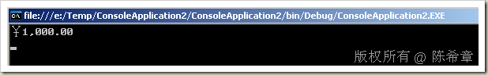

# .NET : 如何强制规定货币数据的区域性 
> 原文发表于 2009-07-26, 地址: http://www.cnblogs.com/chenxizhang/archive/2009/07/26/1531584.html 

今天在讲到多语言设计，其中讨论不同语言环境下的货币显示问题。我们一般都同意，可以针对页面的显示元素做多语言，但对于货币这个部分，应该还是要统一为一个，否则就很容易造成误会。例如￥1000和$1000当然差别是很大的。

 那么，怎么样确保一个货币数据，总是显示某种区域性呢？例如不管当前是什么样的语言设置，都显示人民币。

 答案是：可以在货币的ToString方法中指定zh-CN为其区域性。

 int total = 1000;  
Console.WriteLine(total.ToString("c",System.Globalization.CultureInfo.CreateSpecificCulture("zh-CN")));  本文由作者：[陈希章](http://www.xizhang.com) 于 2009/7/26 22:18:50 发布在：<http://www.cnblogs.com/chenxizhang/>  
 本文版权归作者所有，可以转载，但未经作者同意必须保留此段声明，且在文章页面明显位置给出原文连接，否则保留追究法律责任的权利。   

