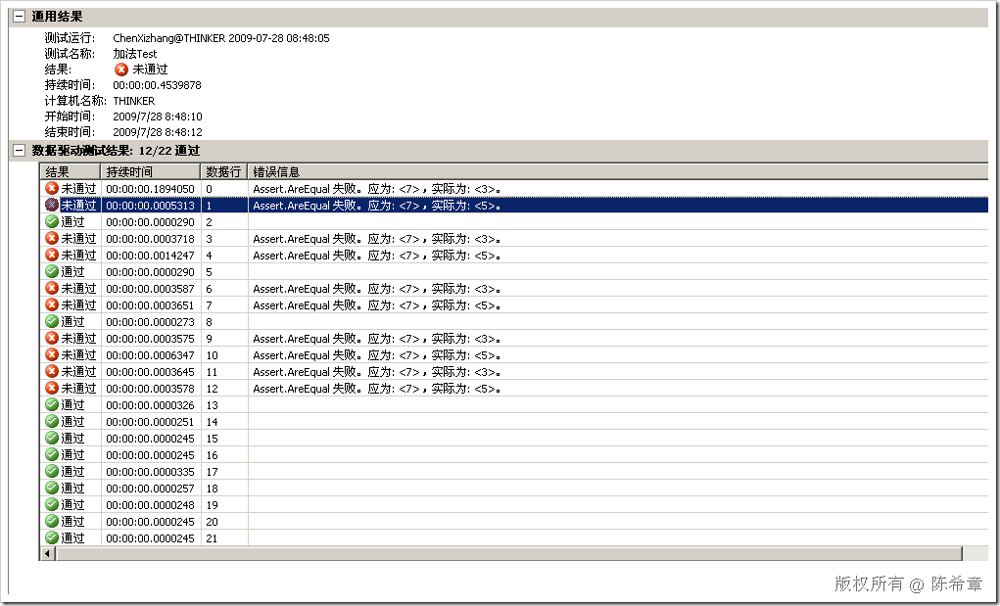

# .NET : 在单元测试中使用外部文件作为数据源 
> 原文发表于 2009-07-28, 地址: http://www.cnblogs.com/chenxizhang/archive/2009/07/28/1532664.html 


全文链接：<http://msdn.microsoft.com/zh-cn/library/ms243192(VS.80).aspx>

  

 核心的部分如下：

 1. 配置文件

 【注意】红色部分，如果是使用VS2008的话，需要改成Version=9.0.0.0

 dbq需要写一个绝对路径，否则找不到文件。

  


```
<?xml version="1.0" encoding="utf-8" ?>
<configuration>
    <configSections>
        <section name="microsoft.visualstudio.testtools" 
```

```
type="Microsoft.VisualStudio.TestTools.UnitTesting.TestConfigurationSection, 
```

```
Microsoft.VisualStudio.QualityTools.UnitTestFramework, **Version=8.0.0.0**, Culture=neutral, PublicKeyToken=b03f5f7f11d50a3a"/> 
    </configSections>
    <connectionStrings>
        <add name="MyJetConn" connectionString="Provider=Microsoft.Jet.OLEDB.4.0; Data Source=C:\testdatasource.mdb; Persist Security Info=False;" providerName="System.Data.OleDb" />
        <add name="MyExcelConn" connectionString="Dsn=Excel Files;**dbq=data.xls;**defaultdir=.; driverid=790;maxbuffersize=2048;pagetimeout=5" providerName="System.Data.Odbc" />
    </connectionStrings>
    <microsoft.visualstudio.testtools>
        <dataSources>
            <add name="MyJetDataSource" connectionString="MyJetConn" dataTableName="MyDataTable" dataAccessMethod="Sequential"/>
            <add name="MyExcelDataSource" connectionString="MyExcelConn" dataTableName="Sheet1$" dataAccessMethod="Sequential"/>
        </dataSources>
    </microsoft.visualstudio.testtools>
</configuration>
```

 


2. 测试代码


```
        [TestMethod()]
        [DeploymentItem("MyTestProject\\data.xls")]
        [DataSource("MyExcelDataSource")]
        public void MyTestMethod2()
        {
            Assert.AreEqual(**context.DataRow**["Val1"], context.DataRow["Val2"]);
        }
```

 


一个截图如下


[](http://images.cnblogs.com/cnblogs_com/chenxizhang/WindowsLiveWriter/9c0d834f0e9d.NET_82FD/image_2.png)


本文由作者：[陈希章](http://www.xizhang.com) 于 2009/7/28 9:59:07 
发布在：<http://www.cnblogs.com/chenxizhang/>  

本文版权归作者所有，可以转载，但未经作者同意必须保留此段声明，且在文章页面明显位置给出原文连接，否则保留追究法律责任的权利。   

更多博客文章，以及作者对于博客引用方面的完整声明以及合作方面的政策，请参考以下站点：[陈希章的博客中心](http://www.xizhang.com/blog.htm)
