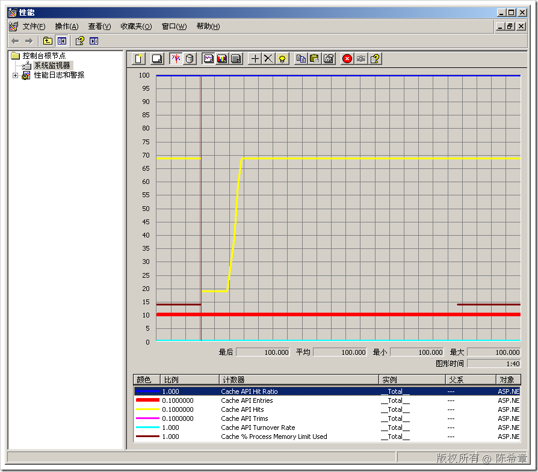

# .NET : 监控ASP.NET应用程序的缓存使用内存数变化和命中情况 
> 原文发表于 2009-07-28, 地址: http://www.cnblogs.com/chenxizhang/archive/2009/07/28/1532770.html 

在ASP.NET开发中，我经常强调，数据的合理缓存是对性能很重要的一个因素。关于ASP.NET的缓存，一般会有三种做法

 1. 页面缓存

 2. 控件缓存

 3. 数据缓存

 其中又以数据缓存这种方式最为灵活，用的最广。

 我们不光要会做缓存，还需要评估缓存的使用情况，利用性能监视工具，可以很容易做到这一点。如下图所示

  

  

 下面是我写的测试代码

 /// 
  
/// 创建100个缓存项目  
/// 
  
/// <param name="sender"></param>  
/// <param name="e"></param>  
protected void Button1\_Click(object sender, EventArgs e)  
{  
    for (int i = 0; i < 100; i++)  
    {  
        Cache["cache\_" + i.ToString()] = i * 100000;  
    }  
}  
/// 
  
/// 读取100个缓存项目  
/// 
  
/// <param name="sender"></param>  
/// <param name="e"></param>  
protected void Button2\_Click(object sender, EventArgs e)  
{  
    StringBuilder sb = new StringBuilder();  
    for (int i = 0; i < 100; i++)  
    {  
        sb.Append(Cache["cache\_" + i.ToString()].ToString());  
    }     Response.Write(sb.ToString());  
} /// 
  
/// 随机读取10个缓存项目  
/// 
  
/// <param name="sender"></param>  
/// <param name="e"></param>  
protected void Button3\_Click(object sender, EventArgs e)  
{  
    StringBuilder sb = new StringBuilder();  
    Random rnd = new Random();  
    for (int i = 0; i < 10; i++)  
    {  
        sb.Append(Cache["cache\_" + rnd.Next(99).ToString()].ToString());  
    }     Response.Write(sb.ToString());  
}

 本文由作者：[陈希章](http://www.xizhang.com) 于 2009/7/28 10:40:54 发布在：<http://www.cnblogs.com/chenxizhang/>  
 本文版权归作者所有，可以转载，但未经作者同意必须保留此段声明，且在文章页面明显位置给出原文连接，否则保留追究法律责任的权利。   
 更多博客文章，以及作者对于博客引用方面的完整声明以及合作方面的政策，请参考以下站点：[陈希章的博客中心](http://www.xizhang.com/blog.htm) 

