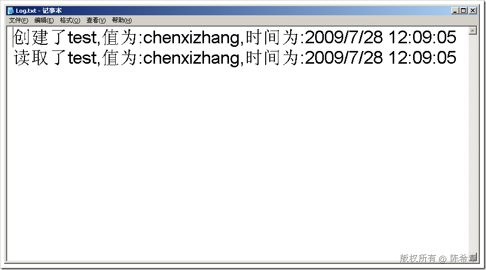

# .NET : 通过配置文件指定跟踪（trace）选项 
> 原文发表于 2009-07-28, 地址: http://www.cnblogs.com/chenxizhang/archive/2009/07/28/1532873.html 

在应用程序开发和调试期间，我们经常需要在代码中添加一些跟踪功能。此时可能会用到System.Diagnostics下面的Debug和Trace两个类型。具体的用法请参考帮助文档。

 本文介绍的是，如何通过配置文件的方式来指定跟踪选项，例如指定监听器

 请在web.config中添加下面的内容

 <system.diagnostics>  
**<trace autoflush="true">**  
    <listeners>  
      **<add name="default" type="System.Diagnostics.TextWriterTraceListener" initializeData="Log.txt">**      </add>  
    </listeners>  
  </trace> </system.diagnostics> 然后，在任何地方，只要想输出跟踪信息，就可以使用如下的语法

 Trace.WriteLine(string.Format("创建了{0},值为:{1},时间为:{2}", key, value,DateTime.Now));

 如果该代码执行，则自动会创建一个Log.txt文件，如下

  

 需要注意的是，代码中的Trace语句无需删除。它不会影响性能。

 本文由作者：[陈希章](http://www.xizhang.com) 于 2009/7/28 12:13:19 发布在：<http://www.cnblogs.com/chenxizhang/>  
 本文版权归作者所有，可以转载，但未经作者同意必须保留此段声明，且在文章页面明显位置给出原文连接，否则保留追究法律责任的权利。   
 更多博客文章，以及作者对于博客引用方面的完整声明以及合作方面的政策，请参考以下站点：[陈希章的博客中心](http://www.xizhang.com/blog.htm) 

