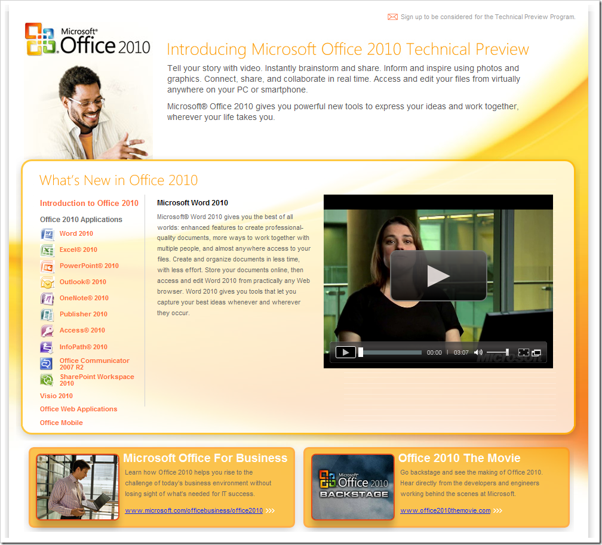

# Office 2010 Technical Review 
> 原文发表于 2009-07-29, 地址: http://www.cnblogs.com/chenxizhang/archive/2009/07/29/1533897.html 

最近经常收到微软发出的邮件，其中有一部分邮件不止一次提到了Office 2010。今天看了一下网站，还不错嘛

 [http://www.microsoft.com/office/2010/](http://www.microsoft.com/office/2010/ "http://www.microsoft.com/office/2010/")

 有兴趣的朋友可以看一下这几个视频，新一代的Office看起来确实很酷，鼓掌～～

 

 本文由作者：[陈希章](http://www.xizhang.com) 于 2009/7/29 11:40:49 发布在：<http://www.cnblogs.com/chenxizhang/>  
 本文版权归作者所有，可以转载，但未经作者同意必须保留此段声明，且在文章页面明显位置给出原文连接，否则保留追究法律责任的权利。   
 更多博客文章，以及作者对于博客引用方面的完整声明以及合作方面的政策，请参考以下站点：[陈希章的博客中心](http://www.xizhang.com/blog.htm) 