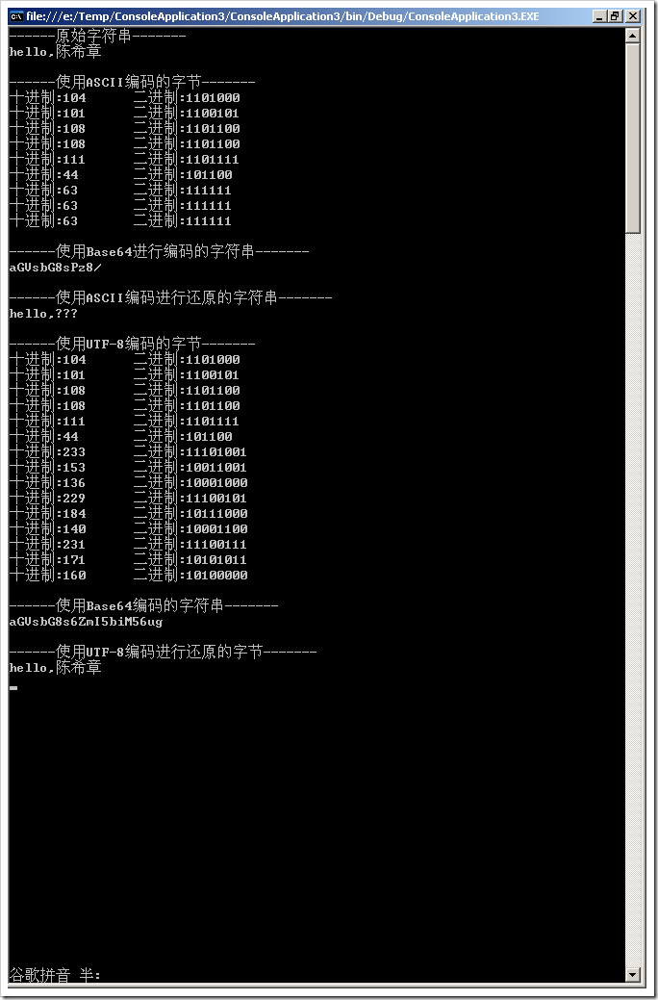

# .NET : 如何理解字符串和它的字节表现形式 
> 原文发表于 2009-08-01, 地址: http://www.cnblogs.com/chenxizhang/archive/2009/08/01/1536329.html 

我们都知道，在计算机中唯一能够识别的是二进制的。但在编程人员的世界里面，我们会使用大量的数据类型（例如数值，字符，字符串等），他们是怎么被处理成二进制的呢？ 下面的例子演示了如何在字符串和字节数组之间转换，并且提到了一个特殊的字符串编码格式，就是所谓的Base 64. using System;  
using System.Text; namespace ConsoleApplication3  
{  
    class Program  
    {  
        static void Main(string[] args)  
        {  
            string test = "hello,陈希章";             Console.WriteLine("------原始字符串-------");  
            Console.WriteLine(test);             byte[] bytecontents = Encoding.ASCII.GetBytes(test);//这是取得ASCII编码的字节，中文字符会导致乱码，不可识别  
            Console.WriteLine("\n------使用ASCII编码的字节-------");  
            foreach (var item in bytecontents)  
            {  
                Console.WriteLine("十进制:{0}\t二进制:{1}", item, Convert.ToString(item, 2));//输出每个字符对应的十进制和二进制值  
            }             Console.WriteLine("\n------使用Base64进行编码的字符串-------");  
            Console.WriteLine(Convert.ToBase64String(bytecontents));//这是用Base64编码的字符串             Console.WriteLine("\n------使用ASCII编码进行还原的字符串-------");  
            Console.WriteLine(Encoding.ASCII.GetString(bytecontents));//这是对字符串进行还原，中文字符会导致乱码，不可识别             byte[] unicodebytecontents = Encoding.UTF8.GetBytes(test);  
            Console.WriteLine("\n------使用UTF-8编码的字节-------");             foreach (var item in unicodebytecontents)  
            {  
                Console.WriteLine("十进制:{0}\t二进制:{1}", item, Convert.ToString(item, 2));  
            }             Console.WriteLine("\n------使用Base64编码的字符串-------");  
            Console.WriteLine(Convert.ToBase64String(unicodebytecontents));//这是用Base64编码的字符串  
            //这里还可以利用Convert.FromBase64String将一个字符串还原为一个字节数组             Console.WriteLine("\n------使用UTF-8编码进行还原的字节-------");  
            Console.WriteLine(Encoding.UTF8.GetString(unicodebytecontents));//对字符串进行还原，因为使用了Unicode，所以即便有中文字符，也能还原  
            Console.Read();  
        }  
    }  
}  **什么是Base64？**  
按照RFC2045的定义，Base64被定义为：Base64内容传送编码被设计用来把任意序列的8位字节描述为一种不易被人直接识别的形式。（The Base64 Content-Transfer-Encoding is designed to represent arbitrary sequences of octets in a form that need not be humanly readable.）  
**为什么要使用Base64？**  
在设计这个编码的时候，我想设计人员最主要考虑了3个问题：  
1.是否加密？  
2.加密算法复杂程度和效率  
3.如何处理传输？  
    加密是肯定的，但是加密的目的不是让用户发送非常安全的Email。这种加密方式主要就是“防君子不防小人”。即达到一眼望去完全看不出内容即可。  
基于这个目的加密算法的复杂程度和效率也就不能太大和太低。和上一个理由类似，MIME协议等用于发送Email的协议解决的是如何收发Email，而并不是如何安全的收发Email。因此算法的复杂程度要小，效率要高，否则因为发送Email而大量占用资源，路就有点走歪了。  
    但是，如果是基于以上两点，那么我们使用最简单的恺撒法即可，为什么Base64看起来要比恺撒法复杂呢？这是因为在Email的传送过程中，由于历史原因，Email只被允许传送ASCII字符，即一个8位字节的低7位。因此，如果您发送了一封带有非ASCII字符（即字节的最高位是1）的Email通过有“历史问题”的网关时就可能会出现问题。网关可能会把最高位置为0！很明显，问题就这样产生了！因此，为了能够正常的传送Email，这个问题就必须考虑！所以，单单靠改变字母的位置的恺撒之类的方案也就不行了。关于这一点可以参考RFC2046。  
基于以上的一些主要原因产生了Base64编码。  

 Base 64最典型的用途是在邮件中。当然也可以用来将一个图片保存为字符串。我下一篇文章演示一下该过程。

 本文由作者：[陈希章](http://www.xizhang.com) 于 2009/8/1 7:43:42 发布在：<http://www.cnblogs.com/chenxizhang/>  
 本文版权归作者所有，可以转载，但未经作者同意必须保留此段声明，且在文章页面明显位置给出原文连接，否则保留追究法律责任的权利。   
 更多博客文章，以及作者对于博客引用方面的完整声明以及合作方面的政策，请参考以下站点：[陈希章的博客中心](http://www.xizhang.com/blog.htm) 

