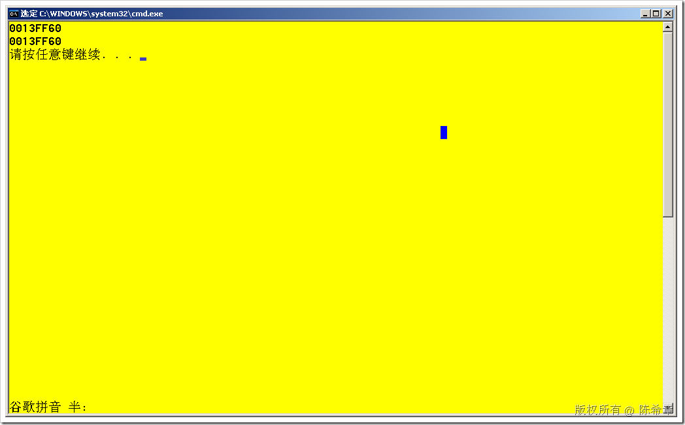
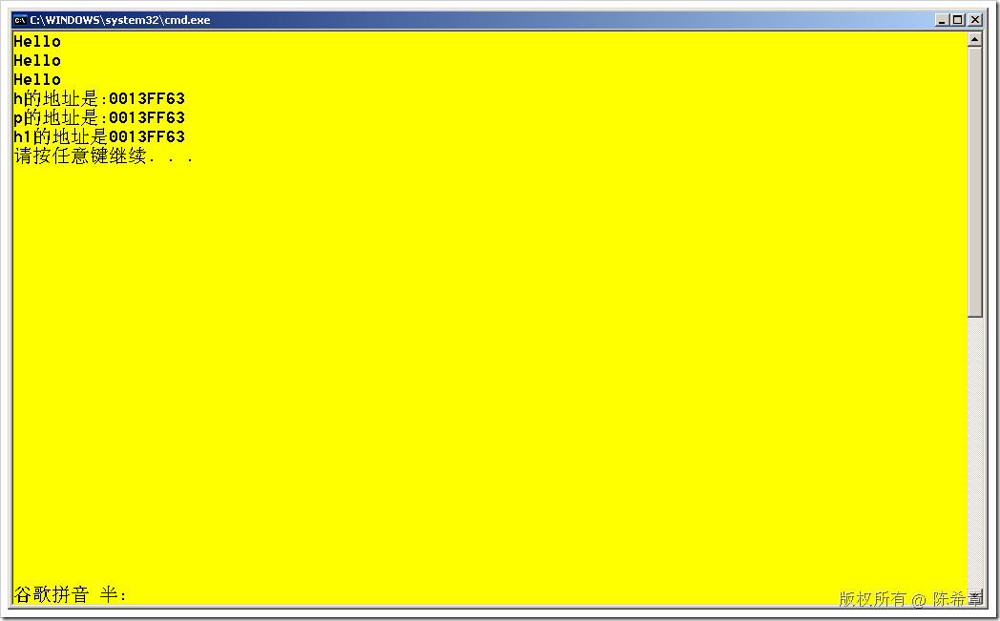

# C++: 引用和地址运算符 
> 原文发表于 2009-08-05, 地址: http://www.cnblogs.com/chenxizhang/archive/2009/08/05/1539601.html 

在C++中，&这个符号有两个含义，一种含义是取某个变量或者对象的地址。这个地址是指内存地址，这个地址取到之后，可以赋给一个指针。例如下面这样

 int a=5;

 int *p=&a;

 这就表示，有一个变量为a，其值为5，然后有一个指针变量p,它保存了变量a的地址。

  

 但C++中，&还有一个用途是定义引用常量。引用其实就相当于是一个变量的别名，从它的功能上说与指针很类似，但使用起来比较简便。

 我们先来看如何定义一个引用

 int a=5;

 int &b=a;

 这就表示，有一个变量为a，其值为5，然后有一个引用变量b，它引用了变量a。实际上此时两个变量的操作都会影响到彼此，因为它们所使用的内存是一样的。

  

 int main()  
{  
    int a=5;  
    int &b=a;     cout<<&a<<endl;  
    cout<<&b<<endl;     return 0;  
}  

 那么，引用与指针相比有什么大的区别呢？依我看，主要是使用起来比较方便

 为了说明这个问题，我用下面的范例做了解释

 #include <iostream>  
using namespace std; class human{  
public:  
    void Talk();  
}; void human::Talk(){  
    cout<<"Hello"<<endl;  
} int main()  
{  
    human h;//创建一个human对象  
    human *p=&h;//创建一个指针，指向该human对象的地址  
    p->Talk();//调用该human对象的Talk方法  
    (*p).Talk();//或者也可以这样写     human &h1=h;//创建一个引用  
    h1.Talk();//可以直接调用Talk方法     cout<<"h的地址是:"<<&h<<endl;  
    cout<<"p的地址是:"<<p<<endl;  
    cout<<"h1的地址是"<<&h1<<endl;     return 0;  
} 

 本文由作者：[陈希章](http://www.xizhang.com) 于 2009/8/5 15:08:04 发布在：[博客园](http://www.cnblogs.com/chenxizhang/),转载请注明出处  
 

