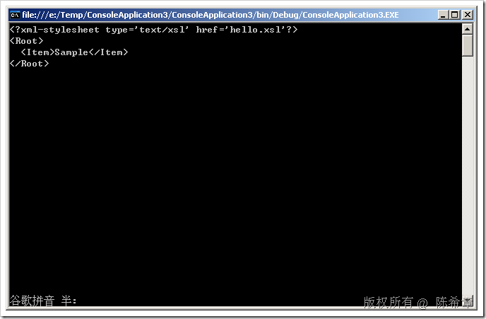

# .NET : 如何在生成XML文档时绑定样式表 
> 原文发表于 2009-08-06, 地址: http://www.cnblogs.com/chenxizhang/archive/2009/08/06/1540675.html 

我们都知道，XML是一种特殊格式的数据文件，它与HTML的一个很大的区别在于它自己不能描述自己，也就是一份XML数据文档一般没有格式。它的格式，需要通过所谓的样式表文件来定义，这种文件一般称为xsl或者xslt文件。

 下面的代码演示了如何在动态构造一份XML文档的时候指定要绑定的样式表。

 using System; using System.Xml.Linq; namespace ConsoleApplication3  
{  
    class Program  
    {  
        static void Main(string[] args)  
        {  
            XDocument doc = new XDocument(  
                new XProcessingInstruction(  
                    "xml-stylesheet",  
                    "type='text/xsl' href='hello.xsl'"),  
                new XElement("Root",  
                    new XElement("Item", "Sample")));             Console.WriteLine(doc);             Console.Read();         }  
    }  
} 最后的结果如下  本文由作者：[陈希章](http://www.xizhang.com) 于 2009/8/6 19:06:52 发布在：[博客园](http://www.cnblogs.com/chenxizhang/),转载请注明出处  
 

