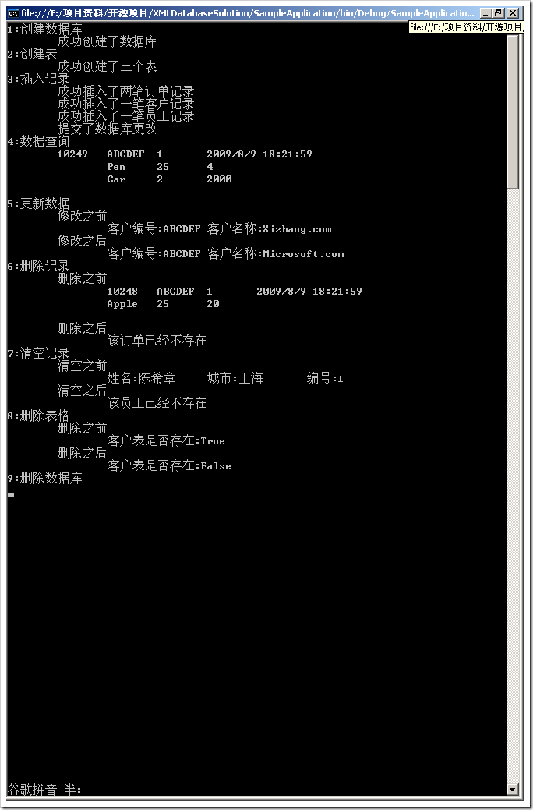

# XML数据库一睹为快 
> 原文发表于 2009-08-09, 地址: http://www.cnblogs.com/chenxizhang/archive/2009/08/09/1542354.html 


这是我正在开发的XML数据库的一个演示程序片段。该项目目前还不完整，会在合适的时候开源。


有关该数据库的一些介绍，请参考


<http://www.cnblogs.com/chenxizhang/archive/2009/08/08/1541888.html>


简单地说，这是一个用XML作为数据存取源的数据库设计方案。完全基于.NET和XML技术，并且使用了LINQ的技术。我自己总结该数据库是：XML+ 面向对象。


* XML是指其存储格式是XML的
* 面向对象是指每个表格都映射为一个业务实体（该实体可以很复杂），而且针对数据库的操作完全是面向对象的方式，不用SQL语法
+ 复杂的查询全部可以用LINQ语法来解决。因为数据库方法返回的就是对象类型。


 


大家想想看，如果操作数据库可以像下面这样，是不是也是一个不错的选择呢？如果大家对于XML数据库的开发有兴趣和高见，欢迎给我反馈和讨论


 


```
using System;
using System.Collections.Generic;
using XMLDatabase;
using DataEntities;
using System.Linq;
namespace SampleApplication
{
class Program
{
static void Main(string[] args)
{
///插入1000个订单约13秒,体积为615KB
///插入第2000个订单约41秒，体积为1229KB，
///插入第3000个订单约77秒，体积为1933KB
///
///TODO: 应该考虑 插入、删除、更新的优化。这三种情况应该不要去加载全部的文档，能不能用XMLWriter的方式做
///应该考虑类似LINQ TO SQL中的SubmitChange的方式，一次性提交
///改进了这个设计之后，插入1000个订单连1秒钟都不需要，太酷了
Console.WriteLine("1:创建数据库");
using (Database db = Database.CreateInstance("Northwind", "E:\\Temp"))
//在E:\Temp目录下面创建一个叫做Northwind的XML数据库
{
Console.WriteLine("\t成功创建了数据库");
#region 创建几个表
Console.WriteLine("2:创建表");
Table<Order> OrderTable = db.Create<Order>("Orders", new[] { "OrderID" });
Table<Customer> CustomerTable = db.Create<Customer>("Customers", new[] { "CustomerID" });
Table<Employee> EmployeeTable = db.Create<Employee>("Employees", new[] { "EmployeeID" });
Console.WriteLine("\t成功创建了三个表");
#endregion
#region 插入记录
Console.WriteLine("3:插入记录");
//插入一个订单记录
OrderTable.Insert(
new Order()
{
OrderID = 10248,
CustomerID = "ABCDEF",
OrderDate = DateTime.Now,
EmployeeID = 1,
OrderItems = new List<OrderItem>(){
new OrderItem(){
OrderId=10248,
Quantity=20,
UnitPrice=25,
Product=new Product(){ ProductId=1, ProductName="Apple"}
}}
});
OrderTable.Insert(
new Order()
{
OrderID = 10249,
CustomerID = "ABCDEF",
OrderDate = DateTime.Now,
EmployeeID = 1,
OrderItems = new List<OrderItem>(){
new OrderItem(){
OrderId=10249,
Quantity=4,
UnitPrice=25,
Product=new Product(){ ProductId=1, ProductName="Pen"}},
new OrderItem(){
OrderId=10249,
Quantity=2000,
UnitPrice=2,
Product=new Product(){ ProductId=1, ProductName="Car"}
}}
});
Console.WriteLine("\t成功插入了两笔订单记录");
//插入一个客户记录
CustomerTable.Insert(
new Customer()
{
CustomerID = "ABCDEF",
CompanyName = "Xizhang.com"
});
Console.WriteLine("\t成功插入了一笔客户记录");
EmployeeTable.Insert(new Employee() { EmployeeID = 1, Name = "陈希章", City = City.上海 });
Console.WriteLine("\t成功插入了一笔员工记录");
db.SubmitChanges();//只有提交了才会真正在数据库中生效
Console.WriteLine("\t提交了数据库更改");
#endregion
#region 读取记录
//这里的查询就是标准的LINQ语法
//选择订单金额大于1000的订单
Console.WriteLine("4:数据查询");
var query = from o in OrderTable.Select()
where o.OrderItems.Sum(d => d.Quantity * d.UnitPrice) > 1000
select o;
foreach (var item in query)
{
Console.WriteLine(item);
}
#endregion
#region 更新记录
Console.WriteLine("5:更新数据");
var customer = CustomerTable.Select().Where(c => c.CustomerID == "ABCDEF").SingleOrDefault();
Console.WriteLine("\t修改之前");
Console.WriteLine(customer);
//进行修改
customer.CompanyName = "Microsoft.com";
CustomerTable.Update(customer);
db.SubmitChanges();
Console.WriteLine("\t修改之后");
customer = CustomerTable.Select().Where(c => c.CustomerID == "ABCDEF").SingleOrDefault();
Console.WriteLine(customer);
#endregion
#region 删除记录
Console.WriteLine("6:删除记录");
var order = OrderTable.Select().Where(o => o.OrderID == 10248).SingleOrDefault();
Console.WriteLine("\t删除之前");
Console.WriteLine("\t" + order);
OrderTable.Delete(order);
db.SubmitChanges();
Console.WriteLine("\t删除之后");
order = OrderTable.Select().Where(o => o.OrderID == 10248).SingleOrDefault();
if (order == null)
Console.WriteLine("\t\t该订单已经不存在");
#endregion
#region 清空记录
Console.WriteLine("7:清空记录");//相当于DELETE * FROM ...
Console.WriteLine("\t清空之前");
var employee = EmployeeTable.Select().FirstOrDefault();
Console.WriteLine("\t" + employee);
EmployeeTable.Clear();
db.SubmitChanges();
employee = EmployeeTable.Select().FirstOrDefault();
Console.WriteLine("\t清空之后");
if (employee == null)
Console.WriteLine("\t\t该员工已经不存在");
#endregion
#region 删除表格
Console.WriteLine("8:删除表格");
Console.WriteLine("\t删除之前");
Console.WriteLine("\t\t客户表是否存在:{0}", db.Exists("Customers"));
db.Drop("Customers");
Console.WriteLine("\t删除之后");
Console.WriteLine("\t\t客户表是否存在:{0}", db.Exists("Customers"));
#endregion
}
Console.WriteLine("9:删除数据库");
Database.DeleteInstance("Northwind", @"E:\Temp");
Console.Read();
}
}
}

```

.csharpcode, .csharpcode pre
{
font-size: small;
color: black;
font-family: consolas, "Courier New", courier, monospace;
background-color: #ffffff;
/*white-space: pre;*/
}
.csharpcode pre { margin: 0em; }
.csharpcode .rem { color: #008000; }
.csharpcode .kwrd { color: #0000ff; }
.csharpcode .str { color: #006080; }
.csharpcode .op { color: #0000c0; }
.csharpcode .preproc { color: #cc6633; }
.csharpcode .asp { background-color: #ffff00; }
.csharpcode .html { color: #800000; }
.csharpcode .attr { color: #ff0000; }
.csharpcode .alt
{
background-color: #f4f4f4;
width: 100%;
margin: 0em;
}
.csharpcode .lnum { color: #606060; }

[](http://images.cnblogs.com/cnblogs_com/chenxizhang/WindowsLiveWriter/XML_FFF0/image_2.png)


本文由作者：[陈希章](http://www.xizhang.com/) 于 2009/8/9 18:25:07
发布在：[博客园](http://www.cnblogs.com/chenxizhang/),转载请注明出处  


 