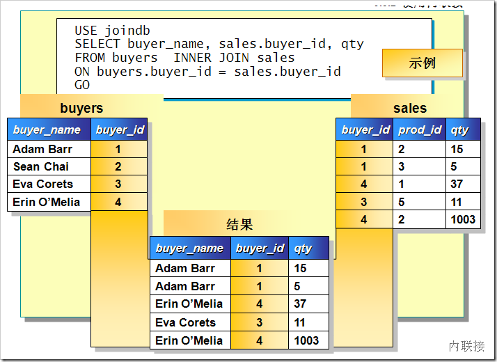
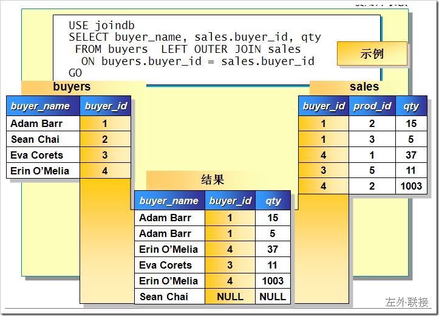

# .NET : LINQ之Join语法的思考 
> 原文发表于 2009-08-10, 地址: http://www.cnblogs.com/chenxizhang/archive/2009/08/10/1542595.html 


我们知道，在LINQ 查询中，对於Join的操作，提供了三种不同的实现方式

 * 内联接(INNER JOIN) * 分组联接(GROUP JOIN) * 左外联接(LEFT JOIN)

 关于上面三种JOIN语法的详细介绍，请直接参考MSDN，这里我做一点简要的总结：

 * 内联接，类似于SQL查询中的**INNER JOIN**。这个很好理解,只有JOIN的两端都匹配到的记录，才被返回。

 [](http://images.cnblogs.com/cnblogs_com/chenxizhang/WindowsLiveWriter/39c59e52eb95.NETLINQJoin_746B/image_4.png) 

 * 分组联接，这个在SQL查询中并没有对应的版本。相当于是GROUP BY和JOIN的一个复合实现吧。**这个设计的确不错**。

  

 * 左外联接，类似于SQL查询中的**LEFT JOIN**。意思就是说，即便JOIN的右侧不存在于与左侧相等的键值，左侧包含的记录也照样返回。

 [](http://images.cnblogs.com/cnblogs_com/chenxizhang/WindowsLiveWriter/39c59e52eb95.NETLINQJoin_746B/image_2.png) 

  

 从上面的图可以看出来，既然左外联接可能发生的情况是：左侧存在的记录，在右侧找不到对应的联接记录。那么就应该为这种情况准备一个处理方案。在SQL查询中，右侧如果找不到匹配的联接记录，则自动用NULL代替。

 根据上面的原理，要在LINQ中要实现Left Join的功能，语法就会稍微复杂一些。大家可以先参考下面的例子,请注意红色的部分


```
                //联合查询三个表的资料
                Console.WriteLine("\t联合查询");
                var joinquery = from o in OrderTable.Select()
                                join c in CustomerTable.Select() on o.CustomerID equals c.CustomerID into x
                                **from xx in x.DefaultIfEmpty(
 new Customer() { CustomerID = "UnKnown", CompanyName = "UnKnown Company" })**
                                join e in EmployeeTable.Select() on o.EmployeeID equals e.EmployeeID into y
                                **from yy in y.DefaultIfEmpty(
 new Employee() { EmployeeID = -1, Name = "UnKnown", City = City.北京 })**
                                select new
                                {
                                    OrderInfo = o,
                                    CustomerInfo = xx,
                                    EmployeeInfo = yy
                                };

                foreach (var item in joinquery)
                {
                    Console.WriteLine("\t" + item.OrderInfo);
                    Console.WriteLine("\t" + item.CustomerInfo);
                    Console.WriteLine("\t\t" + item.EmployeeInfo);
                }
```

```
【备注】该代码是正在开发的XML数据库演示程序的一个片段。如果对该项目有兴趣，请参考<http://www.cnblogs.com/chenxizhang/archive/2009/08/09/1542354.html>
```

```
我的思考是：
```

* ```
**这个LEFT JOIN的语法还有无简化的可能性**
```
* ```
**SQL 中还有一种JOIN叫CROSS JOIN，目前在LINQ 应该如何实现呢？**
```


```
 
```

```
由此我想到一个话题，就是**这些LINQ的关键字能不能定制或者添加呢**？这看起来有点古怪，但如果能实现，那倒是解决大问题了。
```

```
不知道大家的高见如何？
```

```
 
```

```
 
```

```
 
```


.csharpcode, .csharpcode pre
{
 font-size: small;
 color: black;
 font-family: consolas, "Courier New", courier, monospace;
 background-color: #ffffff;
 /*white-space: pre;*/
}
.csharpcode pre { margin: 0em; }
.csharpcode .rem { color: #008000; }
.csharpcode .kwrd { color: #0000ff; }
.csharpcode .str { color: #006080; }
.csharpcode .op { color: #0000c0; }
.csharpcode .preproc { color: #cc6633; }
.csharpcode .asp { background-color: #ffff00; }
.csharpcode .html { color: #800000; }
.csharpcode .attr { color: #ff0000; }
.csharpcode .alt 
{
 background-color: #f4f4f4;
 width: 100%;
 margin: 0em;
}
.csharpcode .lnum { color: #606060; }


本文由作者：[陈希章](http://www.xizhang.com) 于 2009/8/10 9:01:48 
发布在：[博客园](http://www.cnblogs.com/chenxizhang/),转载请注明出处  

