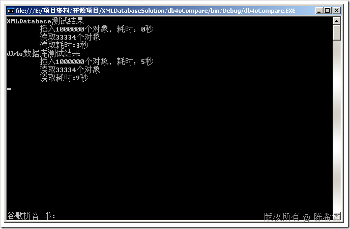
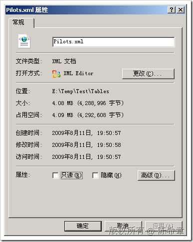
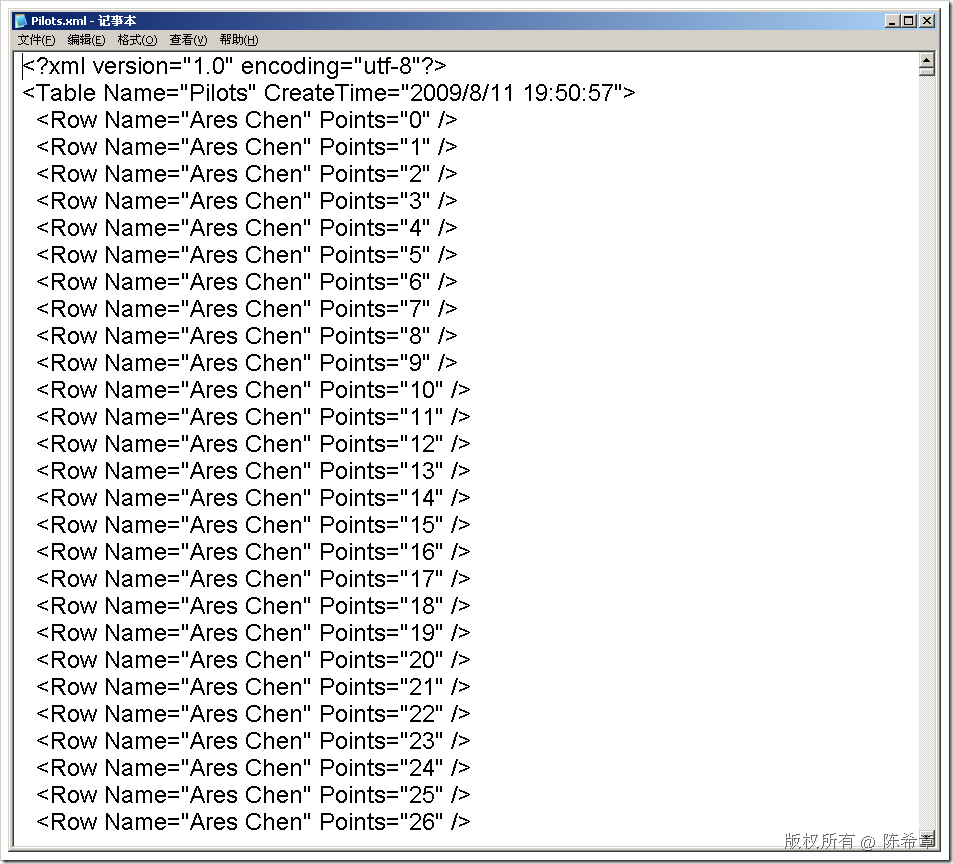
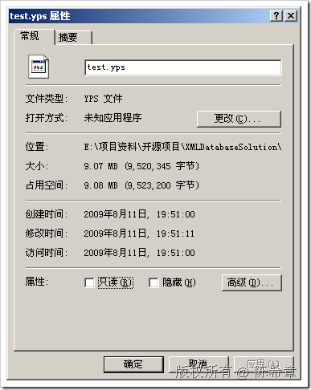

# XML数据库与db4o的简要对比 
> 原文发表于 2009-08-11, 地址: http://www.cnblogs.com/chenxizhang/archive/2009/08/11/1543908.html 


前两天，我公布了正在开发的XML数据库的一些信息，下面这个文章演示了什么是XML数据库，以及如何使用它。


#### [XML数据库一睹为快](http://www.cnblogs.com/chenxizhang/archive/2009/08/09/1542354.html)


<http://www.cnblogs.com/chenxizhang/archive/2009/08/09/1542354.html>


 


文章发表之后，得到了很多朋友的反馈和积极参与讨论，我这里就不一一列举了。期间有多位朋友提到了另外一个开源的面向对象的数据库:db4o


该数据库的主页在：<http://www.db4o.com/>


我今天抽时间对该数据库进行了一些了解，也下载了它的完整源代码，还不及细看，但它的架构很不错，下午在看的时候有一个重要的方面对我触动挺大。我暂时不做太多的评论，但不否认地说，我的第一印象就是眼前一亮。


db4o是一个面向对象的数据库，虽然这个概念并不新，但我觉得概念新不新并不重要，db40能被开发出来，而且做的确实很不错，这本身很值得欣赏。我自己也是觉得，实践和时间才是检验真理的唯一标准，要敢于动手。呵呵


我想很多朋友都比较关心，如果用XML存储数据，那么性能怎么样，会不会很慢呢？我在上一篇文章的评论中多次强调以下几点


1. 据我的经验，读取本地磁盘文件，通常比读取真正的关系型数据库要来得快。


2. XML文件本身不是慢的原因，如果慢的话，则需要考虑更好的设计。而且XML提供了很好的编程接口，其实它反倒是比别的文件有更好的优势。例如，你可以假想一下，你如果要读一个平面文件（例如ini文件），或者CSV文件的情况，那可能就更慢了。


对照db4o提供的官方学习材料（很不错的，赞一个先），我做了一些练习。db4o的数据库文件只有一个，是二进制格式的。但即便在大容量写入和读取的时候，性能表现也很不错。这一点就是看出算法的重要性了。我为什么要这么说呢，因为要在一个文件中，抽取出来特定的部分，往往都是相当不容易的。二进制的读写问题本身就是毁誉参半的。


大家试想一下吧，如果一个文件已经有1GB，然后我要在期间一半的位置写入另外一个对象(例如要修改），这将是一间非常不容易的事情，因为所有内容都在一个文件里面。坦白地说，这也就是我为什么要开发这个XML数据库的根本原因吧。**我觉得如果还是用独立的一个或者为数很少的几个二进制文件，那么与传统的关系型数据库就区别不大了，而且再怎么优化，估计还是有瓶颈的。**


我当然没有办法猜想到db4o的开发小组当时的考虑，也许在当时这是一个比较好的方案。


为了说明这个问题，我写了一个简单的演示程序来对db4o和XML数据库的大容量写入和读取进行对比。我分别向他们插入100000（十万）个对象。然后又各自读取了将近35000（三万五千）个对象。


**第一部分：业务实体类（这是摘自db4o的文档）**
---------------------------


```
   /// <summary>
/// 这是一个很简单的类型，摘自db4o的官方案例
/// </summary>
public class Pilot
{
public Pilot() { }
string \_name;
int \_points;
public Pilot(string name, int points)
{
\_name = name;
\_points = points;
}
public string Name
{
get
{
return \_name;
}
set { \_name = value; }
}
public int Points
{
get
{
return \_points;
}
set { \_points = value; }
}
public void AddPoints(int points)
{
\_points += points;
}
override public string ToString()
{
return string.Format("{0}/{1}", \_name, \_points);
}
}
```


.csharpcode, .csharpcode pre
{
font-size: small;
color: black;
font-family: consolas, "Courier New", courier, monospace;
background-color: #ffffff;
/*white-space: pre;*/
}
.csharpcode pre { margin: 0em; }
.csharpcode .rem { color: #008000; }
.csharpcode .kwrd { color: #0000ff; }
.csharpcode .str { color: #006080; }
.csharpcode .op { color: #0000c0; }
.csharpcode .preproc { color: #cc6633; }
.csharpcode .asp { background-color: #ffff00; }
.csharpcode .html { color: #800000; }
.csharpcode .attr { color: #ff0000; }
.csharpcode .alt
{
background-color: #f4f4f4;
width: 100%;
margin: 0em;
}
.csharpcode .lnum { color: #606060; }


**第二部分：测试代码**
-------------


```
    class Program
{
static void Main(string[] args)
{
//这个测试程序主要用来比较与db4o这个数据库的操作及姓能上的差别
//创建db4o数据库，并插入100000（十万个）对象
Console.WriteLine("db4o数据库测试结果");
IObjectContainer db = Db4oFactory.OpenFile("test.yps");
try
{
Stopwatch watch = new Stopwatch();
watch.Start();
for (int i = 0; i < 100000; i++)
{
Pilot pilot1 = new Pilot("Michael Schumacher", i);
db.Store(pilot1);
}
watch.Stop();
Console.WriteLine("\t插入1000000个对象，耗时：{0}秒", watch.ElapsedMilliseconds / 1000);
watch.Start();
var query = from p in db.Query<Pilot>()
where p.Points % 3 == 0
select p;
Console.WriteLine("\t读取{0}个对象", query.ToArray().Count());
watch.Stop();
Console.WriteLine("\t读取耗时:{0}秒", watch.ElapsedMilliseconds / 1000);
}
finally
{
db.Close();
}
Console.WriteLine("XMLDatabase测试结果");
//创建XMLDatabase，并插入100000（十个）对象
using (XDatabase xdb = XDatabase.CreateInstance("Test", "E:\\Temp")) {
try
{
Stopwatch watch = new Stopwatch();
watch.Start();
XTable<Pilot> table = xdb.Create<Pilot>("Pilots", new[] { "Name" });
for (int i = 0; i < 100000; i++)
{
Pilot pilot1 = new Pilot("Ares Chen", i);
table.Insert(pilot1);
}
xdb.SubmitChanges();
watch.Stop();
Console.WriteLine("\t插入1000000个对象，耗时：{0}秒", watch.ElapsedMilliseconds / 1000);
watch.Start();
var query = from p in table.Select()
where p.Points % 3==0
select p;
Console.WriteLine("\t读取{0}个对象",query.ToArray().Count());
watch.Stop();
Console.WriteLine("\t读取耗时:{0}秒", watch.ElapsedMilliseconds / 1000);
}
finally
{
}
}
Console.Read();
}
}
```


.csharpcode, .csharpcode pre
{
font-size: small;
color: black;
font-family: consolas, "Courier New", courier, monospace;
background-color: #ffffff;
/*white-space: pre;*/
}
.csharpcode pre { margin: 0em; }
.csharpcode .rem { color: #008000; }
.csharpcode .kwrd { color: #0000ff; }
.csharpcode .str { color: #006080; }
.csharpcode .op { color: #0000c0; }
.csharpcode .preproc { color: #cc6633; }
.csharpcode .asp { background-color: #ffff00; }
.csharpcode .html { color: #800000; }
.csharpcode .attr { color: #ff0000; }
.csharpcode .alt
{
background-color: #f4f4f4;
width: 100%;
margin: 0em;
}
.csharpcode .lnum { color: #606060; }


**第三部分：测试结果**
-------------


[](http://images.cnblogs.com/cnblogs_com/chenxizhang/WindowsLiveWriter/XMLdb4o_11917/image_2.png) 


我将执行顺序倒过来，再执行一次，结果如下


[](http://images.cnblogs.com/cnblogs_com/chenxizhang/WindowsLiveWriter/XMLdb4o_11917/image_4.png) 


 


**第四部分：文件比较**
-------------


[](http://images.cnblogs.com/cnblogs_com/chenxizhang/WindowsLiveWriter/XMLdb4o_11917/image_6.png) 


XML数据库是每个表单独存放一个XML文件（我还在考虑如何分布式存放，例如一个表可以有N个XML文件），插入这一百万个对象之后，大约是4.08MB


[](http://images.cnblogs.com/cnblogs_com/chenxizhang/WindowsLiveWriter/XMLdb4o_11917/image_8.png)


而且该文件，就是一个很直观的XML文件


[](http://images.cnblogs.com/cnblogs_com/chenxizhang/WindowsLiveWriter/XMLdb4o_11917/image_12.png) 


 


而db4o是将所有对象放在一个数据库文件的，文件名是无关紧要的。


 [](http://images.cnblogs.com/cnblogs_com/chenxizhang/WindowsLiveWriter/XMLdb4o_11917/image_10.png) 


它的文件大小为9.07MB左右


[](http://images.cnblogs.com/cnblogs_com/chenxizhang/WindowsLiveWriter/XMLdb4o_11917/image_14.png) 


而该文件是一个典型的二进制文件，如果我们一定要打开来看，大致如下


[](http://images.cnblogs.com/cnblogs_com/chenxizhang/WindowsLiveWriter/XMLdb4o_11917/image_16.png) 


 


 


 


 


 


 


 


 


【备注】以上的对比是作为技术研究目的而做的。其实我前面就分析过了，db4o使用一个二进制文件的方式来做，有这样的性能已经是很了不起的了，它的算法应该是很不错的。我还不知道它是否支持多个文件，因为看它的文档说它最大支持的单数据库大小为250GB（这有点雷人，但我断定不可能有人这么用的），如果说250GB的数据，全部在一个文件里面的话，这太可拍了。


最后，用一个文件存储所有的数据库并无一无是处。它的一个最大的好处就是备份和管理方便，因为就只有一个文件。而正在开发的XML数据库，这方面就会有劣势，因为我的想法是通过不同的目录保存不同的东西，例如Tables里面放所有的表数据，Schemas里面放所有的架构文件，Blobs里面放所有的大对象（例如图片），还有一个专门的rels目录，记录了这些文件的关系。这样一来就会有一些风险，因为文件很多。这方面还需要多思考思考。


XML数据库的开发工作在继续进行，大家有什么好的建议和想法，我欢迎留言。由于日常我还有其他的工作要忙，一般晚上再统一回复吧。


本文由作者：[陈希章](http://www.xizhang.com/) 于 2009/8/11 20:26:05
发布在：[博客园](http://www.cnblogs.com/chenxizhang/),转载请注明出处  


 