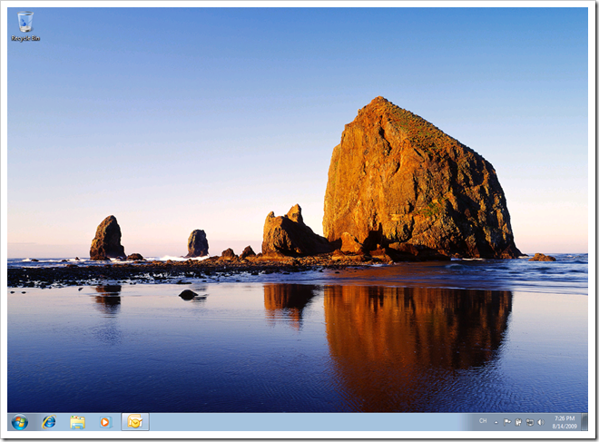
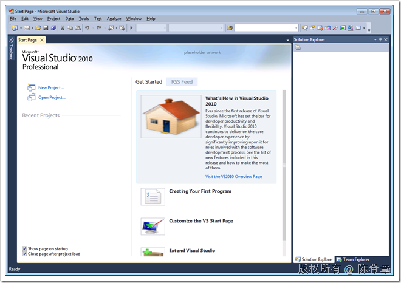
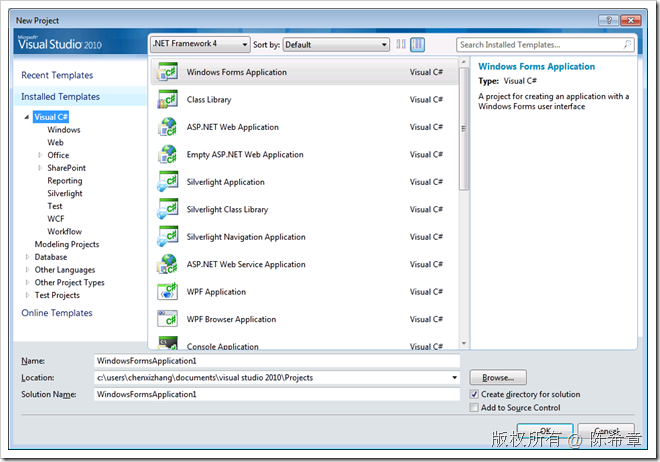
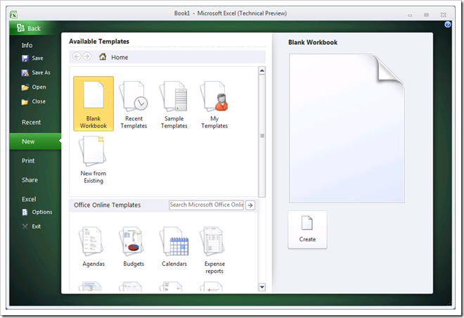
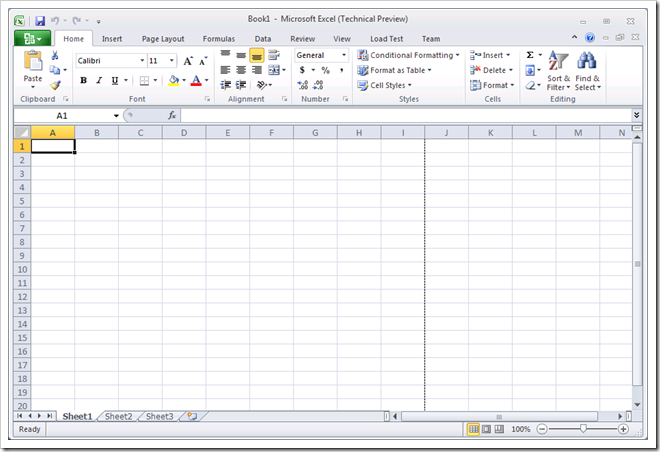

# 新的纪元 
> 原文发表于 2009-08-14, 地址: http://www.cnblogs.com/chenxizhang/archive/2009/08/14/1546404.html 

今天装好了Windows 7 , Visual Studio 2010 , Office System 2010。咱也要与时俱进嘛，眼前确实一亮，发几个图做过记录

 明天还要出去讲课。接下去空闲时间抓紧设计XML数据库这个项目,争取早日取得突破。

  

  

  

  

 

 本文由作者：[陈希章](http://www.xizhang.com) 于 2009/8/14 19:27:45 发布在：[博客园](http://www.cnblogs.com/chenxizhang/),转载请注明出处  
 