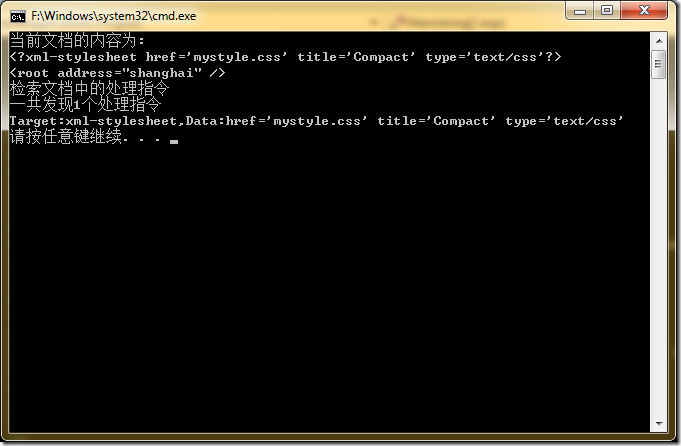

# .NET : 读取XML文档的处理指令 
> 原文发表于 2009-09-05, 地址: http://www.cnblogs.com/chenxizhang/archive/2009/09/05/1560753.html 

最近因为经常处理XML文件，涉及到一个特殊的东西。就是在XML文档的顶部，通常都会有一些特殊的指令，例如

 <? xml version=”1.0” encoding=”utf-8” ?>

 所有的处理指令都是这样的格式，用<?开头，用?>结束。第一个单词称为Target，后面的所有内容都统称为Data

 所有的处理指令，顾名思义，他们不是数据，任何时候都不会显示出来，而是给XML解析器用的。XML解析器当然需要知道这些指令，然后决定如何处理文档。

 处理指令可以放在文档的任何地方，但最好是放在文档的顶部

 下面用一个最简单和最常用的例子来说明这个问题

 static void Main(string[] args)  
{  
    XDocument doc =new XDocument(  
        new XProcessingInstruction("xml-stylesheet", "href='mystyle.css' title='Compact' type='text/css'"),  
        new XElement("root",  
            new XAttribute("address","shanghai"))  
            );  
    Console.WriteLine("当前文档的内容为:");  
    Console.WriteLine(doc);     Console.WriteLine("检索文档中的处理指令");  
    var q = from n in doc.Nodes()  
            where n.NodeType==XmlNodeType.ProcessingInstruction  
            select n as XProcessingInstruction;  
    Console.WriteLine("一共发现{0}个处理指令", q.Count());     foreach (var item in q)  
    {  
        Console.WriteLine("Target:{0},Data:{1}", item.Target, item.Data);  
    }  
}    

 本文由作者：[陈希章](http://www.xizhang.com) 于 2009/9/5 11:36:21 发布在：[博客园](http://www.cnblogs.com/chenxizhang),转载请注明出处  
 

