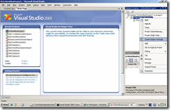
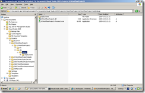
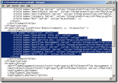
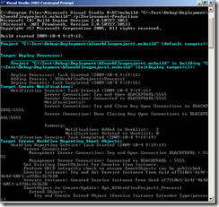

# 如何在生产环境部署K2的流程 
> 原文发表于 2009-10-04, 地址: http://www.cnblogs.com/chenxizhang/archive/2009/10/04/1577877.html 

1. 生成部署包  2.复制下面的内容到生产环境  3. 修改Deployment目录下面的一个msbuild文件内容  4. 运行.NET Framework中的msbuild工具 C:\Program Files\Microsoft Visual Studio 8\VC>msbuild "C:\Test\Debug\Deployment\  
k2workflowproject1.msbuild" /p:Environment=Production  

  

 【备注】同样的操作也适合于SmartObject项目的部署

