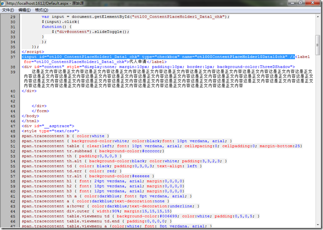
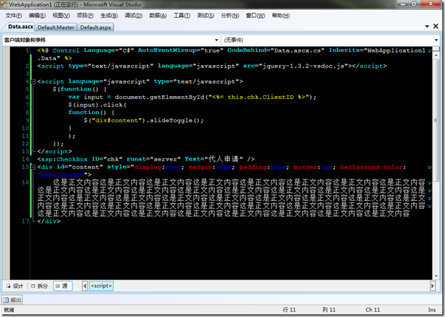

# ASP.NET & JAVASCRIPT: 在Javascript代码中访问服务器控件的ID 
> 原文发表于 2009-10-09, 地址: http://www.cnblogs.com/chenxizhang/archive/2009/10/09/1579920.html 

这不是一个新话题，虽然是一个小问题，但也是很多做ASP.NET开发的朋友比较经常遇到的。

 ASP.NET有一套控件模型，或者说在页面中有一个控件树，从最顶层的页面（Page）开始,一层一层地进行包含。下面是一个简单的范例

  

 这种机制当然会有它的目的，或者说也有一些好处。但却给编写JAVASCRIPT脚本的朋友们带来了实实在在的麻烦。为什么这么说呢？

 例如，我们在一个用户控件中有以下的一个服务器控件和一些静态的文本

 
>  *<asp:CheckBox ID="chk" runat="server" Text="代人申请" />  
> 
  
>     这是正文内容这是正文内容这是正文内容这是正文内容这是正文内容这是正文内容这是正文内容这是正文内容这是正文内容这是正文内容这是正文内容这是正文内容这是正文内容这是正文内容这是正文内容这是正文内容这是正文内容这是正文内容这是正文内容这是正文内容这是正文内容这是正文内容这是正文内容这是正文内容这是正文内容这是正文内容这是正文内容这是正文内容这是正文内容这是正文内容这是正文内容这是正文内容这是正文内容这是正文内容这是正文内容这是正文内容这是正文内容这是正文内容这是正文内容这是正文内容这是正文内容  
> 
*
> 
> 

 我们的CheckBox的ID为chk，但是到了页面中，变成了什么呢？

 **ctl00\_ContentPlaceHolder1\_Data1\_chk**

  

 大家都知道在编写JAVASCRIPT的时候，我们经常使用ID去引用某个元素，并对其进行操作。上面这一串ID不光是难以记忆，而且事实上它会根据当前控件放在什么地方而发生变化。

 那么，如何在脚本中正确地引用到这个CheckBox呢？

 其实说难也不难，一句话即可解决

 var input = document.getElementById("<%= this.chk.ClientID %>");

 注意，这里用到了ClientID这个属性，它会动态解析得到真正的ID

  

 下面是一个简单的范例

 

