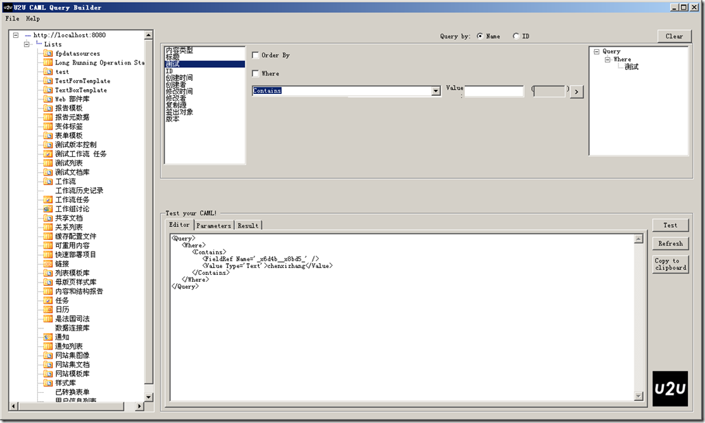
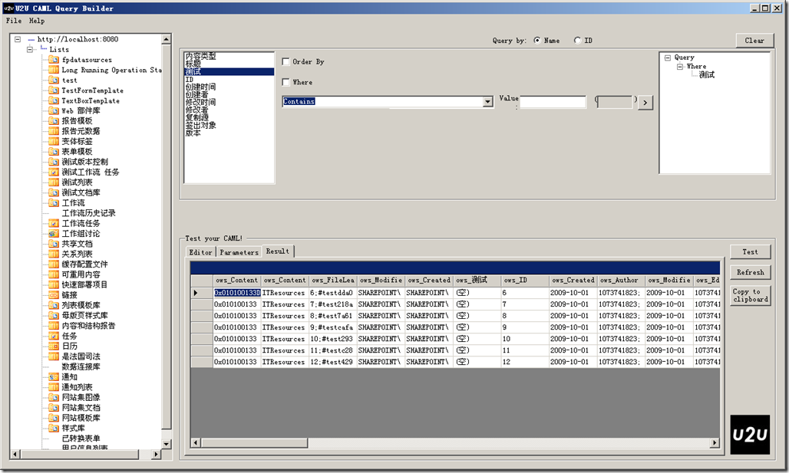

# SharePoint : 使用SPQuery对象时要注意的事项 
> 原文发表于 2009-10-23, 地址: http://www.cnblogs.com/chenxizhang/archive/2009/10/23/1588415.html 

我们经常需要对一个列表进行查询，此时最灵活的方式就是直接使用SPQuery对象。这个对象的查询语法称为CAML。一般为了简单起见，我们会通过下面这样小工具先生成一个查询范例

  

 我们可以看到查询文本大致如下

 <Query>  
   <Where>  
      <Contains>  
         <FieldRef Name='\_x6d4b\_\_x8bd5\_' />  
         <Value Type='Text'>chenxizhang</Value>  
      </Contains>  
   </Where>  
</Query>   点击"Test"之后,可以看到如下效果  下面,我们就很自然地想到将这个查询文本用于我们自己的SPQuery对象 SPSite site = new SPSite("<http://localhost:8080");>  
SPWeb web = site.OpenWeb(); SPList list = web.Lists["测试文档库"];  
SPQuery q = new SPQuery();  
q.Query = string.Format("<Query><Where><Contains><FieldRef Name='{0}' /><Value Type='Text'>{1}</Value></Contains></Where></Query>", "\_x6d4b\_\_x8bd5\_", "chenxizhang"); q.ViewFields = list.DefaultView.ViewFields.SchemaXml; foreach (SPListItem item in list.GetItems(q))  
{  
    Console.WriteLine(item.ID);  
} Console.WriteLine("完成查询");  

  

 以上代码看似很正常，但很奇怪的是，查询似乎没有起作用，因为它总是返回文档库全部的ListItem

 **经过检查和确认，一定要将<Query>这个根元素拿掉，才可以生效**。所以这是典型的由工具产生的误导啊

