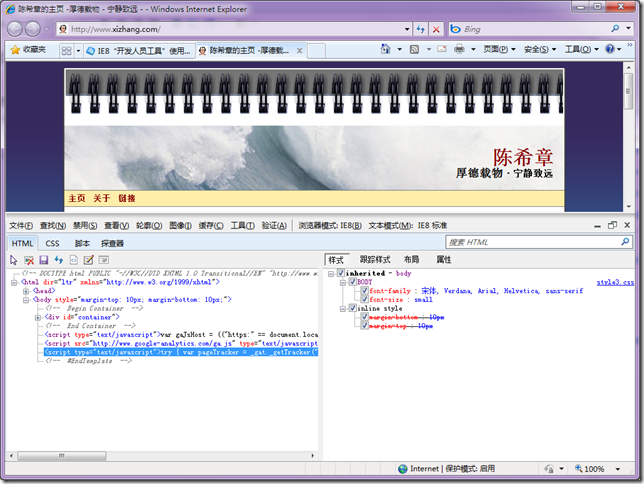

# IE 8 开发人员工具详解 【转载】 
> 原文发表于 2009-11-07, 地址: http://www.cnblogs.com/chenxizhang/archive/2009/11/07/1597781.html 

我的体会，IE 8 较之前面的的版本还是有不少改进的。使用体验上好很多，速度也不错。IE 要继续加油， 

 对于网页开发人员，IE8也提供了一个所谓的开发人员工具，通过F12可以调用出来

  

 关于这套工具的使用细节，我就不写了。有兴趣的朋友可以参考这篇文章

 [http://www.cnblogs.com/JustinYoung/archive/2009/03/24/kaifarenyuangongju.html](http://www.cnblogs.com/JustinYoung/archive/2009/03/24/kaifarenyuangongju.html "http://www.cnblogs.com/JustinYoung/archive/2009/03/24/kaifarenyuangongju.html")

