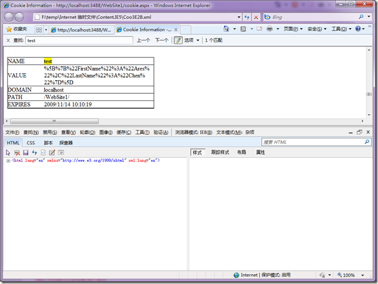
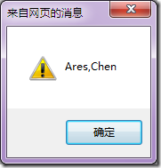

# javascript将Object Array 保存在 cookie中 
> 原文发表于 2009-11-07, 地址: http://www.cnblogs.com/chenxizhang/archive/2009/11/07/1597821.html 

在做一个动态页面框架，类似于WebPart的那种效果.页面上有很多个动态生成的div，这些div可以拖拽，并且根据当前用户进行个性化保存。

 其中我想把数组保存到cookie中，我们知道cookie中只能保存文本，那么怎么样把一个Array保存到cookie中，并且如何进行还原呢？

 下面是一个简单的例子

 <html xmlns="<http://www.w3.org/1999/xhtml">>  
<head runat="server">  
    <title></title>  
      
      
      
      
</head>  
<body>  
    <form id="form1" runat="server">  
    <input type="button" value="设置cookie"  id="setcookie"/>  
    <input type="button" value="读取cookie"  id="getcookie"/>  
    </form>  
</body>  
</html>   

