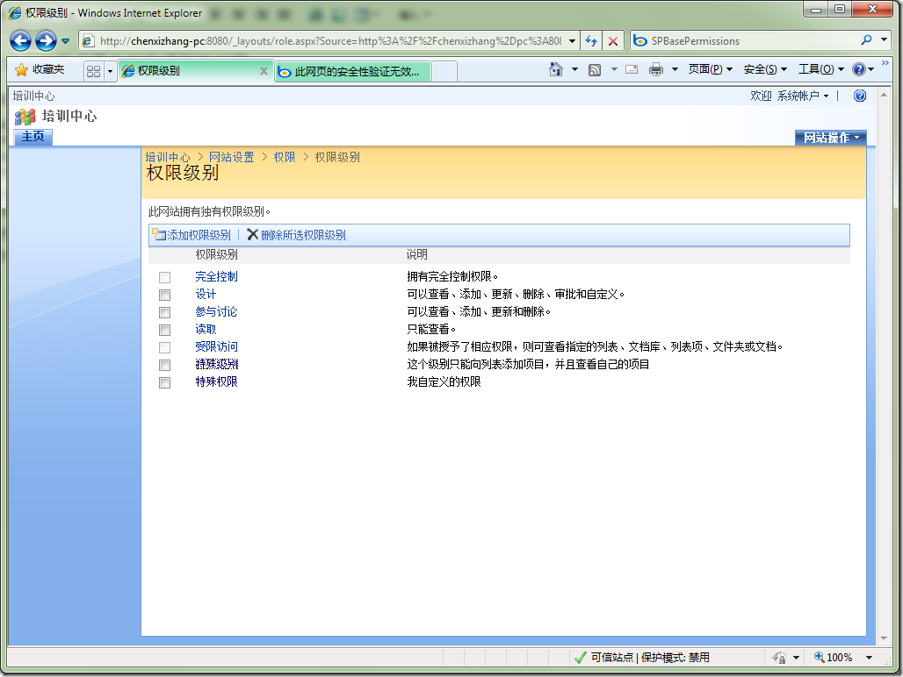
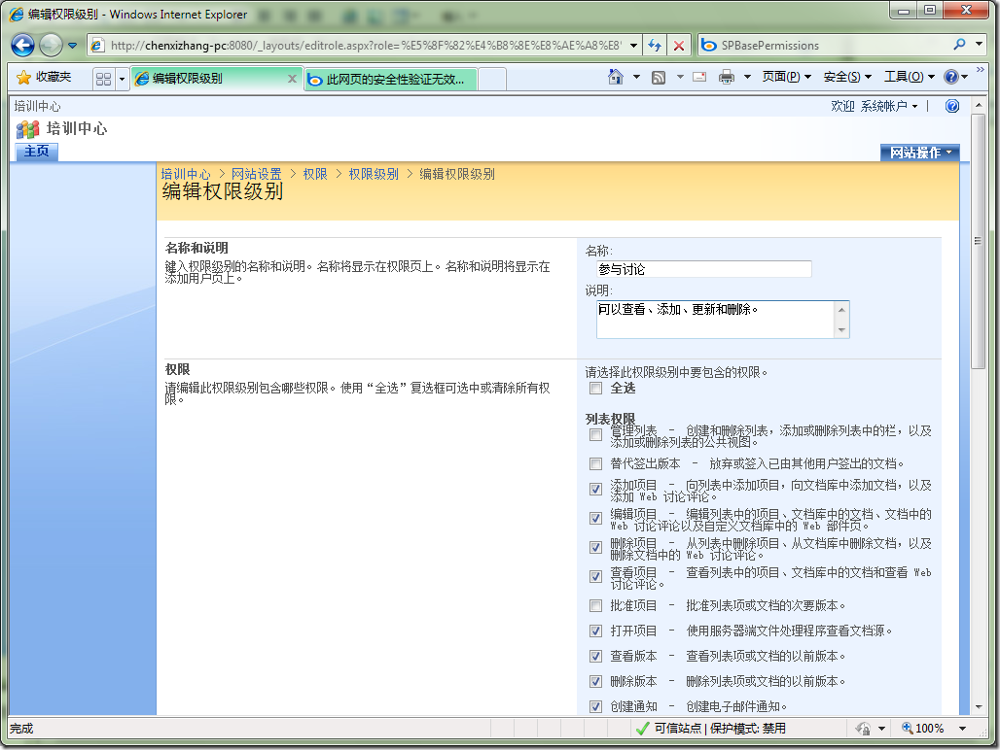
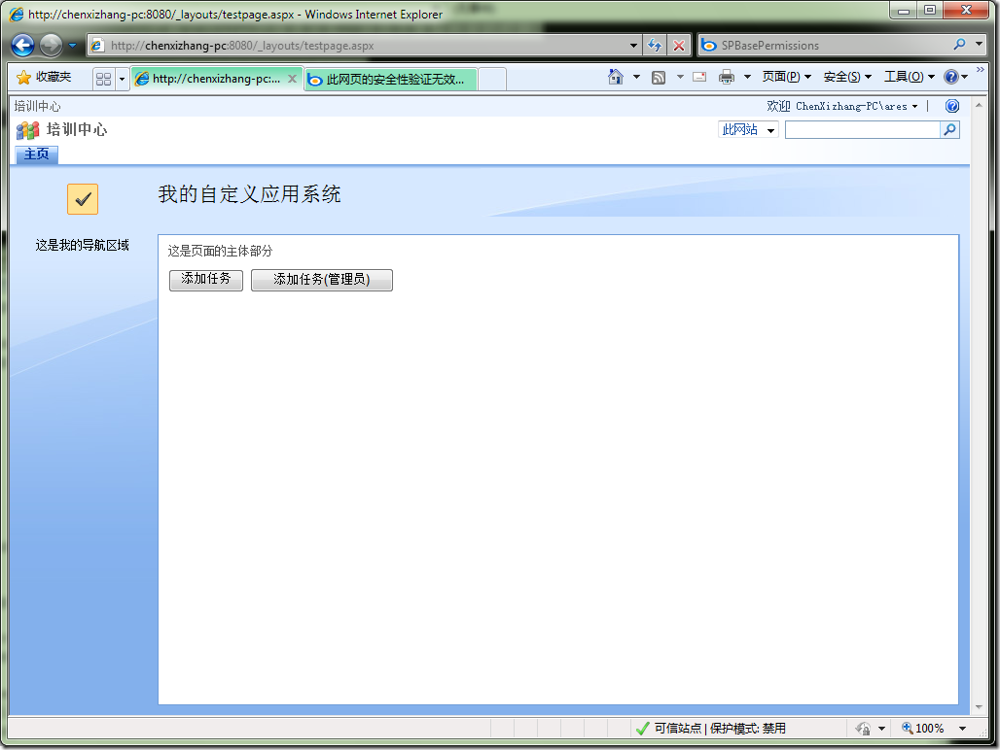
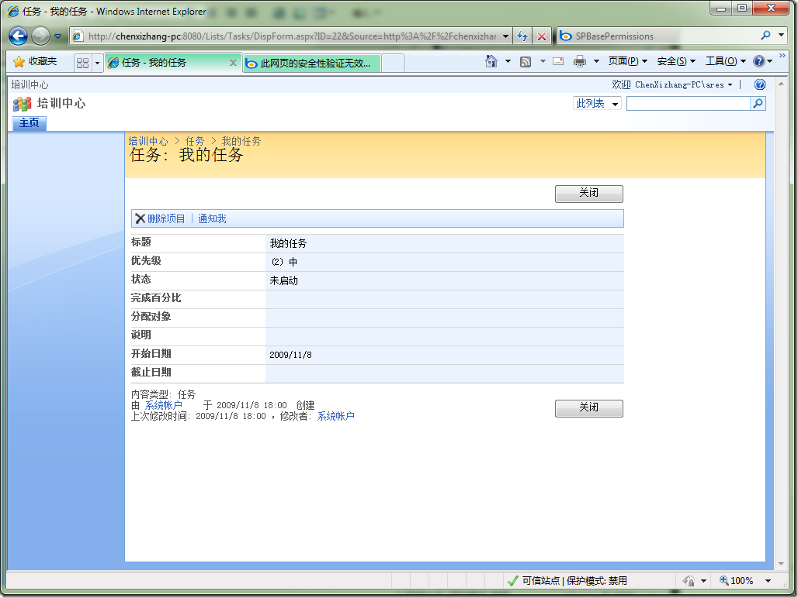
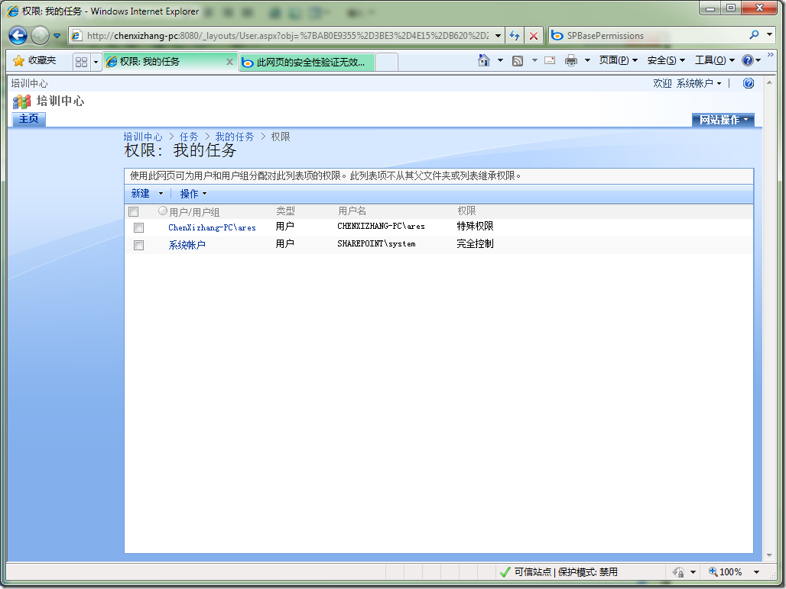

# SharePoint : 自定义权限设置中可能遇到的问题 
> 原文发表于 2009-11-08, 地址: http://www.cnblogs.com/chenxizhang/archive/2009/11/08/1598516.html 

WSS拥有一套比较完整和灵活的权限机制。一般来说包括下面的四个概念

 1. 身份主体(Principal), 一般对应了用户和组，以及SharePoint中的角色
2. 权限级别(RoleDefinition)，对应了一共三类权限组合，一共35个权限。
3. 权限关联(RoleAssignment)，这就是将身份主体与权限级别进行关联的。
4. 安全对象(Secuable)，这就是对应了我们具体要进行权限控制的对象，例如Site,Web,List,ListItem等等

 与此同时，WSS中的权限是有层次概念的，默认情况下，子级对象会继承得到父级对象的所有权限。这在很多时候都是合理的，当然，如果我们想要进行自定义，也是可以的。此时称为“打断”与父级的继承关系，通俗地说就是“断绝父子关系”的意思。继承和断绝是两种不同的策略，你必须选择其中一种，不能说又继承又断绝。这是说不通的。

 要做自定义的权限，就必须要再谈一下权限级别：

 简单地说，权限级别就是对权限的封装和组合，每一个权限级别都对应了一个或者多个权限的组合。系统默认会有几个权限级别

  

 这个图中，前面5个权限级别就是默认的，而后面两个是我自定义的。每个权限级别其实都对应了一些权限的组合，如下图所示

  

 那么，言归正传，我们如何自定义一个权限级别，又如何将其附加到我们的安全对象上去呢？下面我用一个比较简单的例子来演示这个过程。我想很多朋友已经迫不及待地想要看代码了

 //这是模拟系统帐户进行操作  
SPSecurity.RunWithElevatedPrivileges(delegate() {  
    using (SPSite site = new SPSite(SPContext.Current.Site.ID)) {  
        using (SPWeb web = site.OpenWeb(SPContext.Current.Web.ID)) {  
            web.AllowUnsafeUpdates = true;//必须将这个设置为true,否则更新会失败  
            SPList list = web.Lists["任务"];  
            SPListItem item = list.Items.Add();  
            item["Title"] = "我的任务";  
            SPRoleDefinition def = web.RoleDefinitions["特殊权限"];             if (def == null)  
            {  
                def = new SPRoleDefinition();  
                def.Name = "特殊权限";  
                def.Description = "我自定义的权限";  
                def.BasePermissions = SPBasePermissions.ViewListItems | SPBasePermissions.DeleteListItems;  
                //为该权限级别设置了两个权限  
                web.RoleDefinitions.Add(def);  
            }             SPRoleAssignment ra = new SPRoleAssignment("chenxizhang-pc\\ares", "ares@xizhang.com", "ares", "");       
            ra.RoleDefinitionBindings.Add(def);  
            item.Update();//将ListItem添加到List中先             if (!item.HasUniqueRoleAssignments)  
                //如果当前这个列表项目有独立的权限（言下之意就是说它如果仍然是继承了List的权限的话）  
                item.BreakRoleInheritance(false);  
                //打断它与List的继承关系，并且不复制所有的权限 **web.AllowUnsafeUpdates = true;  
            //这句至关重要，一旦发生了BreakRoleInheritance操作，AllowUnsafeUpdate属性将恢复为true。而代码执行就会出错：“此网页的安全验证无效”  
            //这个问题搞了半天，找谁说理去？**             item.RoleAssignments.Add(ra);//分配单独的权限级别  
            item.Update();  
        }  
    }  
});  

    

 

